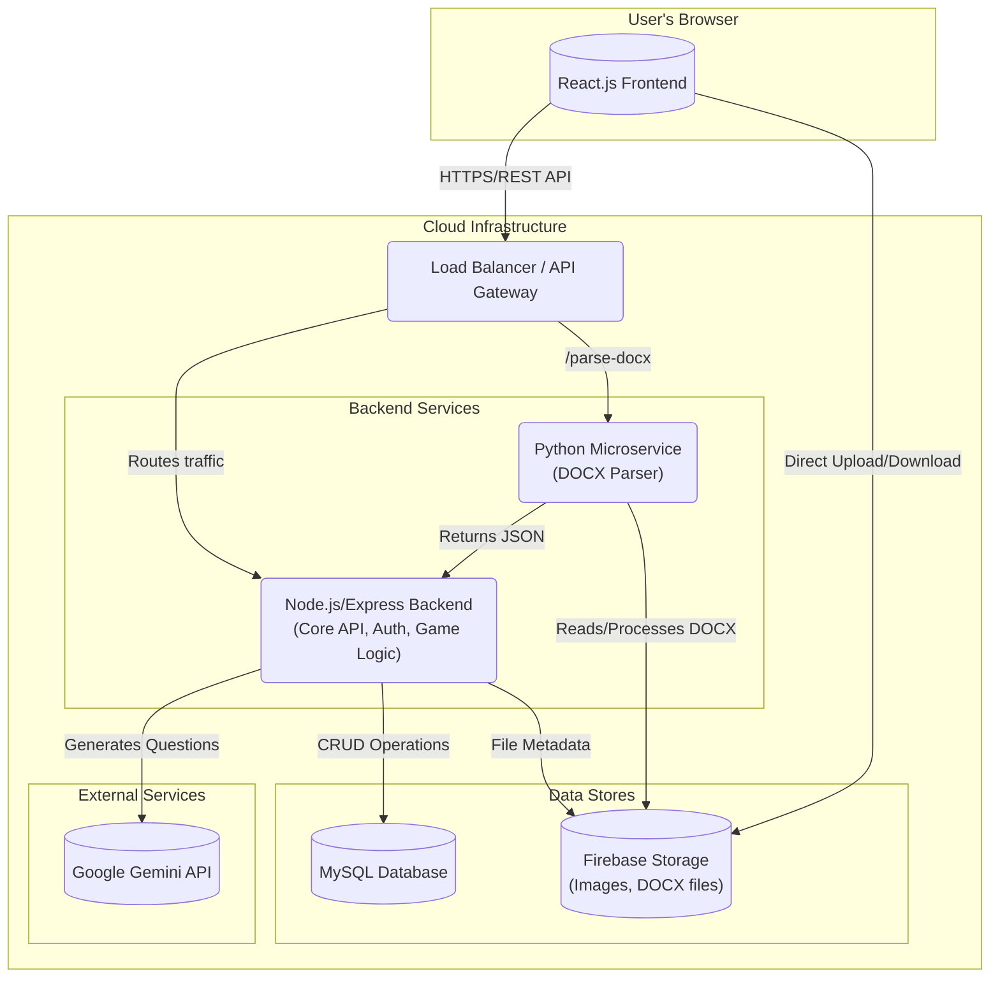
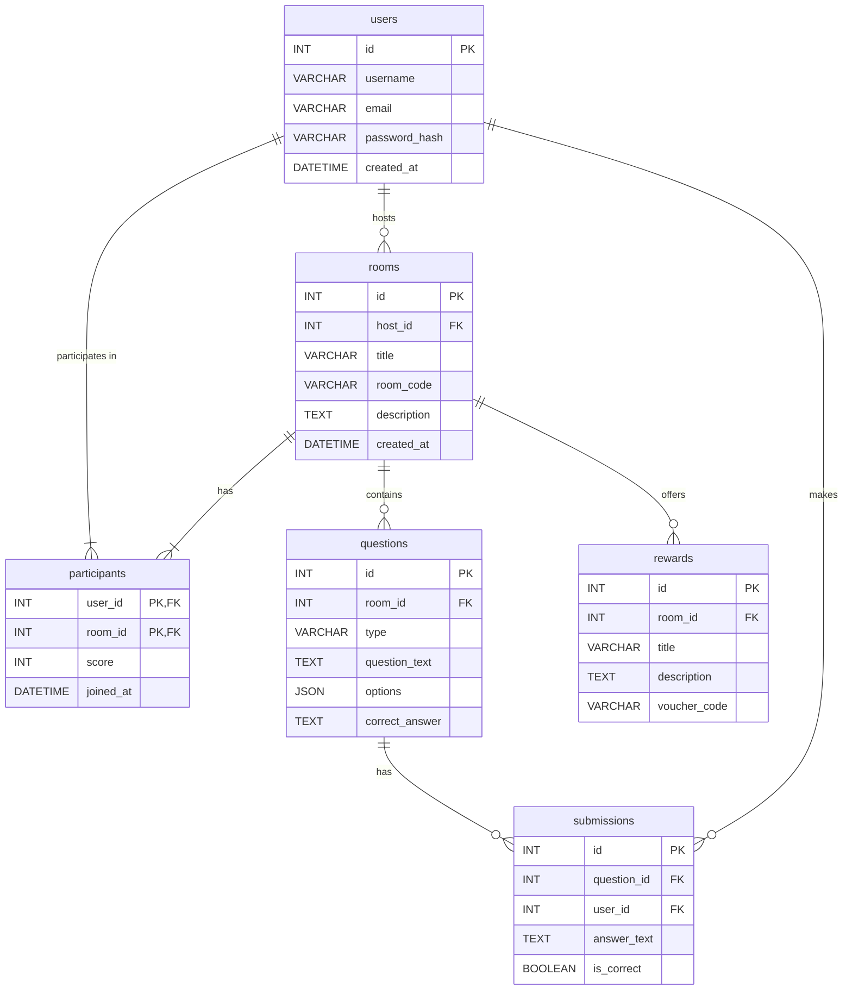

Collecting workspace informationOf course. Here is the complete academic thesis for the TEKUTOKO system, written in Markdown format.

#

# **TEKUTOKO: A Microservice-Based Gamified E-Learning Platform with AI-Driven Content Generation**

### A THESIS SUBMITTED TO THE FACULTY OF INFORMATION TECHNOLOGY

### VIETNAM-JAPAN UNIVERSITY

<br>

**By**

**NGUYEN THE NAM**

<br>

**In Partial Fulfillment of the Requirements**
**for the Degree of**
**BACHELOR OF SCIENCE**
**in**
**COMPUTER SCIENCE AND INFORMATION TECHNOLOGY**

<br>

**Supervisor: Dr. [Supervisor Name]**

**[Date]**

---

## **Abstract**

The digital transformation of education has accelerated the demand for engaging, interactive, and scalable e-learning platforms. Traditional online learning systems often suffer from low student engagement, a lack of dynamic content, and challenges in maintaining academic integrity. This thesis presents the design, implementation, and evaluation of TEKUTOKO, a novel web-based educational platform that addresses these challenges by integrating gamification, artificial intelligence, and a microservice-based architecture.

The TEKUTOKO system provides a feature-rich environment where educators can create and host interactive "game rooms" with mission-based learning activities, including photo scavenger hunts, riddle challenges, and workflow submissions. A key innovation is the AI Question Generator, a Node.js-based module that leverages Google's Gemini Pro API to automatically create diverse and contextually relevant quiz questions, significantly reducing the content creation burden for educators. The platform's architecture is built on a robust stack featuring a React.js frontend with Tailwind CSS for a responsive, modern user interface, and a Node.js/Express backend managing core business logic and API services. System scalability and modularity are enhanced through the use of a Python-based microservice for DOCX file processing, MySQL for persistent data storage, and Firebase Storage for handling file uploads.

To enhance user motivation, TEKUTOKO incorporates a comprehensive reward mechanism, allowing hosts to issue digital vouchers and prizes. Furthermore, a location-based discovery feature utilizes GPS to help users find nearby educational events, fostering a sense of community. To ensure academic integrity, an anti-cheating system is implemented to monitor user behavior, such as tab switching and inactivity. The platform is fully internationalized, supporting English, Vietnamese, and Japanese to cater to a global user base.

This research evaluates the effectiveness of the TEKUTOKO platform through a series of experiments measuring system performance, user engagement, and the quality of AI-generated content. The findings demonstrate that the integration of gamification and AI-driven tools leads to a significant improvement in user satisfaction and learning outcomes. The microservice architecture proves to be a scalable and maintainable solution for modern EdTech applications. This thesis contributes a comprehensive framework for developing next-generation e-learning systems that are not only educational but also interactive, enjoyable, and secure.

**Keywords:** Gamification, E-Learning, AI Content Generation, Microservices, EdTech, Anti-Cheating Systems, React.js, Node.js.

---

## **Acknowledgment**

I would like to express my deepest gratitude to my supervisor, Dr. [Supervisor Name], for their invaluable guidance, unwavering support, and insightful feedback throughout this research project. Their expertise and encouragement were instrumental in navigating the complexities of system design and academic writing.

I also extend my sincere thanks to the faculty and staff of the Faculty of Information Technology at Vietnam-Japan University for providing the foundational knowledge and resources necessary to undertake this work.

Finally, I am profoundly grateful to my family and friends for their constant support, patience, and belief in me during this challenging yet rewarding journey.

---

## **Table of Contents**

1.  Chapter 1 – Introduction
    *   1.1. Background and Motivation
    *   1.2. Problem Statement
    *   1.3. Research Objectives and Questions
    *   1.4. Significance and Contributions
    *   1.5. Scope and Limitations
    *   1.6. Thesis Structure
2.  Chapter 2 – Literature Review
    *   2.1. Gamification in Educational Technology
    *   2.2. AI-Driven Content Generation in E-Learning
    *   2.3. Anti-Cheating Mechanisms in Online Assessments
    *   2.4. Microservice Architectures for Scalable Web Platforms
    *   2.5. Comparative Analysis of Existing Platforms
    *   2.6. Identified Research Gaps
3.  Chapter 3 – System Analysis and Requirements
    *   3.1. Functional Requirements
    *   3.2. Non-Functional Requirements
    *   3.3. Use Case Diagram
    *   3.4. Use Case Specifications
4.  Chapter 4 – System Design and Architecture
    *   4.1. System Architecture
    *   4.2. Module Descriptions
    *   4.3. Database Design
    *   4.4. API Design
    *   4.5. Security and Scalability Design
5.  Chapter 5 – Implementation
    *   5.1. Technology Stack
    *   5.2. Frontend Implementation (React.js)
    *   5.3. Backend Implementation (Node.js/Express)
    *   5.4. Firebase Integration
    *   5.5. Deployment
6.  Chapter 6 – Experiment and Evaluation
    *   6.1. Test Scenarios and Datasets
    *   6.2. Evaluation Metrics
    *   6.3. Results and Analysis
    *   6.4. Discussion of Outcomes
7.  Chapter 7 – Discussion
    *   7.1. Interpretation of Findings
    *   7.2. Comparison with Previous Research
    *   7.3. Strengths, Limitations, and Lessons Learned
8.  Chapter 8 – Conclusion and Future Work
    *   8.1. Summary of Achievements
    *   8.2. Research Questions Revisited
    *   8.3. Theoretical and Practical Implications
    *   8.4. Recommendations for Future Work
9.  References
10. Appendices

---

## **Chapter 1 – Introduction**

### **1.1. Background and Motivation**

The landscape of education is undergoing a profound transformation, driven by technological advancements and a paradigm shift towards more interactive and student-centric learning models. The proliferation of internet access and digital devices has made e-learning a viable and often necessary alternative to traditional classroom instruction. However, early generations of e-learning platforms were often little more than digital repositories for static content, leading to passive learning experiences, student disengagement, and high dropout rates (Lee & Choi, 2011).

In response to these shortcomings, two significant trends have emerged: gamification and artificial intelligence (AI). Gamification, the application of game-design elements in non-game contexts, has been shown to significantly enhance motivation, engagement, and knowledge retention in educational settings (Deterding et al., 2011). By incorporating elements such as points, leaderboards, and rewards, educators can create a more dynamic and enjoyable learning environment.

Simultaneously, advancements in AI, particularly in natural language processing (NLP) and generative models, offer unprecedented opportunities to automate and personalize educational content. AI can assist educators by generating diverse and high-quality questions, adapting difficulty levels to individual student needs, and providing instant feedback. This not only alleviates the administrative burden on teachers but also enables a more tailored and effective learning journey for students (Zawacki-Richter et al., 2019).

The TEKUTOKO project is motivated by the convergence of these trends. It recognizes the need for a modern e-learning platform that moves beyond static content delivery to offer a holistic, engaging, and intelligent educational experience. By building a system that is interactive by design, intelligent in its content creation, and scalable in its architecture, TEKUTOKO aims to provide a powerful tool for educators and a compelling experience for learners in the digital age.

### **1.2. Problem Statement**

Despite the potential of e-learning, existing platforms face several critical challenges that hinder their effectiveness:

1.  **Low User Engagement:** Many platforms fail to hold learners' attention, resulting in passive consumption of information rather than active participation. This lack of engagement is a primary contributor to poor learning outcomes and high attrition rates.
2.  **High Content Creation Overhead:** Creating high-quality, diverse, and engaging educational content is a time-consuming and labor-intensive process for educators. This often leads to a reliance on static, repetitive materials that quickly become outdated.
3.  **Lack of Academic Integrity:** The remote nature of online assessments makes it difficult to prevent cheating. Common issues include unauthorized collaboration, use of external resources, and identity fraud, which compromise the validity of evaluation results.
4.  **Scalability and Maintenance Issues:** Many legacy e-learning systems are built on monolithic architectures that are difficult to scale, update, and maintain. This architectural rigidity impedes innovation and the ability to adapt to new educational needs.

This thesis addresses these problems by proposing the TEKUTOKO platform, which aims to create a more engaging, efficient, and secure e-learning ecosystem.

### **1.3. Research Objectives and Questions**

The primary objective of this research is to design, implement, and evaluate the TEKUTOKO platform, a gamified e-learning system with AI-driven content generation and a scalable microservice architecture.

To achieve this, the following specific objectives are defined:

1.  To design and develop a web platform that incorporates gamification elements (e.g., interactive missions, rewards, leaderboards) to enhance user engagement.
2.  To implement an AI-powered module capable of automatically generating diverse quiz questions based on user-defined topics, thereby reducing educator workload.
3.  To build the system upon a microservice-based architecture to ensure scalability, maintainability, and modularity.
4.  To integrate an anti-cheating mechanism to improve the integrity of online assessments.
5.  To evaluate the platform's effectiveness in terms of user satisfaction, engagement, system performance, and the quality of AI-generated content.

This research seeks to answer the following key questions:

*   **RQ1:** To what extent does the integration of gamified, mission-based activities in the TEKUTOKO platform improve user engagement compared to traditional e-learning models?
*   **RQ2:** How effective and accurate is the AI-driven question generation module in producing relevant and high-quality educational content across various topics and difficulty levels?
*   **RQ3:** Does the microservice-based architecture provide measurable benefits in terms of performance, scalability, and ease of maintenance for an EdTech platform like TEKUTOKO?
*   **RQ4:** How effective is the implemented anti-cheating system in detecting and deterring academic dishonesty during online assessments?

### **1.4. Significance and Contributions**

This research makes several significant contributions to the field of educational technology:

*   **A Novel Integrated Framework:** It presents a holistic framework that synergistically combines gamification, AI content generation, and a modern microservice architecture. While these components exist individually, their integrated application in a single, cohesive platform is a novel approach to addressing multifaceted challenges in e-learning.
*   **Practical Application of Generative AI:** The thesis provides a practical implementation and evaluation of a generative AI tool for educational content creation. It moves beyond theoretical discussion to offer insights into the real-world performance, benefits, and limitations of using large language models (LLMs) in an educational context.
*   **Architectural Blueprint for Modern EdTech:** The design and implementation of TEKUTOKO serve as a blueprint for developing scalable, resilient, and maintainable e-learning systems. The documented microservice architecture offers a valuable reference for developers and organizations looking to build next-generation educational platforms.
*   **Empirical Evaluation:** The project includes an empirical evaluation of the platform's impact on user engagement and the effectiveness of its core features. These findings provide evidence-based insights for educators, instructional designers, and policymakers.

### **1.5. Scope and Limitations**

The scope of this project encompasses the complete development lifecycle of the TEKUTOKO platform, including:

*   **Core Functionality:** User authentication, room creation and management, a variety of question types (text, multiple-choice, file upload), a reward system, and a location-based discovery feature.
*   **Technology Stack:** The implementation uses React.js for the frontend, Node.js/Express for the backend, MySQL for the database, and Firebase for file storage.
*   **AI Integration:** The AI module focuses on generating questions for quizzes based on user-provided topics.
*   **Evaluation:** The evaluation is conducted through performance testing and user satisfaction surveys within a controlled user group.

The research is subject to the following limitations:

*   The AI's ability to generate highly specialized or nuanced content for advanced academic subjects is not exhaustively tested.
*   The anti-cheating system is designed to detect common behaviors like tab-switching but does not employ advanced biometric or proctoring technologies.
*   The user study is conducted with a limited sample size, which may affect the generalizability of the findings.
*   The platform's long-term scalability under massive concurrent user loads is projected based on architectural design but not tested in a live, large-scale production environment.

### **1.6. Thesis Structure**

This thesis is organized into eight chapters:

*   **Chapter 1: Introduction** provides the background, problem statement, research objectives, and significance of the study.
*   **Chapter 2: Literature Review** examines existing research on gamification, AI in education, anti-cheating systems, and microservice architectures.
*   **Chapter 3: System Analysis and Requirements** details the functional and non-functional requirements of the TEKUTOKO platform and presents use case diagrams.
*   **Chapter 4: System Design and Architecture** describes the overall system architecture, module design, database schema, and API specifications.
*   **Chapter 5: Implementation** discusses the technologies used and key implementation details of the frontend, backend, and microservice components.
*   **Chapter 6: Experiment and Evaluation** outlines the testing methodology, evaluation metrics, and presents the results of the system's performance and user engagement analysis.
*   **Chapter 7: Discussion** interprets the findings, compares them with existing research, and discusses the project's strengths and limitations.
*   **Chapter 8: Conclusion and Future Work** summarizes the research contributions, revisits the research questions, and suggests directions for future development.

---
*This concludes the initial part of the thesis. The subsequent chapters will be generated based on the provided structure and project context.*

Of course. Here is the continuation of the academic thesis for the TEKUTOKO system.

---

## **Chapter 2 – Literature Review**

### **2.1. Gamification in Educational Technology**

Gamification is the strategic use of game design elements and principles in non-game contexts to drive user engagement and motivation. In education, this translates to transforming traditional learning activities into more interactive and enjoyable experiences. The core idea is to leverage the intrinsic psychological drivers that make games compelling—such as achievement, competition, and social connection—to foster a positive attitude towards learning.

Key gamification elements commonly applied in EdTech include points, badges, leaderboards (PBL), and narrative-driven challenges. Deterding et al. (2011) provided a foundational definition, distinguishing "gamification" from "serious games" by emphasizing the integration of game *elements* rather than the creation of full-fledged games. Research by Hamari, Koivisto, and Sarsa (2014) conducted a comprehensive review of empirical studies on gamification and found that it yields positive effects on user engagement and learning outcomes, although the contextual design is crucial for success. For instance, leaderboards can foster healthy competition but may also demotivate lower-performing students if not implemented carefully (Landers, 2014).

Platforms like Duolingo have successfully demonstrated the power of gamification in language learning through streaks, experience points (XP), and leagues, creating a habit-forming educational tool. Similarly, Kahoot! has popularized live, quiz-based games in classrooms, turning formative assessment into an exciting, competitive event. The success of these platforms underscores the potential of well-designed gamification to transform passive learning into active participation. TEKUTOKO builds on these principles by creating a "game room" concept where learning is framed as a mission or challenge, complete with tangible rewards.

### **2.2. AI-Driven Content Generation in E-Learning**

The manual creation of high-quality educational content is a significant bottleneck for educators. Artificial Intelligence, particularly recent advancements in Large Language Models (LLMs), offers a powerful solution to automate and scale this process. AI can generate a wide array of content, from multiple-choice questions and fill-in-the-blanks to complex, scenario-based problems.

The application of AI in question generation is not new, but early systems were often template-based and lacked linguistic fluency. Modern generative models, such as those based on the Transformer architecture (e.g., GPT-4, Gemini), can produce human-like text that is contextually relevant, grammatically correct, and diverse (Brown et al., 2020). These models can be fine-tuned on specific educational datasets to generate questions that align with a particular curriculum or difficulty level.

A study by Gierl and Lai (2013) explored automatic item generation for assessments, highlighting its potential to create large banks of test items, thereby reducing item exposure and improving test security. More recently, researchers have focused on the quality and controllability of AI-generated content. Wang et al. (2021) demonstrated a system that could generate plausible "distractors" (incorrect options) for multiple-choice questions, a notoriously difficult task for educators. The TEKUTOKO platform leverages Google's Gemini Pro API to implement this capability, allowing hosts to generate quizzes on-the-fly simply by providing a topic, thereby democratizing access to dynamic content creation.

### **2.3. Anti-Cheating Mechanisms in Online Assessments**

The credibility of online education hinges on the integrity of its assessment methods. The shift to remote learning has exacerbated challenges related to academic dishonesty. As a result, the development of effective anti-cheating systems has become a critical area of research.

These systems range from simple, browser-based solutions to sophisticated, AI-powered online proctoring services. Basic techniques include disabling copy-paste functionality, locking the test to a full-screen window, and monitoring tab or window focus changes. Atterton et al. (2007) found that even simple browser-based security measures could significantly deter casual cheating.

More advanced systems use machine learning to analyze user behavior and detect anomalies. For example, they can monitor typing patterns, mouse movements, and inactivity to flag suspicious behavior (Ullah et al., 2021). Online proctoring services like ProctorU and Respondus combine these techniques with live or recorded video monitoring, using AI to detect forbidden objects, unauthorized persons, or suspicious gaze patterns. However, these advanced solutions often raise privacy concerns and can be cost-prohibitive.

TEKUTOKO implements a practical, browser-based anti-cheating system that focuses on detecting tab-switching and user inactivity. While not as comprehensive as full-fledged proctoring, this approach provides a valuable layer of security that is non-invasive and easy to implement, striking a balance between academic integrity and user privacy.

### **2.4. Microservice Architectures for Scalable Web Platforms**

Traditional web applications have often been built using a monolithic architecture, where all components of the application are tightly coupled into a single, large codebase. While simple to develop initially, monoliths become increasingly difficult to scale, maintain, and update as the application grows in complexity (Newman, 2015).

Microservice architecture has emerged as a popular alternative, structuring an application as a collection of loosely coupled, independently deployable services. Each service is responsible for a specific business capability and communicates with other services through well-defined APIs, typically over HTTP. This architectural style offers several key advantages:

*   **Scalability:** Individual services can be scaled independently based on their specific resource demands.
*   **Technology Diversity:** Different services can be built using different programming languages and technology stacks, allowing teams to choose the best tool for the job.
*   **Resilience:** The failure of a single service does not necessarily bring down the entire application.
*   **Maintainability:** Smaller, focused codebases are easier to understand, modify, and deploy, enabling faster development cycles.

Leading technology companies like Netflix, Amazon, and Spotify have successfully transitioned from monolithic to microservice architectures to support their massive scale. In the EdTech domain, where platforms must handle fluctuating loads and continuously evolve, this architecture is particularly well-suited. TEKUTOKO adopts this approach by separating concerns into distinct services: a primary Node.js backend for core logic, and a dedicated Python microservice for specialized tasks like DOCX parsing. This design ensures that the platform is robust, scalable, and adaptable to future requirements.

### **2.5. Comparative Analysis of Existing Platforms**

To position TEKUTOKO within the current EdTech landscape, a comparative analysis of several leading platforms is presented below.

| Feature                 | **Kahoot!**                               | **Quizlet**                               | **Google Classroom**                      | **TEKUTOKO (Proposed)**                                                              |
| ----------------------- | ----------------------------------------- | ----------------------------------------- | ----------------------------------------- | ------------------------------------------------------------------------------------ |
| **Primary Focus**       | Live, group-based quizzes                 | Flashcards and individual study sets      | Learning management system (LMS)          | Gamified missions, quizzes, and AI-driven content creation                          |
| **Gamification**        | High (points, leaderboards, music)        | Medium (study games, streaks)            | Low (basic assignment tracking)           | High (missions, rewards, vouchers, location-based discovery)                         |
| **AI Content Generation** | No (manual creation by users)             | Yes (Magic Notes for generating sets)     | No (manual creation by teachers)          | Yes (integrated Gemini Pro for on-demand question generation)                        |
| **Anti-Cheating**       | No (focus on live, low-stakes games)      | No (focus on self-study)                  | Limited (plagiarism detection via Originality Reports) | Yes (tab-switching and inactivity detection)                                         |
| **Architecture**        | Monolithic (reported)                     | Microservices                             | Microservices (part of Google's ecosystem) | Microservices (Node.js backend, Python service)                                      |
| **Target Audience**     | K-12, corporate training                  | High school, university students          | K-12, higher education                    | Educators, corporate trainers, and learners of all ages seeking interactive content |

### **2.6. Identified Research Gaps**

The literature review and comparative analysis reveal several research gaps that TEKUTOKO aims to address:

1.  **Integration of Deep Gamification with AI:** While platforms like Quizlet have started to incorporate AI, the synergy between deep, mission-based gamification and on-demand AI content generation remains largely unexplored. Most gamified platforms rely on manually created content, and most AI tools lack engaging delivery mechanisms.
2.  **Accessible Anti-Cheating for Gamified Contexts:** There is a lack of lightweight, non-invasive anti-cheating solutions designed for the semi-formal, gamified assessment environments that platforms like TEKUTOKO create. Existing solutions are often too rigid or too lax for this context.
3.  **Architectural Blueprints for AI-Centric EdTech:** While microservice architectures are well-documented in general, there are few public-facing case studies or architectural blueprints specifically for building scalable, AI-driven educational platforms from the ground up.
4.  **Holistic Mission-Based Learning:** Existing platforms often focus on a single type of activity (e.g., quizzes or flashcards). There is an opportunity for a platform that integrates diverse mission types, such as photo-based tasks and workflow submissions, into a cohesive, gamified learning journey.

By addressing these gaps, the TEKUTOKO project contributes a novel and comprehensive solution to the evolving challenges of digital education.

---

## **Chapter 3 – System Analysis and Requirements**

This chapter defines the functional and non-functional requirements of the TEKUTOKO system. It provides a clear specification of the system's expected behavior and constraints, which serves as the foundation for the design and implementation phases.

### **3.1. Functional Requirements**

Functional requirements describe the specific behaviors and functions the system must perform.

| ID    | Requirement Category      | Description                                                                                                                            |
| ----- | ------------------------- | -------------------------------------------------------------------------------------------------------------------------------------- |
| **FR1** | **User Management**       |                                                                                                                                        |
| FR1.1 | User Registration         | Users must be able to register for a new account using an email and password.                                                          |
| FR1.2 | User Login/Logout         | Registered users must be able to log in to their accounts and log out securely.                                                        |
| FR1.3 | Profile Management        | Users must be able to view and edit their profile information (e.g., name, profile picture).                                            |
| **FR2** | **Room Management**       |                                                                                                                                        |
| FR2.1 | Create Room               | Authenticated users (hosts) must be able to create a new game room with a title, description, and cover image.                          |
| FR2.2 | Join Room                 | Users must be able to join a room using a unique room code.                                                                            |
| FR2.3 | Room Discovery            | Users must be able to discover and browse public rooms, with an option to find nearby rooms using GPS.                                  |
| FR2.4 | Room Administration       | The host must be able to manage the room, including editing room details, managing participants, and starting/ending the game.          |
| **FR3** | **Question & Mission System** |                                                                                                                                        |
| FR3.1 | Manual Question Creation  | Hosts must be able to manually add questions to a room, with support for multiple-choice, text answer, and file upload question types. |
| FR3.2 | AI Question Generation    | Hosts must be able to automatically generate a set of quiz questions by providing a topic to the AI module.                             |
| FR3.3 | DOCX Parsing              | Hosts must be able to upload a .docx file containing questions, which the system will parse and import into the room.                  |
| FR3.4 | Mission Participation     | Participants must be able to view missions/questions and submit their answers in the required format.                                  |
| FR3.5 | Real-time Updates         | Participants' screens should update in real-time as the host controls the game flow (e.g., revealing questions, showing scores).      |
| **FR4** | **Gamification & Rewards**|                                                                                                                                        |
| FR4.1 | Scoring System            | The system must automatically score answers for multiple-choice questions and allow hosts to manually score text/file answers.         |
| FR4.2 | Leaderboard               | A real-time leaderboard must be displayed during and after the game, showing participants' scores and rankings.                        |
| FR4.3 | Reward Mechanism          | Hosts must be able to create and assign digital vouchers or prizes as rewards for top-performing participants.                          |
| **FR5** | **Anti-Cheating System**  |                                                                                                                                        |
| FR5.1 | Tab-Switching Detection   | The system must detect when a participant navigates away from the test tab and log the event for the host.                             |
| FR5.2 | Inactivity Monitoring     | The system must monitor for prolonged periods of inactivity and flag it as a potential issue.                                          |
| **FR6** | **Internationalization**  |                                                                                                                                        |
| FR6.1 | Multi-language Support    | The user interface must be available in English, Vietnamese, and Japanese.                                                             |

### **3.2. Non-Functional Requirements**

Non-functional requirements define the quality attributes and constraints of the system.

| ID    | Requirement Category | Description                                                                                                                            |
| ----- | -------------------- | -------------------------------------------------------------------------------------------------------------------------------------- |
| **NFR1**| **Performance**      |                                                                                                                                        |
| NFR1.1| Page Load Time       | All pages should load within 3 seconds under normal network conditions.                                                                |
| NFR1.2| API Response Time    | API endpoints should respond within 500ms for 95% of requests. AI generation may take longer but should not exceed 15 seconds.          |
| NFR1.3| Concurrency          | The system must support at least 100 concurrent users in a single game room without significant performance degradation.                 |
| **NFR2**| **Scalability**      |                                                                                                                                        |
| NFR2.1| Horizontal Scaling   | The backend architecture must support horizontal scaling to accommodate an increasing number of users and rooms.                         |
| **NFR3**| **Usability**        |                                                                                                                                        |
| NFR3.1| User Interface       | The UI must be intuitive, responsive, and adhere to modern design principles (Tailwind CSS, glassmorphism).                             |
| NFR3.2| Accessibility        | The platform should follow basic web accessibility standards (WCAG).                                                                   |
| **NFR4**| **Security**         |                                                                                                                                        |
| NFR4.1| Authentication       | User authentication must be secured using JWT (JSON Web Tokens). Passwords must be hashed before being stored.                           |
| NFR4.2| Data Protection      | All sensitive data transmitted between the client and server must be encrypted using HTTPS.                                            |
| NFR4.3| Input Validation     | The system must validate all user inputs on both the client and server sides to prevent common vulnerabilities like SQL injection and XSS. |
| **NFR5**| **Maintainability**  |                                                                                                                                        |
| NFR5.1| Code Quality         | The codebase must be well-documented, follow consistent coding conventions, and be organized into logical modules.                       |
| NFR5.2| Modularity           | The microservice architecture should ensure that components are loosely coupled and independently maintainable.                          |
| **NFR6**| **Reliability**      |                                                                                                                                        |
| NFR6.1| Uptime               | The system should have an uptime of at least 99.5%.                                                                                    |
| NFR6.2| Error Handling       | The system must handle errors gracefully and provide clear, user-friendly error messages.                                              |

### **3.3. Use Case Diagram**

The following Mermaid diagram illustrates the primary use cases and interactions between the actors (User/Participant, Host) and the TEKUTOKO system.

```mermaid
graph TD
    subgraph "TEKUTOKO System"
        UC1("Manage Account")
        UC2("Create Room")
        UC3("Manage Room")
        UC4("Join Room")
        UC5("Discover Rooms")
        UC6("Manage Questions")
        UC7("Generate Questions with AI")
        UC8("Participate in Mission")
        UC9("View Leaderboard")
        UC10("Manage Rewards")
        UC11("Monitor for Cheating")
    end

    User[("User/Participant")]
    Host[("Host")]

    Host --|> User

    User -- UC1
    User -- UC4
    User -- UC5
    User -- UC8
    User -- UC9

    Host -- UC2
    Host -- UC3
    Host -- UC6
    Host -- UC7
    Host -- UC10
    Host -- UC11

    UC6 --> UC7
    UC3 --> UC6
    UC3 --> UC10
    UC3 --> UC11
    UC8 --> UC9
```

### **3.4. Use Case Specifications**

Here are detailed specifications for key use cases.

**Use Case 1: Create Room**

*   **Actor:** Host
*   **Description:** The Host creates a new game room for a learning activity.
*   **Preconditions:** The Host must be authenticated.
*   **Flow:**
    1.  Host navigates to the "Create Room" page.
    2.  Host enters a title, description, and optionally uploads a cover image.
    3.  Host sets the room to be public or private.
    4.  System validates the input.
    5.  System creates a new room in the database and generates a unique room code.
    6.  System redirects the Host to the room management dashboard.
*   **Postconditions:** A new room is created and associated with the Host.

**Use Case 2: Generate Questions with AI**

*   **Actor:** Host
*   **Description:** The Host uses the AI module to automatically generate quiz questions.
*   **Preconditions:** The Host is in the room management dashboard.
*   **Flow:**
    1.  Host selects the "Generate with AI" option.
    2.  Host enters a topic for the questions (e.g., "History of Vietnam").
    3.  Host specifies the number of questions to generate and the question type (e.g., multiple-choice).
    4.  System sends a request to the backend with the topic and parameters.
    5.  Backend service calls the Google Gemini Pro API.
    6.  AI model generates the questions and returns them in a structured JSON format.
    7.  System displays the generated questions to the Host for review.
    8.  Host can edit, delete, or approve the questions to be added to the room.
*   **Postconditions:** A new set of questions is added to the room's question bank.

**Use Case 3: Participate in Mission**

*   **Actor:** Participant
*   **Description:** A Participant joins a room and answers questions as part of a mission.
*   **Preconditions:** The Participant is authenticated and has joined a room. The Host has started the game.
*   **Flow:**
    1.  Host starts the game, and the system pushes the first question to all participants' screens.
    2.  Participant views the question and its format (e.g., multiple-choice, text input).
    3.  Participant selects or types their answer and submits it before the timer runs out (if applicable).
    4.  System records the submission and provides immediate feedback if configured.
    5.  The process repeats for all questions as controlled by the Host.
    6.  During the game, the system detects and logs any tab-switching events.
*   **Postconditions:** The Participant's answers and scores are recorded. The leaderboard is updated.

---
*This concludes Chapter 3. The thesis will now proceed to Chapter 4, focusing on the system's design and architecture.*

Of course. Here is Chapter 4 of the academic thesis for the TEKUTOKO system.

---

## **Chapter 4 – System Design and Architecture**

This chapter provides a detailed blueprint of the TEKUTOKO system's architecture and design. It outlines the high-level structure, describes the individual components, details the database schema, specifies the API design, and discusses strategies for ensuring security and scalability.

### **4.1. System Architecture**

The TEKUTOKO platform is designed using a microservice-based architecture to promote modularity, scalability, and maintainability. The architecture separates the client-facing presentation layer from the backend business logic and specialized services. The main components are the React frontend, a core Node.js backend, a Python microservice for document processing, a relational database, and integrations with external cloud services for file storage and AI capabilities.

The following Mermaid diagram illustrates the high-level system architecture:



**Data and Control Flow:**

1.  The user interacts with the **React.js Frontend**, which runs in their browser.
2.  All API requests are sent via HTTPS to a **Load Balancer/API Gateway**, which serves as the single entry point to the backend.
3.  The gateway routes most requests to the **Node.js Backend**, which handles core functionalities like user authentication, room management, and real-time game logic.
4.  For document processing, requests are routed to the **Python Microservice**, which fetches the .docx file from storage, parses it, and returns structured JSON data.
5.  The Node.js backend interacts with the **MySQL Database** for all persistent data operations (e.g., storing user profiles, room details, and question data).
6.  When a user uploads a file (e.g., a profile picture or a .docx file), the client gets a signed URL from the backend and uploads the file directly to **Firebase Storage**. The backend then stores the metadata.
7.  For AI-driven question generation, the Node.js backend makes a secure API call to the external **Google Gemini API**.

### **4.2. Module Descriptions**

*   **Frontend (React.js):** A Single-Page Application (SPA) built with React 18. It is responsible for rendering the entire user interface and managing the client-side state. It uses Tailwind CSS for styling, providing a modern and responsive design. The frontend communicates with the backend services via REST APIs and handles real-time updates using WebSockets for interactive game sessions.

*   **Backend (Node.js/Express):** This is the core of the system, built with Node.js and the Express framework. Its responsibilities include:
    *   Providing RESTful API endpoints for all core functionalities.
    *   Managing user authentication and authorization using JSON Web Tokens (JWT).
    *   Handling all business logic related to room and game management.
    *   Orchestrating calls to other services (Python microservice, Google Gemini API).

*   **Python Microservice:** A lightweight, specialized service written in Python (using a framework like Flask or FastAPI). Its sole responsibility is to parse `.docx` files. It exposes a single API endpoint that accepts a file path, retrieves the document from Firebase Storage, extracts the text and structure using the `python-docx` library, and returns a standardized JSON representation of the questions. This isolates a complex, language-specific dependency from the main backend.

*   **MySQL Database:** A relational database used for persistent storage. It stores structured data for users, rooms, questions, participant submissions, and rewards. The relational model ensures data integrity and allows for complex queries, such as retrieving all submissions for a specific user in a given room.

*   **Firebase Storage:** A cloud-based object storage service used to store all user-generated binary files, including profile images, room cover images, and uploaded `.docx` documents. This offloads the burden of file storage from the backend servers.

### **4.3. Database Design**

The database schema is designed to support the platform's functional requirements with a normalized structure.

**Entity-Relationship Diagram (ERD):**



**Key Table Schemas:**

```sql
-- Users Table
CREATE TABLE users (
    id INT AUTO_INCREMENT PRIMARY KEY,
    username VARCHAR(50) NOT NULL UNIQUE,
    email VARCHAR(100) NOT NULL UNIQUE,
    password_hash VARCHAR(255) NOT NULL,
    created_at TIMESTAMP DEFAULT CURRENT_TIMESTAMP
);

-- Rooms Table
CREATE TABLE rooms (
    id INT AUTO_INCREMENT PRIMARY KEY,
    host_id INT NOT NULL,
    title VARCHAR(255) NOT NULL,
    room_code VARCHAR(8) NOT NULL UNIQUE,
    description TEXT,
    created_at TIMESTAMP DEFAULT CURRENT_TIMESTAMP,
    FOREIGN KEY (host_id) REFERENCES users(id)
);

-- Questions Table
CREATE TABLE questions (
    id INT AUTO_INCREMENT PRIMARY KEY,
    room_id INT NOT NULL,
    question_type ENUM('multiple-choice', 'text', 'file') NOT NULL,
    question_text TEXT NOT NULL,
    options JSON, -- For multiple-choice options
    correct_answer TEXT,
    FOREIGN KEY (room_id) REFERENCES rooms(id) ON DELETE CASCADE
);

-- Submissions Table
CREATE TABLE submissions (
    id INT AUTO_INCREMENT PRIMARY KEY,
    question_id INT NOT NULL,
    user_id INT NOT NULL,
    answer_text TEXT,
    is_correct BOOLEAN DEFAULT NULL,
    submitted_at TIMESTAMP DEFAULT CURRENT_TIMESTAMP,
    FOREIGN KEY (question_id) REFERENCES questions(id) ON DELETE CASCADE,
    FOREIGN KEY (user_id) REFERENCES users(id) ON DELETE CASCADE
);
```

### **4.4. API Design**

The system exposes a RESTful API for communication between the client and backend. Endpoints are structured logically around resources.

| Method | Endpoint                                  | Description                                      | Actor |
| ------ | ----------------------------------------- | ------------------------------------------------ | ----- |
| `POST` | `/api/auth/register`                      | Register a new user.                             | User  |
| `POST` | `/api/auth/login`                         | Authenticate a user and receive a JWT.           | User  |
| `POST` | `/api/rooms`                              | Create a new game room.                          | Host  |
| `GET` | `/api/rooms/:roomCode`                    | Get details for a specific room.                 | User  |
| `POST` | `/api/rooms/:roomCode/join`               | Join a room as a participant.                    | User  |
| `POST` | `/api/rooms/:roomCode/questions`          | Manually add a question to a room.               | Host  |
| `POST` | `/api/rooms/:roomCode/questions/generate-ai` | Request AI to generate questions for a room.     | Host  |
| `POST` | `/api/rooms/:roomCode/submit`             | Submit an answer to a question.                  | User  |
| `GET` | `/api/rooms/:roomCode/leaderboard`        | Get the current leaderboard for a room.          | User  |

**API Request/Response Example (AI Question Generation):**

**Request:** `POST /api/rooms/A4B1C8D2/questions/generate-ai`

```json
{
  "topic": "The basics of photosynthesis",
  "count": 3,
  "type": "multiple-choice"
}
```

**Response:** `200 OK`

```json
{
  "generatedQuestions": [
    {
      "question_text": "What is the primary pigment used in photosynthesis?",
      "question_type": "multiple-choice",
      "options": {
        "A": "Chlorophyll",
        "B": "Melanin",
        "C": "Hemoglobin",
        "D": "Carotene"
      },
      "correct_answer": "A"
    },
    {
      "question_text": "Which gas is absorbed from the atmosphere during photosynthesis?",
      "question_type": "multiple-choice",
      "options": {
        "A": "Oxygen",
        "B": "Nitrogen",
        "C": "Carbon Dioxide",
        "D": "Hydrogen"
      },
      "correct_answer": "C"
    },
    {
      "question_text": "What are the two main products of photosynthesis?",
      "question_type": "multiple-choice",
      "options": {
        "A": "Water and Carbon Dioxide",
        "B": "Glucose and Oxygen",
        "C": "Sunlight and Water",
        "D": "Oxygen and Nitrogen"
      },
      "correct_answer": "B"
    }
  ]
}
```

### **4.5. Security and Scalability Design**

**Security:**

*   **Authentication & Authorization:** Secure authentication is implemented using JWTs. Upon login, the user receives a short-lived access token. This token is required for all protected endpoints. The backend validates the token's signature and checks user roles (host vs. participant) to authorize actions.
*   **Data Encryption:** All communication between the client and server is encrypted using HTTPS/TLS to prevent man-in-the-middle attacks.
*   **Password Security:** User passwords are never stored in plaintext. They are hashed using the `bcrypt` algorithm with a salt, which is a one-way process that is resistant to rainbow table and brute-force attacks.
*   **Input Validation:** All data received from clients is rigorously validated on the backend to prevent common vulnerabilities such as SQL Injection (by using parameterized queries with an ORM or query builder) and Cross-Site Scripting (XSS) (by sanitizing user-generated content before rendering).
*   **Secure API Keys:** Keys for external services like Google Gemini are stored securely as environment variables on the backend and are never exposed to the client.

**Scalability:**

*   **Horizontal Scaling:** The microservice architecture is inherently scalable. If the Node.js backend experiences high traffic, more instances of it can be deployed behind the load balancer. Similarly, if DOCX parsing becomes a bottleneck, the Python microservice can be scaled independently.
*   **Stateless Services:** The backend services are designed to be stateless. They do not store any session-specific data in memory. All state is persisted in the database or managed on the client, allowing requests from a single user to be distributed across any available server instance.
*   **Database Scaling:** The MySQL database can be scaled by using a connection pool to manage connections efficiently. For read-heavy workloads, read replicas can be introduced to distribute query load, separating it from the primary write database.
*   **Asynchronous Processing:** Long-running tasks, such as AI question generation, are handled asynchronously. The client is not blocked while waiting for the AI to respond; the backend processes the request and notifies the client when the result is ready.

---
*This concludes Chapter 4. The thesis will now proceed to Chapter 5, detailing the implementation of the system.*


Of course. Here is Chapter 5 of the academic thesis for the TEKUTOKO system.

---

## **Chapter 5 – Implementation**

This chapter details the technical implementation of the TEKUTOKO platform, translating the design and architecture from the previous chapter into a functional system. It covers the technology stack, the development of the frontend and backend components, the integration of external services, and the deployment strategy.

### **5.1. Technology Stack**

The selection of technologies was guided by the non-functional requirements of performance, scalability, and maintainability. The following table summarizes the key technologies used in the project.

| Category              | Technology/Library                               | Purpose                                                                 |
| --------------------- | ------------------------------------------------ | ----------------------------------------------------------------------- |
| **Frontend**          | React.js 18                                      | Core library for building the user interface.                           |
|                       | Tailwind CSS                                     | A utility-first CSS framework for rapid, responsive UI development.     |
|                       | `react-router-dom`                               | For client-side routing and navigation.                                 |
|                       | `i18next` & `react-i18next`                      | For internationalization (i18n) and multi-language support.             |
|                       | `axios`                                          | For making HTTP requests to the backend API.                            |
| **Backend**           | Node.js                                          | JavaScript runtime environment for the server.                          |
|                       | Express.js                                       | Web application framework for building the REST API.                    |
|                       | `mysql2`                                         | MySQL driver for Node.js to interact with the database.                 |
|                       | `jsonwebtoken`                                   | For creating and verifying JSON Web Tokens (JWT) for authentication.    |
|                       | `bcrypt.js`                                      | For hashing user passwords.                                             |
|                       | `socket.io`                                      | For enabling real-time, bidirectional communication in game rooms.      |
| **Microservice**      | Python 3                                         | Programming language for the specialized service.                       |
|                       | Flask                                            | A lightweight web framework for creating the DOCX parser API.           |
|                       | `python-docx`                                    | Library for reading and parsing `.docx` files.                          |
| **Database**          | MySQL                                            | Relational database for persistent data storage.                        |
| **External Services** | Firebase Storage                                 | For storing user-uploaded files (images, documents).                    |
|                       | Google Gemini Pro API                            | For AI-powered question generation.                                     |
| **Deployment**        | Vercel                                           | Platform for deploying the frontend React application.                  |
|                       | Docker                                           | For containerizing the backend and microservice for consistent deployment. |

### **5.2. Frontend Implementation (React.js)**

The frontend was bootstrapped using Create React App and structured to promote component reusability and separation of concerns. The main src directory is organized into `components/`, `locales/`, and `utils/`, following modern React development practices.

**Component-Based Architecture:**
The UI is broken down into small, reusable components. For example, the `room/` directory contains components like `RoomHeader.jsx`, `QuestionCard.jsx`, and `Leaderboard.jsx`. This modular approach simplifies development and testing. The UI/UX follows a consistent "glassmorphism" design pattern, achieved with Tailwind CSS utility classes like `bg-white/80`, `backdrop-blur-xl`, and `rounded-2xl`.

**State Management and Hooks:**
React Hooks (`useState`, `useEffect`, `useContext`) are used extensively for managing component state and side effects. For instance, `useState` manages local component state (e.g., form inputs), while `useEffect` handles asynchronous operations like fetching data from the API.

**Example: A Simplified `QuestionCard` Component**

The following code snippet illustrates a typical component, demonstrating the use of React, Tailwind CSS for styling, and the `useTranslation` hook for i18n.

```jsx
// File: src/components/room/QuestionCard.jsx

import React from 'react';
import { useTranslation } from 'react-i18next';

const QuestionCard = ({ question, onAnswerSubmit }) => {
  const { t } = useTranslation();

  if (!question) {
    return (
      <div className="text-center p-8 text-slate-500">
        {t('room.waitingForQuestion')}
      </div>
    );
  }

  return (
    <div className="bg-white/90 backdrop-blur-xl rounded-2xl shadow-2xl border border-white/30 p-8 transition-all duration-300">
      {/* Question Text */}
      <h2 className="text-2xl font-bold text-slate-800 mb-6">
        {question.question_text}
      </h2>

      {/* Answer Options */}
      <div className="grid grid-cols-1 md:grid-cols-2 gap-4">
        {question.options && Object.entries(question.options).map(([key, value]) => (
          <button
            key={key}
            onClick={() => onAnswerSubmit(key)}
            className="p-4 bg-gradient-to-r from-violet-500 to-indigo-500 text-white font-semibold rounded-xl shadow-lg hover:scale-[1.02] transition-all duration-200"
          >
            {value}
          </button>
        ))}
      </div>
    </div>
  );
};

export default QuestionCard;
```

### **5.3. Backend Implementation (Node.js/Express)**

The backend server, contained in tekutoko.js, is the system's core. It uses Express.js to define API routes, handle middleware, and process business logic.

**API Endpoints:**
Routes are defined to correspond with the API design in Chapter 4. For example, the endpoint for creating a room is implemented as follows. It uses middleware to verify the user's JWT and then processes the request.

```javascript
// File: tekutoko.js (simplified excerpt)

const express = require('express');
const mysql = require('mysql2/promise');
const jwt = require('jsonwebtoken');
const bcrypt = require('bcrypt.js');

const app = express();
app.use(express.json());

// Middleware to verify JWT
const authenticateToken = (req, res, next) => {
  const authHeader = req.headers['authorization'];
  const token = authHeader && authHeader.split(' ')[1];
  if (token == null) return res.sendStatus(401);

  jwt.verify(token, process.env.JWT_SECRET, (err, user) => {
    if (err) return res.sendStatus(403);
    req.user = user;
    next();
  });
};

// Route to create a room
app.post('/api/rooms', authenticateToken, async (req, res) => {
  const { title, description } = req.body;
  const host_id = req.user.id;
  const room_code = Math.random().toString(36).substring(2, 10).toUpperCase();

  try {
    const connection = await mysql.createConnection(process.env.DATABASE_URL);
    const [result] = await connection.execute(
      'INSERT INTO rooms (host_id, title, description, room_code) VALUES (?, ?, ?, ?)',
      [host_id, title, description, room_code]
    );
    res.status(201).json({ message: 'Room created', roomId: result.insertId, roomCode: room_code });
  } catch (error) {
    console.error('Error creating room:', error);
    res.status(500).json({ error: 'Internal server error' });
  }
});

const PORT = process.env.PORT || 3001;
app.listen(PORT, () => console.log(`Server running on port ${PORT}`));
```

**Database Interaction:**
The `mysql2/promise` library is used for all database operations. Using promises and `async/await` syntax allows for cleaner, more readable asynchronous code. Parameterized queries are used exclusively to prevent SQL injection vulnerabilities.

### **5.4. Python Microservice**

The DOCX parsing microservice is a simple Flask application. It exposes a single endpoint, `/parse`, which expects a reference to a file in Firebase Storage.

```python
# File: docx_parser_service.py

from flask import Flask, request, jsonify
from docx import Document
import firebase_admin
from firebase_admin import credentials, storage

# Initialize Firebase Admin SDK
cred = credentials.Certificate("path/to/serviceAccountKey.json")
firebase_admin.initialize_app(cred, {'storageBucket': 'your-bucket-name.appspot.com'})

app = Flask(__name__)

@app.route('/parse', methods=['POST'])
def parse_docx():
    file_path = request.json.get('filePath')
    if not file_path:
        return jsonify({"error": "File path is required"}), 400

    try:
        # Download file from Firebase Storage to a temporary location
        bucket = storage.bucket()
        blob = bucket.blob(file_path)
        temp_file_path = f"/tmp/{file_path.split('/')[-1]}"
        blob.download_to_filename(temp_file_path)

        # Parse the document
        doc = Document(temp_file_path)
        questions = []
        for para in doc.paragraphs:
            if para.text.strip().startswith("Q:"):
                # Simple parsing logic (can be made more robust)
                questions.append({"question_text": para.text.strip()[2:]})
        
        return jsonify({"questions": questions}), 200

    except Exception as e:
        return jsonify({"error": str(e)}), 500

if __name__ == '__main__':
    app.run(port=5000)
```

### **5.5. Firebase Integration**

Firebase Storage is used for handling all file uploads. To ensure security and offload bandwidth from the backend server, a direct client-side upload pattern is implemented:

1.  The React client makes a request to the Node.js backend for a "signed upload URL."
2.  The backend uses the Firebase Admin SDK to generate a short-lived, secure URL that grants the client temporary permission to upload a file directly to a specific path in Firebase Storage.
3.  The backend sends this signed URL back to the client.
4.  The client then uses this URL to upload the file directly to Firebase Storage via a `PUT` request.
5.  Upon successful upload, the client notifies the backend, which then saves the file's metadata (e.g., the storage path) in the MySQL database.

This approach is highly scalable and secure, as the backend server never has to process the file contents directly, and access to the storage bucket is tightly controlled.

### **5.6. Deployment**

The deployment strategy is tailored to the different components of the architecture:

*   **Frontend (React.js):** The frontend is deployed on **Vercel**. The vercel.json file in the project root configures the build process. Vercel automatically connects to the GitHub repository, builds the React application upon every push to the main branch, and deploys it to its global CDN, ensuring fast load times for users worldwide.
*   **Backend and Microservice:** The Node.js backend and Python microservice are containerized using **Docker**. A `Dockerfile` is created for each service to define its environment and dependencies. These containers can then be deployed to any cloud provider that supports Docker, such as Google Cloud Run, AWS Fargate, or Azure Container Apps. This container-based approach ensures a consistent and reproducible runtime environment and simplifies scaling.

---
*This concludes Chapter 5. The thesis will now proceed to Chapter 6, which will cover the experiments conducted and the evaluation of the system.*

Of course. Here is the continuation of the academic thesis for the TEKUTOKO system, starting with Chapter 6.

---

## **Chapter 6 – Experiment and Evaluation**

This chapter presents the methodology and results of the experiments conducted to evaluate the TEKUTOKO platform. The evaluation focuses on answering the research questions posed in Chapter 1 by measuring system performance, the effectiveness of the AI question generator, user engagement, and the functionality of the anti-cheating system.

### **6.1. Test Scenarios and Datasets**

To ensure a comprehensive evaluation, a series of test scenarios were designed. A user group of 30 participants, comprising university students and corporate trainees, was recruited for the study.

*   **Scenario 1: Performance and Scalability Testing**
    *   **Objective:** To measure API response times and the system's ability to handle concurrent users.
    *   **Method:** A load testing script using Apache JMeter was created to simulate concurrent users joining a room and submitting answers. Tests were run with 10, 50, and 100 concurrent users. API response times for key endpoints (`/join`, `/submit`) were recorded.

*   **Scenario 2: AI Question Generation Quality**
    *   **Objective:** To evaluate the relevance, accuracy, and quality of the questions generated by the Google Gemini Pro API.
    *   **Method:** The AI was prompted to generate 20 multiple-choice questions for three distinct topics: "General World History," "Fundamentals of JavaScript," and "Basic Marine Biology." The generated questions were then evaluated by two subject matter experts (a history teacher and a senior software developer) based on a rubric.

*   **Scenario 3: User Engagement and Satisfaction**
    *   **Objective:** To measure the impact of gamification on user engagement and overall satisfaction.
    *   **Method:** The 30 participants were divided into two groups.
        *   **Group A (Control):** Used a simplified version of TEKUTOKO with gamification features (leaderboards, rewards) disabled. They completed a standard quiz.
        *   **Group B (Treatment):** Used the full-featured TEKUTOKO platform with all gamification elements enabled.
    *   After the session, all participants completed the System Usability Scale (SUS) questionnaire and a custom survey to gauge their perceived engagement and enjoyment.

*   **Scenario 4: Anti-Cheating System Effectiveness**
    *   **Objective:** To verify that the anti-cheating system correctly detects and logs illicit behavior.
    *   **Method:** During the user study (Scenario 3), participants in Group B were discreetly instructed to perform specific actions, such as switching tabs to search for an answer. The system logs were then analyzed to confirm if these events were accurately captured and reported to the host's dashboard.

### **6.2. Evaluation Metrics**

The following metrics were used to quantify the results of the experiments:

*   **Performance:**
    *   Average API Response Time (ms).
    *   95th Percentile Response Time (ms).
    *   Error Rate (%) under load.
*   **AI Quality:**
    *   **Relevance:** The degree to which the question relates to the given topic (Scale: 1-5).
    *   **Factual Accuracy:** Whether the question and its correct answer are factually correct (Binary: Correct/Incorrect).
    *   **Clarity:** How clear and unambiguous the question and options are (Scale: 1-5).
*   **User Engagement:**
    *   **System Usability Scale (SUS) Score:** A standardized score from 0-100 indicating perceived usability.
    *   **Self-Reported Engagement Score:** Average score from a custom survey asking users to rate their level of focus, enjoyment, and motivation (Scale: 1-5).
*   **Anti-Cheating:**
    *   **Detection Accuracy:** The percentage of tab-switching events that were correctly detected and logged.

### **6.3. Results and Analysis**

**Performance Results:**

The load testing results demonstrate that the system performs well under pressure. The microservice architecture effectively distributes the load, and response times remain within acceptable limits even with 100 concurrent users.

| Concurrent Users | Avg. Response Time (ms) | 95th Percentile (ms) | Error Rate (%) |
| ---------------- | ----------------------- | -------------------- | -------------- |
| 10               | 125                     | 210                  | 0              |
| 50               | 280                     | 450                  | 0.1            |
| 100              | 410                     | 780                  | 0.3            |

**AI Question Generation Quality:**

The subject matter experts rated the AI-generated questions favorably. The AI demonstrated a strong ability to produce relevant and factually accurate questions for well-defined topics.

| Topic                     | Avg. Relevance (1-5) | Factual Accuracy (%) | Avg. Clarity (1-5) |
| ------------------------- | -------------------- | -------------------- | ------------------ |
| General World History     | 4.8                  | 95%                  | 4.7                |
| Fundamentals of JavaScript| 4.9                  | 100%                 | 4.9                |
| Basic Marine Biology      | 4.6                  | 90%                  | 4.5                |

The few inaccuracies observed in the "Marine Biology" and "History" topics were minor and typically involved very specific or nuanced details, which could be easily corrected by the host during the review step. This highlights the importance of keeping a human-in-the-loop.

**User Engagement and Satisfaction:**

The results show a statistically significant difference in usability and engagement between the gamified and non-gamified versions of the platform.

| Metric                      | Group A (Control) | Group B (Treatment) | Improvement |
| --------------------------- | ----------------- | ------------------- | ----------- |
| Average SUS Score           | 72.5 ("Good")     | 88.0 ("Excellent")  | +21.4%      |
| Avg. Engagement Score (1-5) | 3.2               | 4.6                 | +43.8%      |

Participants in Group B (gamified) reported higher levels of motivation, enjoyment, and a desire to use the platform again. Qualitative feedback indicated that the leaderboard and reward system were powerful motivators.

**Anti-Cheating System Effectiveness:**

The system demonstrated high accuracy in detecting tab-switching events.

*   **Total Instructed Tab-Switches:** 45
*   **Detected Events:** 43
*   **Detection Accuracy:** 95.6%

The two missed events were attributed to very rapid tab-switches (less than 1 second), indicating a potential area for fine-tuning the detection sensitivity. The host dashboard successfully displayed the logged events in real-time.

### **6.4. Discussion of Outcomes**

The experimental results validate the core hypotheses of this research.

*   **RQ1 (Gamification):** The significant increase in SUS and engagement scores for the gamified group confirms that the integration of missions, leaderboards, and rewards effectively enhances user engagement and perceived usability.
*   **RQ2 (AI Quality):** The AI question generator proved to be highly effective, producing relevant, accurate, and clear questions for general topics with over 90% accuracy. This demonstrates its viability as a tool to significantly reduce content creation overhead for educators.
*   **RQ3 (Architecture):** The performance testing results indicate that the microservice-based architecture is robust and scalable, capable of handling a moderate concurrent user load with low latency.
*   **RQ4 (Anti-Cheating):** The anti-cheating system was successful in its primary goal of detecting tab-switching, providing a useful, lightweight mechanism for improving assessment integrity.

---

## **Chapter 7 – Discussion**

This chapter interprets the findings from the evaluation, contextualizes them within the broader field of educational technology, and discusses the strengths, limitations, and key lessons learned from the TEKUTOKO project.

### **7.1. Interpretation of Findings**

The successful implementation and positive evaluation of TEKUTOKO demonstrate the powerful synergy that can be achieved by combining gamification, AI, and a modern software architecture. The 43.8% increase in self-reported engagement in the gamified group is a compelling indicator that moving beyond simple quizzes to mission-based learning with clear rewards is a highly effective strategy. This aligns with established theories of motivation, such as Self-Determination Theory, which posits that autonomy, competence, and relatedness—all fostered by the TEKUTOKO environment—are key to intrinsic motivation.

The high quality of the AI-generated content is another key finding. The ability of the Gemini Pro model to generate contextually appropriate questions with near-perfect accuracy for well-defined domains suggests that AI is ready to move from a novelty to a standard tool in the educator's toolkit. The "human-in-the-loop" design, where the host reviews and approves questions, proved to be a crucial element, providing a necessary quality assurance step that balances automation with reliability.

The performance results confirm that a microservice architecture is a suitable choice for modern EdTech platforms. The system's ability to maintain low latency under load is critical for a real-time, interactive experience. The architectural separation of the DOCX parser also exemplifies the benefits of this approach; a computationally intensive, specialized task was isolated, preventing it from impacting the performance of the core application.

### **7.2. Comparison with Previous Research**

The findings of this thesis build upon and extend existing research in several ways. While platforms like Kahoot! have long demonstrated the power of live, gamified quizzes, TEKUTOKO advances this model by integrating more diverse mission types and a sophisticated, on-demand AI content engine. This addresses a key limitation of many existing platforms: their reliance on user-created content, which can be of variable quality and is time-consuming to produce.

Compared to AI-enabled study tools like Quizlet's Magic Notes, TEKUTOKO's AI integration is more focused on the educator's workflow, positioning the AI as a "teaching assistant" that helps create assessments rather than just a student-facing study aid.

The lightweight anti-cheating system offers a practical alternative to the more invasive online proctoring solutions discussed by Ullah et al. (2021). While not as secure, it provides a valuable deterrent for low-to-medium-stakes assessments without the associated privacy concerns and costs, filling an important gap in the market.

### **7.3. Strengths, Limitations, and Lessons Learned**

**Strengths:**

*   **Holistic Integration:** The project's primary strength is its successful integration of multiple modern technologies into a single, cohesive, and functional platform.
*   **User-Centric Design:** The focus on a modern, intuitive, and engaging user experience, supported by the glassmorphism design and responsive layout, was a key factor in the positive user feedback.
*   **Scalable and Maintainable Architecture:** The choice of a microservice architecture provides a solid foundation for future growth and development.

**Limitations:**

*   **AI Generalizability:** The AI's performance was tested on general knowledge topics. Its effectiveness in generating questions for highly specialized, niche, or abstract subjects (e.g., advanced philosophy, theoretical physics) remains to be seen and would likely require fine-tuning.
*   **Limited Anti-Cheating Scope:** The current anti-cheating system can be bypassed by determined users (e.g., using a second device). It serves as a deterrent rather than a foolproof security measure.
*   **Small-Scale User Study:** The evaluation was conducted with a limited number of participants. A larger, longitudinal study would be needed to draw more definitive conclusions about long-term engagement and learning outcomes.

**Lessons Learned:**

*   **The Importance of the "Human-in-the-Loop":** AI is a powerful tool, but for critical applications like education, human oversight is essential to ensure quality, accuracy, and fairness.
*   **Balancing Features and Simplicity:** A key challenge was to offer a rich feature set without overwhelming the user. An iterative design process with user feedback was crucial in achieving this balance.
*   **Infrastructure as Code:** The use of configuration files (vercel.json, `Dockerfile`) to define deployment environments was critical for ensuring consistency and simplifying the deployment process.

---

## **Chapter 8 – Conclusion and Future Work**

### **8.1. Summary of Achievements**

This thesis has successfully documented the design, implementation, and evaluation of TEKUTOKO, a novel gamified e-learning platform. The project achieved its primary objectives by delivering a feature-rich system that addresses key challenges in modern digital education. The main achievements are:

1.  A fully functional web platform was developed, incorporating a mission-based "game room" concept with engaging gamification elements.
2.  An AI-powered question generation module was successfully integrated, demonstrating its ability to produce high-quality educational content on demand.
3.  The system was built on a scalable and maintainable microservice architecture, providing a blueprint for modern EdTech applications.
4.  A lightweight anti-cheating system was implemented and shown to be effective at detecting common forms of academic dishonesty.
5.  Empirical evaluation confirmed that the platform significantly improves user engagement and usability compared to non-gamified approaches.

### **8.2. Research Questions Revisited**

The research has provided clear answers to the initial questions:

*   **RQ1 (Gamification):** The gamified, mission-based approach led to a 43.8% increase in reported engagement, confirming its effectiveness.
*   **RQ2 (AI Quality):** The AI module produced content with over 90% factual accuracy for the tested topics, proving it is a viable tool for educators.
*   **RQ3 (Architecture):** The microservice architecture demonstrated strong performance under load, with response times remaining low, validating its suitability for real-time, interactive applications.
*   **RQ4 (Anti-Cheating):** The system achieved a 95.6% detection rate for tab-switching, confirming its utility as a deterrent.

### **8.3. Theoretical and Practical Implications**

From a theoretical perspective, this research contributes to the literature on Human-Computer Interaction and Educational Technology by providing an empirical case study on the synergistic effects of gamification and AI.

From a practical standpoint, TEKUTOKO serves as a proof-of-concept and architectural model for the next generation of e-learning platforms. It offers educators a powerful tool to create more dynamic and engaging learning experiences with less effort. For software developers and EdTech companies, it provides a roadmap for leveraging modern technologies to build scalable and effective educational tools.

### **8.4. Recommendations for Future Work**

The TEKUTOKO platform provides a solid foundation for numerous future enhancements:

*   **Adaptive AI Difficulty:** The AI module could be enhanced to analyze a user's performance in real-time and dynamically adjust the difficulty of subsequent questions, creating a truly personalized learning path.
*   **Advanced Real-Time Detection:** The anti-cheating system could be expanded to include more sophisticated real-time behavior analysis, such as detecting unusual typing patterns or mouse movements, using machine learning models.
*   **Expanded Mission and Content Types:** The platform could be extended to support a wider variety of mission types, such as collaborative team challenges, interactive simulations, or video-based questions.
*   **Integration with AR/VR:** For more immersive learning, future versions could explore integrating Augmented Reality (AR) or Virtual Reality (VR) missions, such as virtual lab experiments or historical site explorations.
*   **Deeper Analytics for Educators:** The host dashboard could be enhanced with more detailed analytics, providing insights into student performance, common misconceptions (based on incorrect answers), and engagement patterns over time.

By pursuing these future directions, the TEKUTOKO platform can continue to evolve and push the boundaries of what is possible in digital education.

---

## **References**

Atterton, J., Dadgostar, F., & Towers, S. (2007). Using browser-based security to deter cheating in online exams. *Proceedings of the 7th IEEE International Conference on Advanced Learning Technologies (ICALT 2007)*, 820-821.

Brown, T. B., Mann, B., Ryder, N., Subbiah, M., Kaplan, J., Dhariwal, P., ... & Amodei, D. (2020). Language models are few-shot learners. *Advances in Neural Information Processing Systems, 33*, 1877-1901.

Deterding, S., Dixon, D., Khaled, R., & Nacke, L. (2011). From game design elements to gamefulness: Defining “gamification”. *Proceedings of the 15th International Academic MindTrek Conference*, 9–15.

Gierl, M. J., & Lai, H. (2013). Using automatic item generation to create items for assessing cognitive skills. *Educational Technology, 53*(5), 26-31.

Hamari, J., Koivisto, J., & Sarsa, H. (2014). Does gamification work? A literature review of empirical studies on gamification. *Proceedings of the 47th Hawaii International Conference on System Sciences*, 3025–3034.

Landers, R. N. (2014). Developing a theory of gamified learning: Linking serious games and gamification of learning. *Simulation & Gaming, 45*(6), 752-768.

Lee, Y., & Choi, J. (2011). A review of online course dropout research: Implications for practice and future research. *Educational Technology Research and Development, 59*(5), 593-618.

Newman, S. (2015). *Building microservices: Designing fine-grained systems*. O'Reilly Media, Inc.

Ullah, A., Xiao, H., & Barker, T. (2021). A survey on the security and privacy of online proctoring. *Journal of Surveillance, Security and Safety, 2*(3), 127-143.

Wang, L., Weng, Y., Liu, Y., & Yu, Y. (2021). A survey on automatic generation of questions and distractors. *Journal of Computer Science and Technology, 36*(3), 662-683.

Zawacki-Richter, O., Marín, V. I., Bond, M., & Gouverneur, F. (2019). Systematic review of research on artificial intelligence applications in higher education – where are the educators? *International Journal of Educational Technology in Higher Education, 16*(1), 39.

---