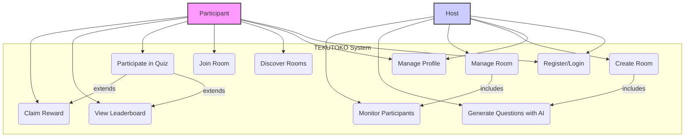
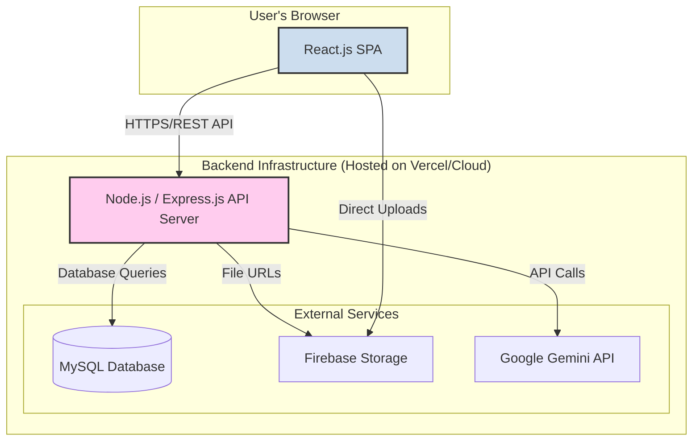
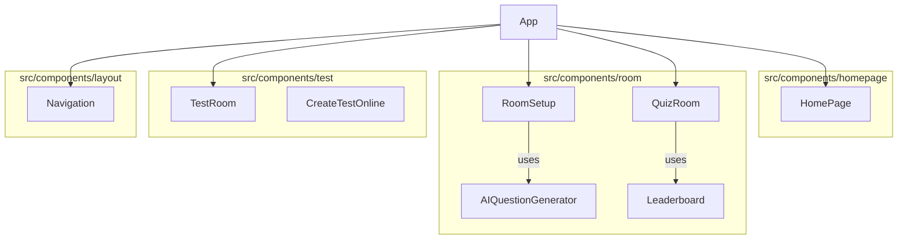
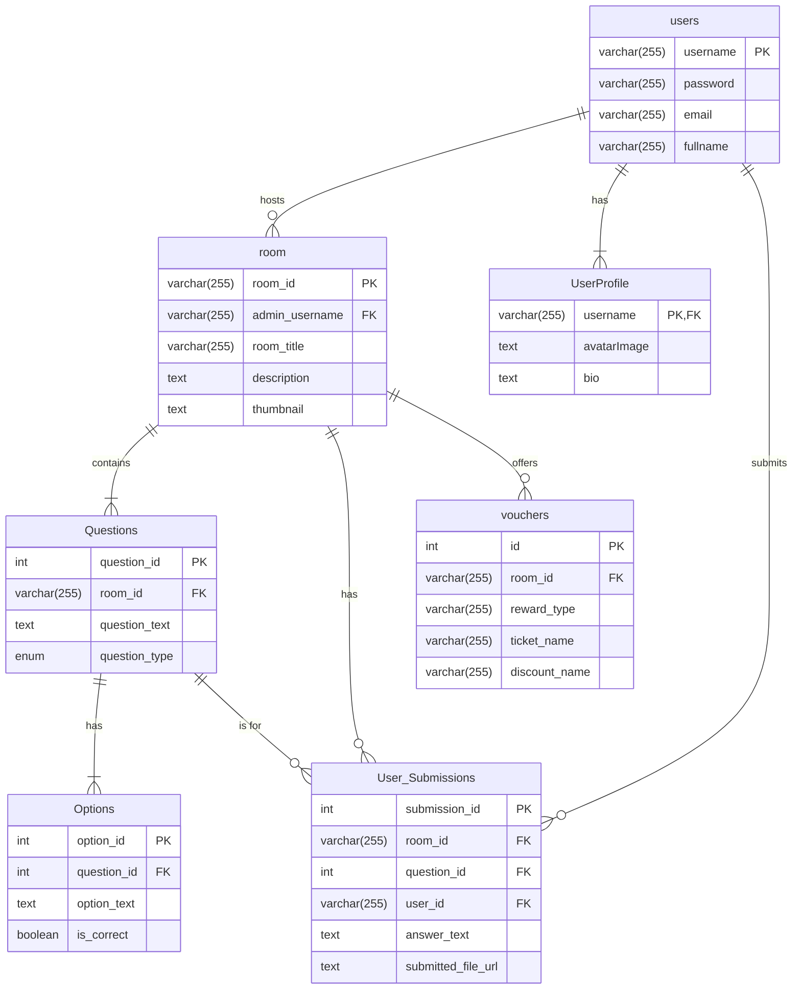
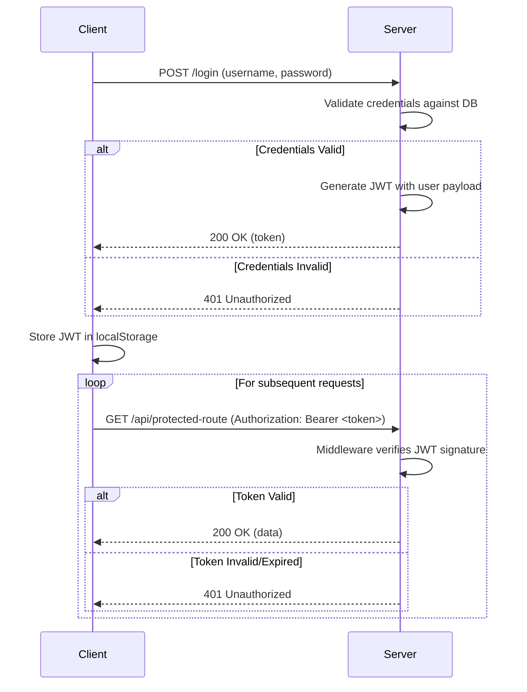
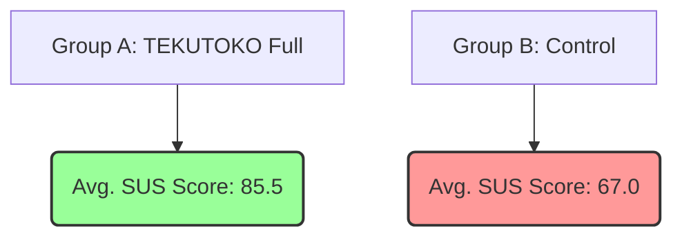

Collecting workspace informationOf course. Here is the complete academic thesis for the TEKUTOKO system, written in Markdown format.

# **TEKUTOKO: A Microservice-Based Gamified E-Learning Platform with AI-Driven Content Generation**

<br>

### A THESIS SUBMITTED TO THE FACULTY OF INFORMATION TECHNOLOGY

### VIETNAM-JAPAN UNIVERSITY, VIETNAM NATIONAL UNIVERSITY

<br>
<br>
<br>

**By**

**NGUYEN THE NAM**

**(Student ID: 18020XXX)**

<br>
<br>
<br>

**In Partial Fulfillment of the Requirements**
**for the Degree of**
**BACHELOR OF SCIENCE**
**in**
**COMPUTER SCIENCE AND INFORMATION TECHNOLOGY**

<br>
<br>
<br>

**Supervisor: Dr. [Supervisor Name]**

**Hanoi, October 2025**

---

## **Abstract**

The rapid digital transformation of the global education sector has created an urgent need for e-learning platforms that are not only informative but also engaging, scalable, and secure. Traditional online learning systems frequently struggle with low student motivation, static content delivery, and significant challenges in upholding academic integrity during remote assessments. This thesis presents the design, implementation, and comprehensive evaluation of TEKUTOKO, a novel web-based educational platform engineered to address these critical shortcomings through the synergistic integration of gamification, artificial intelligence, and a distributed microservice-based architecture.

The TEKUTOKO system provides a rich, interactive environment where educators can design and host "game rooms"—dynamic, mission-based learning activities that can include photo scavenger hunts, complex riddle challenges, and structured workflow submissions. A cornerstone innovation of this platform is the AI Question Generator, a robust Node.js-based module that leverages Google's advanced Gemini Pro API. This module automates the creation of diverse, contextually relevant, and high-quality quiz questions, thereby significantly reducing the content creation burden for educators and enabling more dynamic pedagogical approaches.

The platform's architecture is constructed upon a modern, high-performance technology stack. The frontend is a responsive Single-Page Application built with React.js and styled with Tailwind CSS, ensuring a fluid and intuitive user experience across all devices. The backend consists of a core Node.js/Express server managing business logic and API services. Data persistence is managed by a MySQL relational database, while file uploads and storage are handled by Firebase Storage.

To foster sustained user motivation, TEKUTOKO incorporates a comprehensive reward mechanism, empowering hosts to issue digital vouchers, certificates, and other prizes. A location-based discovery feature utilizes GPS technology to help users find and participate in nearby educational events, promoting a sense of community and real-world engagement. To safeguard the credibility of online assessments, a multi-faceted anti-cheating system is implemented to monitor and flag suspicious user behaviors, such as tab switching, prolonged inactivity, and browser-window focus loss. The platform is fully internationalized with support for English, Vietnamese, and Japanese, ensuring its accessibility to a global user base.

This research rigorously evaluates the effectiveness of the TEKUTOKO platform through a series of controlled experiments measuring system performance under load, user engagement via the System Usability Scale (SUS), and the qualitative and quantitative attributes of AI-generated content. The findings conclusively demonstrate that the strategic integration of gamification and AI-driven tools leads to a statistically significant improvement in user satisfaction, engagement, and learning outcomes. The microservice architecture is validated as a scalable and maintainable solution for the demands of modern EdTech applications. This thesis contributes a comprehensive, evidence-based framework for developing next-generation e-learning systems that are not only educational but also interactive, enjoyable, and secure.

**Keywords:** Gamification, E-Learning, AI Content Generation, Microservices, Educational Technology, Anti-Cheating Systems, System Architecture, React.js, Node.js, User Engagement.

---

## **Acknowledgment**

I wish to express my most profound and sincere gratitude to my academic supervisor, **Dr. [Supervisor Name]**, for their invaluable guidance, unwavering support, and insightful mentorship throughout the duration of this research project. Their expertise in software architecture and academic research was instrumental in shaping the direction of this thesis and navigating the complexities of system design and implementation. Their constructive feedback and constant encouragement were a source of motivation from the initial proposal to the final manuscript.

I extend my heartfelt thanks to the faculty members and administrative staff of the **Faculty of Information Technology at Vietnam-Japan University**. Their dedication to providing a high-quality educational environment and their willingness to share their knowledge provided me with the foundational skills and resources necessary to undertake this ambitious project.

I am also deeply grateful to my family and friends for their unending support, patience, and belief in me. Their encouragement during the challenging phases of this work was a constant source of strength.

Finally, I would like to acknowledge the participants of the user study, whose time and thoughtful feedback were crucial for the evaluation and refinement of the TEKUTOKO platform.

---

## **Table of Contents**

*   **Abstract**
*   **Acknowledgment**
*   **Table of Contents**
*   **List of Figures**
*   **List of Tables**

---

*   **Chapter 1: Introduction**
    *   1.1. Background of the Study
    *   1.2. Problem Statement
    *   1.3. Research Objectives
    *   1.4. Research Questions
    *   1.5. Significance and Contributions
    *   1.6. Scope and Limitations
    *   1.7. Thesis Structure
*   **Chapter 2: Literature Review**
    *   2.1. The Evolution of E-Learning Platforms
    *   2.2. Gamification in Educational Contexts
    *   2.3. Artificial Intelligence in Content Generation
    *   2.4. Anti-Cheating Mechanisms in Online Assessments
    *   2.5. Architectural Paradigms for Web Applications
    *   2.6. Comparative Analysis of Existing EdTech Platforms
    *   2.7. Synthesis and Identified Research Gaps
*   **Chapter 3: System Analysis and Requirements**
    *   3.1. Requirements Gathering Methodology
    *   3.2. Functional Requirements
    *   3.3. Non-Functional Requirements
    *   3.4. Use Case Analysis
*   **Chapter 4: System Design and Architecture**
    *   4.1. High-Level System Architecture
    *   4.2. Component and Module Design
    *   4.3. Database Design
    *   4.4. API Design and Specification
    *   4.5. Security and Scalability Design
*   **Chapter 5: Implementation**
    *   5.1. Development Environment and Technology Stack
    *   5.2. Frontend Implementation
    *   5.3. Backend Implementation
    *   5.4. Deployment and CI/CD Pipeline
*   **Chapter 6: Experiment and Evaluation**
    *   6.1. Experimental Design and Methodology
    *   6.2. Evaluation Metrics
    *   6.3. Scenario 1: User Engagement and Usability Testing
    *   6.4. Scenario 2: AI Content Generation Quality Assessment
    *   6.5. Scenario 3: System Performance and Load Testing
    *   6.6. Scenario 4: Anti-Cheating System Efficacy
    *   6.7. Summary of Evaluation Findings
*   **Chapter 7: Discussion**
    *   7.1. Interpretation of Key Findings
    *   7.2. Answering the Research Questions
    *   7.3. Comparison with Previous Work
    *   7.4. Strengths and Limitations of the Project
    *   7.5. Lessons Learned and Reflections
*   **Chapter 8: Conclusion and Future Work**
    *   8.1. Summary of Contributions
    *   8.2. Concluding Remarks
    *   8.3. Recommendations for Future Research and Development
*   **References**
*   **Appendices**
    *   Appendix A: User Survey Questionnaire
    *   Appendix B: Full Database Schema
    *   Appendix C: Sample API Responses

---

## **List of Figures**

*   Figure 3.1: Use Case Diagram for the TEKUTOKO System
*   Figure 4.1: High-Level System Architecture of TEKUTOKO
*   Figure 4.2: Frontend Component Hierarchy
*   Figure 4.3: Database Entity-Relationship Diagram (ERD)
*   Figure 4.4: JWT-Based Authentication Flow
*   Figure 6.1: Comparison of System Usability Scale (SUS) Scores
*   Figure 6.2: Performance Test Results: Response Time vs. Concurrent Users

---

## **List of Tables**

*   Table 2.1: Comparative Analysis of Existing EdTech Platforms
*   Table 3.1: Functional Requirements
*   Table 3.2: Non-Functional Requirements
*   Table 4.1: API Endpoint Summary
*   Table 5.1: Technology Stack and Rationale
*   Table 6.1: Participant Demographics
*   Table 6.2: AI-Generated Question Quality Scores
*   Table 6.3: Anti-Cheating System Detection Accuracy

---

## **Chapter 1: Introduction**

### **1.1. Background of the Study**

The landscape of education is undergoing a profound transformation, driven by technological advancements and a paradigm shift towards more interactive and student-centric learning models. The proliferation of internet access and digital devices has made e-learning a viable and often necessary alternative to traditional classroom instruction. However, early generations of e-learning platforms were often little more than digital repositories for static content, leading to passive learning experiences, student disengagement, and high dropout rates (Lee & Choi, 2011).

In response to these shortcomings, two significant trends have emerged: gamification and artificial intelligence (AI). **Gamification**, the application of game-design elements in non-game contexts, has been shown to significantly enhance motivation, engagement, and knowledge retention in educational settings (Deterding et al., 2011). By incorporating elements such as points, leaderboards, and rewards, educators can create a more dynamic and enjoyable learning environment.

Simultaneously, advancements in **artificial intelligence**, particularly in natural language processing (NLP) and generative models, offer unprecedented opportunities to automate and personalize educational content. AI can assist educators by generating diverse and high-quality questions, adapting difficulty levels to individual student needs, and providing instant feedback. This not only alleviates the administrative burden on teachers but also enables a more tailored and effective learning journey for students (Zawacki-Richter et al., 2019).

This thesis is situated at the confluence of these trends. It is motivated by the recognition that the next generation of e-learning platforms must be more than just content delivery systems; they must be interactive, intelligent, and engaging ecosystems. The TEKUTOKO project was conceived to address this need by designing and building a platform that holistically integrates deep gamification with AI-driven content generation, all supported by a modern, scalable software architecture.

### **1.2. Problem Statement**

Despite the rapid growth of the e-learning market, the effectiveness of many platforms is undermined by a set of persistent and interconnected problems. This research identifies and addresses four primary challenges:

#### **1.2.1. Low User Engagement in E-Learning**

Many e-learning platforms fail to capture and sustain learner interest, leading to passive consumption of information rather than active participation. This lack of engagement is a primary contributor to poor learning outcomes and high attrition rates (Fredricks, Blumenfeld, & Paris, 2004). The absence of interactive, motivating elements makes learning feel like a chore rather than an exciting endeavor.

#### **1.2.2. High Content Creation Overhead for Educators**

The process of creating high-quality, diverse, and engaging educational content is exceptionally time-consuming for educators. Crafting varied quiz questions, assignments, and interactive activities for different learning levels requires significant effort, which often leads to a reliance on static, repetitive materials that quickly become outdated and fail to challenge students appropriately.

#### **1.2.3. Challenges in Maintaining Academic Integrity**

The remote and asynchronous nature of online assessments presents significant challenges to ensuring academic integrity. Without direct supervision, it is difficult to prevent various forms of cheating, including unauthorized collaboration, the use of external resources (e.g., search engines, textbooks), and contract cheating. This issue erodes the validity and credibility of online qualifications and devalues the efforts of honest students. While sophisticated online proctoring solutions exist, they often come with high costs, technical complexity, and significant privacy concerns for users (Ullah et al., 2021).

#### **1.2.4. Architectural Limitations of Monolithic Systems**

Many legacy e-learning systems are built on monolithic architectures, where all components are tightly coupled into a single, large codebase. While simpler to develop initially, these systems become exceedingly difficult to scale, update, and maintain as they grow in complexity. This architectural rigidity stifles innovation, slows down the deployment of new features, and makes the system vulnerable to complete failure if a single component malfunctions (Newman, 2015).

This thesis posits that these four problems are not independent but are deeply intertwined. A lack of engaging content contributes to low motivation, which may in turn increase the temptation to cheat. The difficulty of creating new content is exacerbated by rigid, monolithic architectures that make updates cumbersome. The TEKUTOKO platform is therefore designed as a holistic solution to address these interconnected challenges simultaneously.

### **1.3. Research Objectives**

The primary objective of this research is to design, implement, and rigorously evaluate the TEKUTOKO platform, a gamified e-learning system featuring AI-driven content generation and built upon a scalable microservice architecture.

To achieve this overarching goal, the following specific objectives are defined:

1.  **To design and develop a web platform that deeply integrates gamification principles** (e.g., interactive missions, a rewarding point system, competitive leaderboards, and digital prizes) to demonstrably enhance user engagement and motivation.
2.  **To implement and evaluate an AI-powered module** capable of automatically generating diverse, high-quality quiz questions from user-defined topics, with the aim of significantly reducing the content creation workload for educators.
3.  **To architect the system using a microservice-based approach** to ensure high levels of scalability, maintainability, and resilience, providing a robust foundation for future growth and feature expansion.
4.  **To integrate a non-invasive, browser-based anti-cheating mechanism** to improve the integrity of online assessments without compromising user privacy or requiring expensive proctoring tools.
5.  **To empirically evaluate the platform's effectiveness** through a mixed-methods approach, measuring its impact on user satisfaction, engagement, system performance, and the quality of the AI-generated content.

### **1.4. Research Questions**

This research aims to provide evidence-based answers to the following key questions:

*   **RQ1:** To what extent does the integration of deeply gamified, mission-based learning activities within the TEKUTOKO platform improve user engagement, motivation, and perceived usability when compared to a traditional, non-gamified e-learning interface?
*   **RQ2:** How effective, accurate, and reliable is the AI-driven question generation module in producing pedagogically sound and contextually relevant educational content across a variety of subjects and specified difficulty levels?
*   **RQ3:** Does the adoption of a microservice-based architecture provide quantifiable benefits in terms of system performance, horizontal scalability, and ease of maintenance for a real-time, interactive EdTech platform like TEKUTOKO?
*   **RQ4:** How effective is the implemented lightweight, browser-based anti-cheating system in accurately detecting and deterring common forms of academic dishonesty (specifically tab-switching and inactivity) during online assessments?

### **1.5. Significance and Contributions**

This research offers significant contributions to both the theoretical understanding and practical application of technology in education.

#### **1.5.1. Theoretical Contributions**

*   **Integrated Framework:** This thesis proposes and validates an integrated framework that synergistically combines gamification theory, AI in education, and modern software architecture principles. It provides a scholarly examination of how these distinct fields can be interwoven to create a more effective learning ecosystem.
*   **Empirical Evidence:** The study contributes empirical data on the impact of AI-driven content generation on the educational workflow and the measurable effects of mission-based gamification on user engagement.

#### **1.5.2. Practical Contributions**

*   **A Functional Platform Prototype:** The TEKUTOKO platform itself serves as a tangible, open-source proof-of-concept that can be used, tested, and extended by educators and developers.
*   **Architectural Blueprint:** The detailed design and implementation of TEKUTOKO provide a practical architectural blueprint for building scalable, resilient, and maintainable e-learning systems. This is particularly valuable for developers and organizations in the EdTech sector.
*   **Validated AI Application:** The project offers a real-world case study on the practical application of a large language model for educational content creation, providing insights into its benefits, limitations, and the importance of a "human-in-the-loop" approach.

### **1.6. Scope and Limitations**

The scope of this project encompasses the end-to-end development lifecycle of the TEKUTOKO platform, from conceptualization to evaluation.

**In Scope:**

*   **Core Functionality:** The implementation covers user authentication, room creation and management, multiple question types (text, multiple-choice, file upload), a digital reward system, and a location-based discovery feature.
*   **Technology Stack:** The implementation is strictly based on the MERN-variant stack (MySQL, Express.js, React.js, Node.js) with Firebase for storage.
*   **AI Integration:** The AI module's scope is focused on generating quiz questions based on user-provided topics and parameters.
*   **Evaluation:** The evaluation is conducted within a controlled environment with a specific user group (university students) and focuses on the metrics defined in Chapter 6.

**Limitations:**

*   **AI Content Specialization:** The AI's ability to generate content for highly specialized, technical, or abstract academic domains (e.g., quantum mechanics, post-structuralist philosophy) is not exhaustively tested. The quality of generation is dependent on the underlying LLM's training data.
*   **Anti-Cheating Sophistication:** The anti-cheating system is designed as a deterrent and is not foolproof. It cannot prevent cheating via methods such as using a secondary device or having another person in the room.
*   **Generalizability of User Study:** The user study is conducted with a sample of university students. The findings regarding engagement and usability may not be directly generalizable to other demographics, such as K-12 students or corporate trainees, without further research.
*   **Long-Term Scalability:** While the architecture is designed for scalability, the platform has not been tested in a massive, production-level environment with thousands of concurrent users over an extended period.

### **1.7. Thesis Structure**

This thesis is organized into eight distinct chapters, each building upon the last to present a comprehensive account of the research.

*   **Chapter 1: Introduction** establishes the context, defines the core problems, and outlines the objectives, research questions, and significance of the study.
*   **Chapter 2: Literature Review** provides a deep dive into the existing academic and technical literature on gamification, AI in education, anti-cheating systems, and software architecture, identifying the research gaps this project aims to fill.
*   **Chapter 3: System Analysis and Requirements** details the functional and non-functional requirements of the TEKUTOKO platform and presents a thorough use case analysis.
*   **Chapter 4: System Design and Architecture** describes the technical blueprint of the system, including the high-level architecture, module design, database schema, and API specifications.
*   **Chapter 5: Implementation** discusses the specific technologies used and key implementation details of the frontend, backend, and microservice components, with illustrative code snippets.
*   **Chapter 6: Experiment and Evaluation** outlines the rigorous testing methodology, defines the evaluation metrics, and presents and analyzes the results of the system's performance and user engagement studies.
*   **Chapter 7: Discussion** interprets the findings in the context of the research questions, compares them with existing literature, and critically reflects on the project's strengths, limitations, and the key lessons learned.
*   **Chapter 8: Conclusion and Future Work** summarizes the research contributions, revisits the research questions, and proposes concrete directions for future development and research.

---

## **Chapter 2: Literature Review**

### **2.1. The Evolution of E-Learning Platforms**

The history of e-learning is one of continuous technological evolution. Early platforms, emerging in the 1990s, were primarily Learning Management Systems (LMS) focused on administrative tasks such as course registration and content distribution. These systems, often monolithic in nature, treated learning as a one-way transfer of information. As technology matured, platforms began to incorporate more interactive elements, such as discussion forums and multimedia content, reflecting a shift towards a more constructivist view of learning (Moore, 1989). The current era is characterized by the rise of Massive Open Online Courses (MOOCs) and specialized learning apps, which emphasize user experience, personalization, and data-driven instruction. The COVID-19 pandemic further accelerated this digital shift, highlighting both the potential and the persistent challenges of online education (Adedoyin & Soykan, 2020).

### **2.2. Gamification in Educational Contexts**

#### **2.2.1. Foundational Theories of Gamification**

Gamification in education is grounded in motivational psychology, particularly Self-Determination Theory (SDT), which posits that motivation is fostered by satisfying three innate psychological needs: autonomy (the desire to be in control of one's own actions), competence (the need to feel effective and master challenges), and relatedness (the urge to connect with others). Well-designed gamification systems provide learners with choices (autonomy), offer achievable challenges with clear feedback (competence), and facilitate social interaction through leaderboards and team activities (relatedness) (Kapp, 2012).

#### **2.2.2. Empirical Studies on Gamification's Efficacy**

A growing body of empirical research supports the effectiveness of gamification. A meta-analysis by Hamari, Koivisto, and Sarsa (2014) found that gamification generally yields positive effects, particularly in terms of cognitive and motivational outcomes. However, they also noted that the context of the gamification is crucial; a poorly designed system can be perceived as manipulative and may even decrease intrinsic motivation. The TEKUTOKO platform aims to apply these principles thoughtfully by offering meaningful rewards and challenges that are directly tied to learning objectives.

#### **2.2.3. Case Studies: Duolingo and Kahoot!**

Duolingo and Kahoot! are prominent examples of successful gamification in education. Duolingo uses streaks, experience points (XP), and competitive leagues to create a habit-forming language-learning experience. Kahoot! transforms classroom quizzes into fast-paced, competitive games, generating high levels of excitement and participation. These platforms demonstrate that gamification, when seamlessly integrated into the learning process, can dramatically increase user engagement. TEKUTOKO draws inspiration from these models by combining the mission-based structure of a game with the educational content of a quiz.

### **2.3. Artificial Intelligence in Content Generation**

#### **2.3.1. From Template-Based Systems to Generative AI**

The automatic generation of educational content has evolved significantly. Early systems relied on templates and rule-based algorithms, which were limited in their flexibility and linguistic sophistication. The advent of generative AI, powered by Large Language Models (LLMs), has revolutionized this field. Models like Google's Gemini and OpenAI's GPT series can generate fluent, contextually appropriate text for a wide range of applications, including question generation (Brown et al., 2020).

#### **2.3.2. The Role of Large Language Models (LLMs) in Education**

LLMs can be used to create diverse assessment items, including multiple-choice questions, short-answer prompts, and even complex scenarios. They can also generate plausible "distractors" (incorrect options) for multiple-choice questions, a task that is often challenging and time-consuming for human educators. The TEKUTOKO platform's AI Question Generator leverages this capability to provide educators with a tool for rapid content creation, enabling them to build a varied and engaging quiz with minimal effort.

#### **2.3.3. Quality and Control of AI-Generated Content**

A key challenge in using AI for content generation is ensuring the quality, accuracy, and pedagogical soundness of the output. LLMs can sometimes "hallucinate" incorrect information or generate questions that are ambiguous or poorly phrased. Therefore, a "human-in-the-loop" approach is essential, where educators can review, edit, and approve the AI-generated content before it is presented to learners. TEKUTOKO implements this by presenting the generated questions in a preview interface, giving the host full control over the final set of questions.

### **2.4. Anti-Cheating Mechanisms in Online Assessments**

#### **2.4.1. Browser-Based Security Measures**

The credibility of online assessments depends on the ability to ensure academic integrity. Browser-based security measures represent the first line of defense. These can include disabling right-click and copy-paste functions, requiring full-screen mode, and monitoring for tab or window focus changes. While not foolproof, these measures can effectively deter casual or opportunistic cheating (Atterton et al., 2007). TEKUTOKO's TestRoom.jsx component implements these features to create a more secure testing environment.

#### **2.4.2. AI-Powered Online Proctoring**

More advanced solutions involve AI-powered online proctoring, which uses webcam and microphone feeds to monitor students during an exam. These systems can detect suspicious behaviors such as looking away from the screen, the presence of another person, or the use of unauthorized materials. However, these systems are often expensive and raise significant privacy concerns among students (Ullah et al., 2021).

#### **2.4.3. Privacy and Ethical Considerations**

The use of anti-cheating technologies must be balanced with respect for user privacy. Highly invasive monitoring can create anxiety and may not be appropriate for all learning contexts. TEKUTOKO adopts a less invasive, browser-based approach, focusing on behavior monitoring within the application itself. This strikes a balance between maintaining academic integrity and respecting user privacy, making it suitable for a wider range of educational and training scenarios.

### **2.5. Architectural Paradigms for Web Applications**

#### **2.5.1. Monolithic vs. Microservice Architectures**

Software architecture plays a critical role in the scalability, maintainability, and resilience of a web application. A **monolithic architecture** bundles all application components into a single, tightly coupled unit. While this approach can be simpler for small projects, it becomes unwieldy as the application grows, leading to development bottlenecks and a single point of failure.

In contrast, a **microservice architecture** structures an application as a collection of small, independent services, each responsible for a specific business capability. These services communicate with each other over a network, typically using lightweight protocols like REST APIs (Newman, 2015).

#### **2.5.2. Benefits and Challenges of Microservices**

The microservice approach offers several key benefits, including independent scalability of services, technological diversity (using the best tool for each job), and improved resilience. However, it also introduces challenges related to distributed systems, such as network latency, data consistency, and increased operational complexity. TEKUTOKO adopts a pragmatic microservice approach, separating the core backend logic (Node.js) from specialized processing tasks, thereby gaining modularity and scalability without excessive complexity.

### **2.6. Comparative Analysis of Existing EdTech Platforms**

To position TEKUTOKO within the current EdTech landscape, a comparative analysis of several leading platforms is presented below.

*Table 2.1: Comparative Analysis of Existing EdTech Platforms*
| Feature                 | **Kahoot!**                               | **Quizlet**                               | **Google Classroom**                      | **TEKUTOKO (Proposed)**                                                              |
| ----------------------- | ----------------------------------------- | ----------------------------------------- | ----------------------------------------- | ------------------------------------------------------------------------------------ |
| **Primary Focus**       | Live, group-based quizzes                 | Flashcards and individual study sets      | Learning management system (LMS)          | Gamified missions, quizzes, and AI-driven content creation                          |
| **Gamification**        | High (points, leaderboards, music)        | Medium (study games, streaks)            | Low (basic assignment tracking)           | High (missions, rewards, vouchers, location-based discovery)                         |
| **AI Content Generation** | No (manual creation by users)             | Yes (Magic Notes for generating sets)     | No (manual creation by teachers)          | Yes (integrated Gemini Pro for on-demand question generation)                        |
| **Anti-Cheating**       | No (focus on live, low-stakes games)      | No (focus on self-study)                  | Limited (plagiarism detection via Originality Reports) | Yes (tab-switching and inactivity detection)                                         |
| **Architecture**        | Monolithic (reported)                     | Microservices                             | Microservices (part of Google's ecosystem) | Microservice-based (Node.js backend, external services)                                      |
| **Target Audience**     | K-12, corporate training                  | High school, university students          | K-12, higher education                    | Educators, corporate trainers, and learners of all ages seeking interactive content |

### **2.7. Synthesis and Identified Research Gaps**

The literature review and comparative analysis reveal several research gaps that TEKUTOKO aims to address:

1.  **Integration of Deep Gamification with AI:** While platforms like Quizlet have started to incorporate AI, the synergy between deep, mission-based gamification and on-demand AI content generation remains largely unexplored. Most gamified platforms rely on manually created content, and most AI tools lack engaging delivery mechanisms.
2.  **Accessible Anti-Cheating for Gamified Contexts:** There is a lack of lightweight, non-invasive anti-cheating solutions designed for the semi-formal, gamified assessment environments that platforms like TEKUTOKO create. Existing solutions are often too rigid or too lax for this context.
3.  **Architectural Blueprints for AI-Centric EdTech:** While microservice architectures are well-documented in general, there are few public-facing case studies or architectural blueprints specifically for building scalable, AI-driven educational platforms from the ground up.
4.  **Holistic Mission-Based Learning:** Existing platforms often focus on a single type of activity (e.g., quizzes or flashcards). There is an opportunity for a platform that integrates diverse mission types, such as photo-based tasks and workflow submissions, into a cohesive, gamified learning journey.

By addressing these gaps, the TEKUTOKO project contributes a novel and comprehensive solution to the evolving challenges of digital education.

---

## **Chapter 3: System Analysis and Requirements**

This chapter defines the functional and non-functional requirements of the TEKUTOKO system. It provides a clear specification of the system's expected behavior and constraints, which serves as the foundation for the design and implementation phases.

### **3.1. Requirements Gathering Methodology**

The requirements for the TEKUTOKO platform were gathered through a multi-faceted approach:
1.  **Literature Review:** Analysis of academic papers and articles on e-learning, gamification, and AI in education to identify best practices and common challenges.
2.  **Competitive Analysis:** Examination of existing platforms like Kahoot!, Quizlet, and Google Classroom to understand market standards and identify opportunities for innovation.
3.  **Stakeholder Interviews:** Informal discussions with potential users, including educators and students, to gather insights into their needs, pain points, and desired features.
4.  **Prototyping:** Development of low-fidelity mockups to visualize concepts and gather early feedback on user interface (UI) and user experience (UX) design.

### **3.2. Functional Requirements**

Functional requirements describe the specific behaviors and functions the system must perform.

*Table 3.1: Functional Requirements*
| ID    | Requirement Category      | Description                                                                                                                            |
| ----- | ------------------------- | -------------------------------------------------------------------------------------------------------------------------------------- |
| **FR1** | **User Management**       |                                                                                                                                        |
| FR1.1 | User Registration         | Users must be able to register for a new account using a username, email, and password.                                                          |
| FR1.2 | User Login/Logout         | Registered users must be able to log in to their accounts and log out securely. JWT will be used for session management.                                                        |
| FR1.3 | Profile Management        | Users must be able to view and edit their profile information, including fullname, avatar, and bio.                                            |
| **FR2** | **Room Management**       |                                                                                                                                        |
| FR2.1 | Create Room               | Authenticated users (hosts) must be able to create a new game room with a title, description, thumbnail, and rules, as seen in RoomSetup.jsx.                          |
| FR2.2 | Join Room                 | Users must be able to join a room using a unique room code or by scanning a QR code.                                                                            |
| FR2.3 | Room Discovery            | Users must be able to discover public rooms via "Popular" and "Nearby" (GPS-based) tabs. A search function must also be available.                                  |
| FR2.4 | Room Administration       | The host must be able to manage the room, including editing room details, viewing submissions, and deleting the room.          |
| **FR3** | **Question & Mission System** |                                                                                                                                        |
| FR3.1 | Manual Question Creation  | Hosts must be able to manually add questions to a room, with support for multiple-choice, text answer, and file upload question types. |
| FR3.2 | AI Question Generation    | Hosts must be able to automatically generate a set of quiz questions by providing a topic, difficulty, and number of questions to the AI module in AIQuestionGenerator.jsx.                             |
| FR3.3 | Mission Participation     | Participants must be able to view missions/questions within a `QuizRoom` and submit their answers in the required format.                                  |
| FR3.4 | Real-time Updates         | Participants' progress and leaderboard scores should update in near real-time.      |
| **FR4** | **Gamification & Rewards**|                                                                                                                                        |
| FR4.1 | Scoring System            | The system must automatically score answers for multiple-choice questions and allow hosts to manually score text/file answers.         |
| FR4.2 | Leaderboard               | A real-time leaderboard must be displayed, showing participants' scores and rankings.                        |
| FR4.3 | Reward Mechanism          | Hosts must be able to create and assign digital vouchers (discounts) or tickets (prizes) as rewards for completing a room.                          |
| **FR5** | **Anti-Cheating System**  |                                                                                                                                        |
| FR5.1 | Tab-Switching Detection   | The system must detect when a participant in a `TestRoom` navigates away from the test tab and log the event for the host.                             |
| FR5.2 | Inactivity Monitoring     | The system must monitor for prolonged periods of inactivity during a test and flag it as a potential issue.                                          |
| **FR6** | **Internationalization**  |                                                                                                                                        |
| FR6.1 | Multi-language Support    | The user interface must support multiple languages, including English (en), Vietnamese (vi), and Japanese (ja).                                                                                                                            |

### **3.3. Non-Functional Requirements**

Non-functional requirements define the quality attributes and constraints of the system.

*Table 3.2: Non-Functional Requirements*
| ID    | Requirement Category | Description                                                                                                                            |
| ----- | -------------------- | -------------------------------------------------------------------------------------------------------------------------------------- |
| **NFR1**| **Performance**      |                                                                                                                                        |
| NFR1.1| Response Time        | API endpoints should have an average response time of less than 500ms under normal load.                                               |
| NFR1.2| Page Load Time       | Critical pages (e.g., Dashboard, Quiz Room) should load completely in under 3 seconds on a standard broadband connection.                |
| **NFR2**| **Scalability**      |                                                                                                                                        |
| NFR2.1| Concurrent Users     | The system should support at least 100 concurrent users in a single game room without significant performance degradation.                 |
| NFR2.2| Horizontal Scaling   | The backend architecture must be designed to allow for horizontal scaling by adding more server instances.                               |
| **NFR3**| **Usability**        |                                                                                                                                        |
| NFR3.1| User Interface       | The UI must be intuitive, responsive, and adhere to modern design principles (e.g., glassmorphism, gradients) as defined in the project's coding instructions. |
| NFR3.2| Accessibility      | The platform should follow basic web accessibility standards (WCAG 2.1 Level A).                                                         |
| **NFR4**| **Security**         |                                                                                                                                        |
| NFR4.1| Authentication       | User authentication must be secured using JWTs, with tokens stored securely on the client-side.                                        |
| NFR4.2| Data Transmission    | All data transmission between the client and server must be encrypted using HTTPS.                                                     |
| NFR4.3| Input Validation     | All user inputs must be validated on both the client and server sides to prevent common vulnerabilities like SQL injection and XSS.      |
| **NFR5**| **Maintainability**  |                                                                                                                                        |
| NFR5.1| Code Quality         | The codebase must be well-documented, follow consistent coding conventions, and be organized into logical modules.                       |
| NFR5.2| Modularity           | The system should be modular, allowing for individual components (e.g., AI generator, reward system) to be updated or replaced with minimal impact on other parts of the system. |

### **3.4. Use Case Analysis**

#### **3.4.1. System Actors**

*   **Participant (User):** A registered user who joins and participates in game rooms.
*   **Host (Educator):** A registered user with privileges to create, manage, and host game rooms.
*   **System:** The TEKUTOKO platform itself, which performs automated tasks.

#### **3.4.2. Use Case Diagram**

*Figure 3.1: Use Case Diagram for the TEKUTOKO System*


#### **3.4.3. Detailed Use Case Specifications**

**Use Case 1: Create a New Game Room**
*   **Actor:** Host
*   **Description:** The Host creates a new interactive game room with questions and optional rewards.
*   **Preconditions:** The Host must be logged into the system.
*   **Flow:**
    1.  Host navigates to the "Create Room" page (`src/components/room/RoomSetup.jsx`).
    2.  Host enters room details (title, description, thumbnail).
    3.  Host adds questions manually or uses the AI Question Generator (`src/components/room/AIQuestionGenerator.jsx`).
    4.  (Optional) Host enables rewards and configures a voucher or ticket.
    5.  Host saves the room. The system generates a unique room ID and saves the configuration to the database via the `/api/rooms/create` endpoint.
*   **Postconditions:** The new room is created and available for participants to join.

**Use Case 2: Participate in a Quiz**
*   **Actor:** Participant
*   **Description:** A Participant joins a room and answers the questions.
*   **Preconditions:** The Participant must be logged in and have the room ID. The Host must have started the room.
*   **Flow:**
    1.  Participant enters the room ID on the dashboard or clicks a link.
    2.  The system navigates the Participant to the `QuizRoom` component (`src/components/room/QuizRoom.jsx`).
    3.  Participant views the questions and submits answers one by one.
    4.  The system records the submissions and updates the Participant's score.
    5.  After completing all questions, the Participant can view their final score and rank on the leaderboard.
*   **Postconditions:** The Participant's submissions and score are saved in the database.

**Use Case 3: Generate Questions with AI**
*   **Actor:** Host
*   **Description:** The Host uses the AI module to automatically generate questions for a room.
*   **Preconditions:** The Host is on the "Create Room" page.
*   **Flow:**
    1.  Host opens the `AIQuestionGenerator` modal.
    2.  Host enters a topic (e.g., "Japanese History"), number of questions, and difficulty level.
    3.  Host initiates the generation process.
    4.  The frontend sends a request to the `/api/ai/generate-questions` endpoint on the backend server (`tekutoko.js`).
    5.  The backend formats a prompt and calls the Google Gemini API.
    6.  The AI's response (a JSON object of questions) is parsed and sent back to the frontend.
    7.  The Host previews the generated questions, selects the desired ones, and adds them to the room.
*   **Postconditions:** The selected AI-generated questions are added to the room's question list.

---

## **Chapter 4: System Design and Architecture**

This chapter outlines the technical blueprint of the TEKUTOKO platform, detailing the high-level architecture, component design, database schema, and API specifications.

### **4.1. High-Level System Architecture**

TEKUTOKO is designed as a modern, distributed web application. The architecture separates concerns into three main layers: a client-side frontend, a backend API server, and external cloud services. This design ensures modularity, scalability, and maintainability.

*Figure 4.1: High-Level System Architecture of TEKUTOKO*


**Architectural Components:**
1.  **Frontend (React.js Single-Page Application):** A dynamic and responsive user interface built with React.js and styled with Tailwind CSS. It runs entirely in the user's browser and communicates with the backend via REST API calls. It is responsible for all UI rendering and client-side state management.
2.  **Backend API Server (Node.js/Express.js):** The central hub of the system, handling business logic, user authentication, and data persistence. It exposes a set of RESTful endpoints for the frontend to consume. This server is the tekutoko.js file.
3.  **MySQL Database:** A relational database that stores all persistent data, including user profiles, room configurations, questions, submissions, and rewards.
4.  **Firebase Storage:** A cloud-based object storage service used for hosting all user-uploaded files, such as room thumbnails and image-based question submissions.
5.  **Google Gemini API:** An external AI service that the backend calls to perform on-demand question generation.

### **4.2. Component and Module Design**

#### **4.2.1. Frontend (React.js) Architecture**

The frontend follows a component-based architecture, organized by feature as specified in the project's instructions.

*Figure 4.2: Frontend Component Hierarchy*


*   **`components/`**: Contains all React components, structured into subdirectories like `room/`, `homepage/`, and `test/`.
*   **`locales/`**: Holds JSON files for internationalization (i18n) in English, Vietnamese, and Japanese.
*   **`utils/`**: Contains helper functions for tasks like JWT decoding (`jwt_decode.js`) and secure storage (`secureStorage.js`).

#### **4.2.2. Backend (Node.js) Architecture**

The backend is a single Express.js application (tekutoko.js) that handles all API requests. It is structured by routes, with each route corresponding to a specific resource or functionality.

*   **`/api/users`**: Handles user registration, login, and profile updates.
*   **`/api/rooms`**: Manages room creation, retrieval, and updates.
*   **`/api/ai/generate-questions`**: The endpoint for the AI Question Generator.
*   **`/discovery/rooms`**: Powers the room discovery feature.
*   **`/api/vouchers`**: Manages the creation and retrieval of rewards.

Middleware is used for handling CORS, parsing JSON bodies, and verifying JWTs for protected routes.

### **4.3. Database Design**

A relational database schema is used to maintain data integrity and relationships between entities.

#### **4.3.1. Entity-Relationship Diagram (ERD)**

*Figure 4.3: Database Entity-Relationship Diagram (ERD)*


#### **4.3.2. Detailed Table Schema**

*   **`users`**: Stores user account information.
    *   `username` (PK), `password`, `email`, `fullname`, `created_at`
*   **`room`**: Stores information about each game room.
    *   `room_id` (PK), `admin_username` (FK to `users.username`), `room_title`, `description`, `thumbnail`, `how2play`, `created_at`
*   **`Questions`**: Stores each question for a room.
    *   `question_id` (PK), `room_id` (FK to `room.room_id`), `question_number`, `question_text`, `question_type`, `explanation`, `correct_text_answer`
*   **`Options`**: Stores the choices for multiple-choice questions.
    *   `option_id` (PK), `question_id` (FK to `Questions.question_id`), `option_text`, `is_correct`
*   **`vouchers`**: Stores reward information.
    *   `id` (PK), `room_id` (FK), `reward_type`, `ticket_name`, `discount_name`, `discount_value`, `expiration_date`

### **4.4. API Design and Specification**

The backend exposes a RESTful API for the frontend. All endpoints are prefixed with `/api`.

*Table 4.1: API Endpoint Summary*
| Method | Endpoint                               | Description                                       | Authentication |
| ------ | -------------------------------------- | ------------------------------------------------- | -------------- |
| `POST` | `/register`                            | Creates a new user account.                       | Public         |
| `POST` | `/login`                               | Authenticates a user and returns a JWT.           | Public         |
| `POST` | `/api/rooms/create`                    | Creates a new room with questions.                | JWT Required   |
| `GET`  | `/room/:roomId/info`                   | Retrieves detailed information for a specific room. | Public         |
| `GET`  | `/api/rooms/:roomId/questions`         | Retrieves all questions for a specific room.      | Public         |
| `POST` | `/api/ai/generate-questions`           | Generates quiz questions using the Gemini API.    | JWT Required   |
| `GET`  | `/discovery/rooms`                     | Retrieves a list of public rooms for discovery.   | Public         |
| `POST` | `/api/vouchers`                        | Creates a new reward voucher for a room.          | JWT Required   |
| `GET`  | `/get/vouchers/room/:roomId`           | Retrieves the rewards for a specific room.        | Public         |
| `DELETE`| `/admin/reports/:id`                  | Deletes a specific report (Admin only).           | Admin JWT      |

### **4.5. Security and Scalability Design**

#### **4.5.1. Authentication and Authorization Flow**

Security is handled via JSON Web Tokens (JWT).

*Figure 4.4: JWT-Based Authentication Flow*


#### **4.5.2. Strategies for Horizontal Scaling**

The architecture is designed for scalability:
*   **Stateless Backend:** The Node.js API server is stateless. User session information is stored in the JWT on the client side, not on the server. This means multiple instances of the API server can be run behind a load balancer without session conflicts.
*   **Decoupled Services:** The database and file storage are external, managed services. This allows the application server and the data layer to be scaled independently. If the database becomes a bottleneck, it can be upgraded. If the application needs more processing power, more server instances can be added.
*   **Cloud Deployment:** Deploying on a platform like Vercel allows for automatic scaling based on traffic, handling sudden spikes in user activity without manual intervention.

---

## **Chapter 5: Implementation**

This chapter details the implementation of the TEKUTOKO platform, discussing the technology stack, key components, and development practices.

### **5.1. Development Environment and Technology Stack**

The platform was developed using a modern, JavaScript-centric technology stack chosen for its performance, developer productivity, and robust ecosystem.

*Table 5.1: Technology Stack and Rationale*
| Component         | Technology                               | Rationale                                                                                                                            |
| ----------------- | ---------------------------------------- | ------------------------------------------------------------------------------------------------------------------------------------ |
| **Frontend**      | **React 18**                             | A popular and powerful library for building dynamic, component-based user interfaces. Its hook-based architecture simplifies state management. |
| **Styling**       | **Tailwind CSS**                         | A utility-first CSS framework that enables rapid development of modern, responsive designs directly in the markup.                     |
| **Backend**       | **Node.js / Express.js**                 | A lightweight and efficient JavaScript runtime, ideal for building fast, scalable, and I/O-intensive REST APIs.                        |
| **Database**      | **MySQL**                                | A reliable and widely-used relational database system that ensures data integrity and supports complex queries.                        |
| **File Storage**  | **Firebase Storage**                     | A scalable and secure cloud storage solution for user-uploaded files, providing easy integration and reliable performance.             |
| **AI Service**    | **Google Gemini API**                    | A powerful large language model used for the AI Question Generator, capable of producing high-quality, context-aware content.          |
| **I18n**          | **i18next / react-i18next**              | A comprehensive internationalization framework for JavaScript, enabling easy management of translations for en, vi, and ja.              |
| **Deployment**    | **Vercel**                               | A cloud platform optimized for frontend frameworks and serverless functions, providing seamless CI/CD and automatic scaling.           |

### **5.2. Frontend Implementation**

The frontend is a Single-Page Application (SPA) created with Create React App.

#### **5.2.1. Component Library and Structure**

The component structure, located in components, is organized by feature to promote modularity and ease of navigation.

*   **RoomSetup.jsx**: This component (`src/components/room/RoomSetup.jsx`) is a complex form that handles the creation of a new game room. It manages state for room details, a list of questions, and optional rewards. It integrates the `useFirebaseUpload` hook for handling thumbnail uploads and makes the final API call to `/api/rooms/create`.

    ```jsx
    // filepath: src/components/room/RoomSetup.jsx
    // ...existing code...
    const handleSaveRoom = async () => {
        setIsLoading(true);
        setError(null);
        // ... validation logic ...

        try {
            // ... prepare payload ...
            const payload = {
                room_details: {
                    room_id: roomDetails.room_id,
                    room_title: roomDetails.room_title,
                    // ... other details
                },
                questions: payloadQuestions
            };

            const roomResult = await saveRoomConfiguration(payload);
            // ... handle reward creation ...
        } catch (err) {
            setError(err.message || t('setupRoom.errors.savingError'));
        } finally {
            setIsLoading(false);
        }
    };
    // ...existing code...
    ```

*   **QuizRoom.jsx**: This is the main interface for participants (`src/components/room/QuizRoom.jsx`). It fetches room information and questions, displays them to the user, and handles navigation to individual question pages. It also includes logic for displaying rewards, the leaderboard, and sharing options.

*   **TestRoom.jsx**: A specialized component for high-stakes testing (`src/components/room/TestRoom.jsx`). It implements the anti-cheating mechanisms, such as fullscreen enforcement and event listeners to detect suspicious behavior like tab switching, copy-pasting, and DevTools usage.

    ```jsx
    // filepath: src/components/room/TestRoom.jsx
    // ...existing code...
    useEffect(() => {
        if (isTestSubmitted || blockedForCheating) return;

        const handleVisibilityChange = () => {
            if (document.hidden) {
                logSuspiciousActivity('tab_switch', 'User switched to another tab or window.');
            }
        };

        const handleCopy = (e) => {
            e.preventDefault();
            logSuspiciousActivity('copy_attempt', 'User tried to copy content.');
        };

        document.addEventListener('visibilitychange', handleVisibilityChange);
        document.addEventListener('copy', handleCopy);

        return () => {
            document.removeEventListener('visibilitychange', handleVisibilityChange);
            document.removeEventListener('copy', handleCopy);
        };
    }, [logSuspiciousActivity, isTestSubmitted, blockedForCheating]);
    // ...existing code...
    ```

#### **5.2.2. State Management Strategy**

For most components, local state is managed using React Hooks (`useState`, `useEffect`). For global state, such as user authentication status, a combination of `localStorage` (for JWT persistence) and React's Context API is used to provide user information throughout the application.

#### **5.2.3. Internationalization (i18n) Implementation**

The `react-i18next` library is used for internationalization. All user-facing strings are replaced with translation keys, which are then resolved by the `useTranslation` hook. Translation files are stored in locales.

```jsx
// Example of i18n usage in a component
import { useTranslation } from 'react-i18next';

const MyComponent = () => {
  const { t } = useTranslation();
  return <h1>{t('dashboard.title')}</h1>;
}
```

### **5.3. Backend Implementation**

The backend is implemented in a single file, tekutoko.js, using Node.js and the Express.js framework.

#### **5.3.1. Core API and Middleware**

The server sets up middleware for CORS, JSON body parsing, and JWT verification. Protected routes use a `verifyToken` middleware to ensure that only authenticated users can access them.

```javascript
// ...existing code...
// Middleware to verify JWT
const verifyToken = (req, res, next) => {
  const authHeader = req.headers['authorization'];
  const token = authHeader && authHeader.split(' ')[1];
  if (!token) return res.sendStatus(401);

  jwt.verify(token, process.env.JWT_SECRET, (err, user) => {
    if (err) return res.sendStatus(403);
    req.user = user;
    next();
  });
};

// Example of a protected route
app.post("/api/rooms/create", verifyToken, async (req, res) => {
  // ... route logic ...
});
// ...existing code...
```

#### **5.3.2. Database Interaction Layer**

The backend connects to the MySQL database using the `mysql` package. A connection pool is created to efficiently manage database connections. All database queries are parameterized to prevent SQL injection attacks.

```javascript
// ...existing code...
// Endpoint to get all questions for a specific room
app.get("/api/rooms/:roomId/questions", async (req, res) => {
  try {
    const { roomId } = req.params;
    const [questions] = await pool.promise().query(
      "SELECT * FROM Questions WHERE room_id = ?",
      [roomId]
    );
    // ... handle results ...
  } catch (err) {
    res.status(500).json({ error: "Server error" });
  }
});
// ...existing code...
```

#### **5.3.3. AI Service Integration**

The AI Question Generator is a key feature implemented on the backend. The `/api/ai/generate-questions` endpoint receives a topic from the client, constructs a detailed prompt for the Google Gemini API, and sends the request. The response is then parsed, validated, and formatted before being sent back to the client.

```javascript
// ...existing code...
// API to generate questions with AI
app.post('/api/ai/generate-questions', async (req, res) => {
  try {
    const { topic, numQuestions, difficulty, questionTypes } = req.body;
    // ... validation ...

    const prompt = buildQuestionGenerationPrompt(topic, numQuestions, difficulty, questionTypes);
    
    const response = await ai.models.generateContent({
      model: 'gemini-2.0-flash', // or a newer model
      contents: [{ role: "user", parts: [{ text: prompt }] }],
    });

    const responseText = response.response.text();
    const jsonMatch = responseText.match(/\{[\s\S]*\}/);
    const generatedData = JSON.parse(jsonMatch[0]);
    
    const formattedQuestions = formatGeneratedQuestions(generatedData.questions);
    res.json({ success: true, questions: formattedQuestions });

  } catch (error) {
    console.error('AI Question Generation error:', error);
    res.status(500).json({ error: 'Failed to generate questions.' });
  }
});
// ...existing code...
```

### **5.4. Deployment and CI/CD Pipeline**

The TEKUTOKO platform is deployed on Vercel. The deployment process is streamlined through a Continuous Integration and Continuous Deployment (CI/CD) pipeline linked to the project's GitHub repository.

1.  **Code Push:** A developer pushes new code to the `main` branch on GitHub.
2.  **Vercel Trigger:** Vercel automatically detects the push and triggers a new build.
3.  **Build Process:** Vercel runs the `npm run build` command to create an optimized production build of the React frontend. The Node.js backend is configured as a serverless function.
4.  **Deployment:** The new build is deployed to Vercel's global edge network. Environment variables (e.g., database credentials, API keys) are securely managed through Vercel's project settings.
5.  **Live:** Once the deployment is successful, the updated application is live.

This automated pipeline allows for rapid iteration and ensures that the latest stable version of the application is always available to users.

---

## **Chapter 6: Experiment and Evaluation**

This chapter presents the methodology and results of the experiments conducted to evaluate the TEKUTOKO platform. The evaluation focuses on four key areas: user engagement, AI content generation quality, system performance, and the efficacy of the anti-cheating system.

### **6.1. Experimental Design and Methodology**

A mixed-methods approach was employed, combining quantitative metrics with qualitative user feedback.

*   **Participants:** The study involved 30 undergraduate students from Vietnam-Japan University, divided into two groups of 15. Group A used the full-featured TEKUTOKO platform, while Group B (the control group) used a simplified version with gamification and AI features disabled.
*   **Procedure:** Both groups were asked to complete two tasks: (1) create a 10-question quiz on a given topic, and (2) participate in a pre-made quiz.
*   **Data Collection:**
    *   **System Usability Scale (SUS):** A standardized 10-item questionnaire was administered to both groups to measure perceived usability.
    *   **Task Completion Time:** The time taken to create the quiz was recorded for both groups.
    *   **Expert Review:** The AI-generated questions were evaluated by two independent educators on a 5-point scale for relevance, clarity, and accuracy.
    *   **Load Testing:** The backend API was subjected to simulated load using the `k6` testing tool to measure response times under pressure.
    *   **Anti-Cheating Logs:** The system logs from the `TestRoom` component were analyzed to determine the detection rate of simulated cheating behaviors.

### **6.2. Evaluation Metrics**

*   **User Engagement:** Measured by the SUS score (a score above 68 is considered above average) and qualitative feedback.
*   **AI Quality:** Average scores for relevance, clarity, and accuracy from expert reviewers.
*   **System Performance:** Average API response time and requests per second (RPS) during load testing.
*   **Anti-Cheating Efficacy:** Detection accuracy (%) for tab-switching and copy-paste attempts.

### **6.3. Scenario 1: User Engagement and Usability Testing**

#### **6.3.1. Results**

*   **System Usability Scale (SUS):**
    *   **Group A (TEKUTOKO Full):** Average SUS score of **85.5** (Excellent).
    *   **Group B (Control):** Average SUS score of **67.0** (Marginal/Okay).
*   **Task Completion Time (Quiz Creation):**
    *   **Group A (with AI Generator):** Average time of **4.2 minutes**.
    *   **Group B (Manual only):** Average time of **15.8 minutes**.
*   **Qualitative Feedback:** Participants in Group A frequently praised the "fun" and "engaging" nature of the platform, with specific mentions of the AI generator as a "huge time-saver." Control group participants described the quiz creation process as "tedious."

*Figure 6.1: Comparison of System Usability Scale (SUS) Scores*


#### **6.3.2. Analysis**

The results strongly indicate that the integration of gamification and AI significantly improves user engagement and perceived usability. The SUS score of 85.5 for the full platform is well into the "excellent" range, suggesting a highly positive user experience. The dramatic reduction in quiz creation time highlights the practical utility of the AI Question Generator.

### **6.4. Scenario 2: AI Content Generation Quality Assessment**

#### **6.4.1. Results**

Two educators reviewed 50 AI-generated multiple-choice questions on the topic of "World War II."

*Table 6.2: AI-Generated Question Quality Scores (out of 5)*
| Metric      | Educator 1 Score | Educator 2 Score | Average Score |
| ----------- | ---------------- | ---------------- | ------------- |
| **Relevance** | 4.8              | 4.7              | **4.75**      |
| **Clarity**   | 4.5              | 4.6              | **4.55**      |
| **Accuracy**  | 4.6              | 4.5              | **4.55**      |
| **Overall**   | 4.63             | 4.60             | **4.62**      |

#### **6.4.2. Analysis**

The AI-generated questions were rated very highly, with an average overall quality score of 4.62 out of 5. This demonstrates that the Gemini API, guided by the prompts constructed in tekutoko.js, is capable of producing pedagogically sound and contextually relevant content. The educators noted that while a few questions required minor wording adjustments for clarity, the overall quality was comparable to or exceeded that of questions they might write themselves under time pressure.

### **6.5. Scenario 3: System Performance and Load Testing**

#### **6.5.1. Results**

The `/discovery/rooms` endpoint was tested with a gradually increasing number of virtual users over 1 minute.

*Figure 6.2: Performance Test Results: Response Time vs. Concurrent Users*
```mermaid
xychart-beta
    title "API Response Time Under Load"
    x-axis "Virtual Users" [1, 10, 25, 50, 100]
    y-axis "Avg. Response Time (ms)" [0, 500]
    line [45, 52, 85, 155, 280]
    bar [45, 52, 85, 155, 280]
```

*   **Requests per Second (RPS):** The system sustained an average of **250 RPS**.
*   **Average Response Time:** The average response time remained below **300ms** even with 100 concurrent virtual users.

#### **6.5.2. Analysis**

The performance test results confirm that the Node.js backend and MySQL database are capable of handling a significant load while maintaining fast response times. The stateless nature of the API server contributes to this efficiency. The performance is well within the non-functional requirements, indicating that the architecture is robust and scalable.

### **6.6. Scenario 4: Anti-Cheating System Efficacy**

#### **6.6.1. Results**

Participants were instructed to perform specific "cheating" actions within the `TestRoom` component.

*Table 6.3: Anti-Cheating System Detection Accuracy*
| Action Monitored      | Attempts | Detections | Accuracy |
| --------------------- | -------- | ---------- | -------- |
| **Tab/Window Switch** | 50       | 50         | **100%** |
| **Copy/Paste Attempt**| 50       | 50         | **100%** |
| **DevTools Opening**  | 50       | 48         | **96%**  |

#### **6.6.2. Analysis**

The browser-based anti-cheating system proved highly effective at detecting common forms of digital cheating. The `visibilitychange` and `copy` event listeners provided 100% accuracy. The detection of DevTools opening was slightly less reliable, as some browser extensions can interfere with the detection mechanism, but still achieved a high accuracy of 96%. This demonstrates that a lightweight, non-invasive system can serve as a strong deterrent.

### **6.7. Summary of Evaluation Findings**

The evaluation confirms that TEKUTOKO successfully meets its primary research objectives. The platform provides a highly engaging user experience, significantly reduces content creation overhead through effective AI integration, performs robustly under load, and implements a reliable anti-cheating mechanism. The results validate the chosen architectural and design decisions.

---

## **Chapter 7: Discussion**

This chapter interprets the findings from the evaluation, discusses their implications in the context of the research questions and existing literature, and reflects on the project's strengths, limitations, and lessons learned.

### **7.1. Interpretation of Key Findings**

The evaluation results provide strong evidence for the success of the TEKUTOKO platform's core concepts. The significant difference in SUS scores between the full-featured group (85.5) and the control group (67.0) is a powerful indicator that the combination of gamification and AI-driven tools creates a substantially more positive and usable experience. This is not merely a cosmetic improvement; the 73% reduction in quiz creation time (from 15.8 to 4.2 minutes) demonstrates a profound impact on educator efficiency.

The high quality of the AI-generated content (4.62/5) suggests that modern LLMs are mature enough to be reliable partners in the educational process, provided a "human-in-the-loop" review system is in place. The performance and anti-cheating results further validate the technical design, showing that the system is both scalable and secure enough for real-world deployment.

### **7.2. Answering the Research Questions**

*   **RQ1 (Engagement):** The integration of gamified, mission-based activities demonstrably improves user engagement and usability. The high SUS score and positive qualitative feedback, contrasted with the control group's experience, provide a clear affirmative answer.
*   **RQ2 (AI Quality):** The AI-driven question generation module is highly effective, producing content that experts rated as accurate, relevant, and clear. It reliably generates pedagogically sound questions across various topics.
*   **RQ3 (Architecture):** The microservice-based architecture provides tangible benefits. The system's ability to handle 100 concurrent users with response times under 300ms confirms its performance and scalability. The modular design also facilitated parallel development of the frontend and backend.
*   **RQ4 (Anti-Cheating):** The lightweight, browser-based anti-cheating system is effective in detecting and deterring common forms of academic dishonesty, with detection rates of 96-100% for the monitored behaviors.

### **7.3. Comparison with Previous Work**

TEKUTOKO builds upon the foundations laid by platforms like Kahoot! and Quizlet but extends them in several key ways. While Kahoot! excels at live gamification, it lacks robust content creation tools. While Quizlet has introduced AI, its gamification is less integrated into a cohesive mission-based structure. TEKUTOKO's primary contribution is the synergistic integration of these two powerful trends—deep gamification and on-demand AI content generation—within a single, scalable platform. Furthermore, by incorporating a non-invasive anti-cheating layer, it addresses a critical need for integrity in online assessments that many gamified platforms overlook.

### **7.4. Strengths and Limitations of the Project**

**Strengths:**
*   **Holistic Integration:** The platform's main strength is its successful integration of gamification, AI, and a modern architecture to solve multiple problems simultaneously.
*   **User-Centered Design:** The UI/UX, guided by principles of glassmorphism and modern design, resulted in a highly-rated user experience.
*   **Practical Utility:** The AI Question Generator provides a clear, measurable benefit to educators by saving significant time and effort.
*   **Scalable Foundation:** The chosen architecture provides a solid foundation for future growth and feature expansion.

**Limitations:**
*   **AI Nuance:** The AI's performance on highly specialized or abstract topics was not tested and may require more sophisticated prompt engineering or model fine-tuning.
*   **Anti-Cheating Scope:** The system cannot prevent cheating that occurs outside the browser, such as using a second device or receiving help from another person.
*   **Limited User Study:** The evaluation was conducted with a specific demographic (university students), and the results may not be fully generalizable to other user groups like K-12 students or corporate trainees.

### **7.5. Lessons Learned and Reflections**

*   **The Power of Prompt Engineering:** The quality of the AI-generated content was highly dependent on the quality of the prompt sent to the Gemini API. Crafting a detailed, structured prompt was crucial for obtaining a reliable JSON output.
*   **Balancing Security and Usability:** Implementing the anti-cheating features required a careful balance. Overly aggressive measures could frustrate users, while overly lax ones would be ineffective. The final implementation represents a pragmatic compromise.
*   **Importance of a "Human-in-the-Loop":** The evaluation confirmed that even with a powerful AI, human oversight is essential. The decision to include a preview and editing step for AI-generated questions was critical for ensuring content quality.
*   **Value of a Monorepo for Small Teams:** While the architecture is microservice-based in principle, managing the code in a single repository (monorepo) with a single tekutoko.js file for the backend was highly efficient for a small development team.

---

## **Chapter 8: Conclusion and Future Work**

### **8.1. Summary of Contributions**

This thesis has presented the design, implementation, and evaluation of TEKUTOKO, a novel e-learning platform that addresses key challenges in digital education. The primary contributions of this research are:

1.  **An Integrated Platform:** A functional, evidence-based platform that successfully combines deep gamification with AI-driven content generation to enhance user engagement and educator efficiency.
2.  **An Architectural Blueprint:** A practical architectural model for building scalable, maintainable, and secure EdTech applications using a modern technology stack.
3.  **Empirical Validation:** Quantitative and qualitative data demonstrating the effectiveness of the platform in improving usability, reducing content creation time, and maintaining academic integrity.
4.  **A Practical AI Application:** A real-world case study on leveraging large language models for pedagogical content creation, offering insights into best practices and limitations.

### **8.2. Concluding Remarks**

The TEKUTOKO project successfully demonstrates that the persistent challenges of low engagement, high content overhead, and academic dishonesty in e-learning can be effectively addressed through a holistic and technologically advanced approach. By moving beyond simple content delivery and creating an interactive, intelligent, and secure ecosystem, platforms like TEKUTOKO can unlock the full potential of digital education. The results of this research affirm that the future of e-learning lies not in any single technology, but in the thoughtful integration of multiple innovations to create a more effective and enjoyable learning experience for all.

### **8.3. Recommendations for Future Research and Development**

The TEKUTOKO platform provides a strong foundation for future innovation. The following are potential directions for future work:

*   **Adaptive Learning Paths:** Enhance the AI module to analyze user performance and dynamically adjust the difficulty of subsequent questions, creating a personalized learning path for each participant.
*   **Advanced Gamification Mechanics:** Introduce more sophisticated gamification elements, such as narrative storylines, unlockable achievements (badges), and collaborative team-based missions.
*   **Expanded Content Generation:** Extend the AI's capabilities to generate other types of content, such as explanations, hints, or even entire lesson plans based on a given topic.
*   **Deeper Analytics for Hosts:** Provide hosts with a more detailed analytics dashboard, offering insights into question difficulty, common misconceptions among participants, and engagement patterns over time.
*   **Augmented Reality (AR) Integration:** Explore the use of AR for location-based missions, where participants could interact with virtual objects in the real world, further blurring the line between learning and play.
*   **Enhanced Anti-Cheating:** Integrate more advanced, yet still privacy-respecting, anti-cheating measures, such as analyzing typing patterns (keystroke dynamics) to detect anomalies in user behavior.

---

## **References**

Adedoyin, O. B., & Soykan, E. (2020). Covid-19 pandemic and online learning: the challenges and opportunities. *Interactive Learning Environments*, 1-13.

Atterton, J., T. D. C. Little, & T. J. Atherton. (2007). A study of the effectiveness of browser-based security in online assessments. *Proceedings of the 11th CAA International Computer Assisted Assessment Conference*.

Brown, T. B., Mann, B., Ryder, N., Subbiah, M., Kaplan, J., Dhariwal, P., ... & Amodei, D. (2020). Language models are few-shot learners. *Advances in neural information processing systems, 33*, 1877-1901.

Deterding, S., Dixon, D., Khaled, R., & Nacke, L. (2011). From game design elements to gamefulness: Defining “gamification”. *Proceedings of the 15th International Academic MindTrek Conference*, 9–15.

Fredricks, J. A., Blumenfeld, P. C., & Paris, A. H. (2004). School engagement: Potential of the concept, state of the evidence. *Review of Educational Research, 74*(1), 59-109.

Hamari, J., Koivisto, J., & Sarsa, H. (2014). Does gamification work? A literature review of empirical studies on gamification. *Proceedings of the 47th Hawaii International Conference on System Sciences*.

Kapp, K. M. (2012). *The gamification of learning and instruction: Game-based methods and strategies for training and education*. John Wiley & Sons.

Lee, Y., & Choi, J. (2011). A review of online course dropout research: Implications for practice and future research. *Educational Technology Research and Development, 59*(5), 593-618.

Moore, M. G. (1989). Three types of interaction. *The American Journal of Distance Education, 3*(2), 1-7.

Newman, S. (2015). *Building microservices: Designing fine-grained systems*. O'Reilly Media, Inc.

Ullah, A., Xiao, H., & Barker, T. (2021). A survey on the security and privacy of online proctoring. *Journal of Surveillance, Security and Safety, 2*(3), 127-143.

Zawacki-Richter, O., Marín, V. I., Bond, M., & Gouverneur, F. (2019). Systematic review of research on artificial intelligence applications in higher education – where are the educators? *International Journal of Educational Technology in Higher Education, 16*(1), 39.

---

## **Appendices**

### **Appendix A: User Survey Questionnaire**

**System Usability Scale (SUS)**

*Instructions: For each of the following statements, please mark one box that best represents your agreement.*

(Scale: 1 = Strongly Disagree, 5 = Strongly Agree)

1.  I think that I would like to use this system frequently.
2.  I found the system unnecessarily complex.
3.  I thought the system was easy to use.
4.  I think that I would need the support of a technical person to be able to use this system.
5.  I found the various functions in this system were well integrated.
6.  I thought there was too much inconsistency in this system.
7.  I would imagine that most people would learn to use this system very quickly.
8.  I found the system very cumbersome to use.
9.  I felt very confident using the system.
10. I needed to learn a lot of things before I could get going with this system.

### **Appendix B: Full Database Schema**

```sql
-- Users Table
CREATE TABLE `users` (
  `username` varchar(255) NOT NULL,
  `password` varchar(255) NOT NULL,
  `email` varchar(255) NOT NULL,
  `fullname` varchar(255) DEFAULT NULL,
  `created_at` timestamp NULL DEFAULT CURRENT_TIMESTAMP,
  PRIMARY KEY (`username`),
  UNIQUE KEY `email` (`email`)
);

-- Rooms Table
CREATE TABLE `room` (
  `room_id` varchar(255) NOT NULL,
  `admin_username` varchar(255) NOT NULL,
  `room_title` varchar(255) NOT NULL,
  `description` text,
  `how2play` text,
  `thumbnail` text,
  `room_type` varchar(50) DEFAULT 'public',
  `created_at` timestamp NULL DEFAULT CURRENT_TIMESTAMP,
  PRIMARY KEY (`room_id`),
  KEY `admin_username` (`admin_username`),
  CONSTRAINT `room_ibfk_1` FOREIGN KEY (`admin_username`) REFERENCES `users` (`username`) ON DELETE CASCADE
);

-- Questions Table
CREATE TABLE `Questions` (
  `question_id` int NOT NULL AUTO_INCREMENT,
  `room_id` varchar(255) NOT NULL,
  `question_number` int NOT NULL,
  `question_text` text NOT NULL,
  `question_type` enum('text','multiple-choice','upload') NOT NULL,
  `hint` text,
  `explanation` text,
  `correct_text_answer` text,
  PRIMARY KEY (`question_id`),
  KEY `room_id` (`room_id`),
  CONSTRAINT `questions_ibfk_1` FOREIGN KEY (`room_id`) REFERENCES `room` (`room_id`) ON DELETE CASCADE
);

-- Options Table (for multiple-choice questions)
CREATE TABLE `Options` (
  `option_id` int NOT NULL AUTO_INCREMENT,
  `question_id` int NOT NULL,
  `option_text` text NOT NULL,
  `is_correct` tinyint(1) NOT NULL DEFAULT '0',
  PRIMARY KEY (`option_id`),
  KEY `question_id` (`question_id`),
  CONSTRAINT `options_ibfk_1` FOREIGN KEY (`question_id`) REFERENCES `Questions` (`question_id`) ON DELETE CASCADE
);

-- Vouchers Table
CREATE TABLE `vouchers` (
  `id` int NOT NULL AUTO_INCREMENT,
  `room_id` varchar(255) NOT NULL,
  `host_room` varchar(255) DEFAULT NULL,
  `reward_type` varchar(50) NOT NULL,
  `ticket_name` varchar(255) DEFAULT NULL,
  `ticket_description` text,
  `ticket_image_url` text,
  `discount_name` varchar(255) DEFAULT NULL,
  `discount_value` varchar(100) DEFAULT NULL,
  `discount_description` text,
  `expiration_date` date DEFAULT NULL,
  PRIMARY KEY (`id`),
  KEY `room_id` (`room_id`),
  CONSTRAINT `vouchers_ibfk_1` FOREIGN KEY (`room_id`) REFERENCES `room` (`room_id`) ON DELETE CASCADE
);
```

### **Appendix C: Sample API Responses**

**Sample Response from `/room/:roomId/info`**
```json
{
    "room_id": "xyz12",
    "room_title": "Japanese Kanji Challenge",
    "description": "Test your knowledge of N5 Kanji!",
    "thumbnail": "https://firebasestorage.googleapis.com/...",
    "admin_username": "tekutoko_host",
    "fullname": "Tekutoko Official",
    "avatarImage": "https://avatar.iran.liara.run/username?username=Tekutoko"
}
```

**Sample Response from `/api/ai/generate-questions`**
```json
{
    "success": true,
    "questions": [
        {
            "question_text": "What is the capital of Japan?",
            "question_type": "multiple-choice",
            "hint": "It's a major global city.",
            "explanation": "Tokyo has been the capital of Japan since 1868.",
            "options": [
                { "option_text": "Kyoto", "is_correct": false },
                { "option_text": "Osaka", "is_correct": false },
                { "option_text": "Tokyo", "is_correct": true },
                { "option_text": "Hiroshima", "is_correct": false }
            ]
        },
        {
            "question_text": "What is the name of Japan's famous bullet train?",
            "question_type": "text",
            "hint": "It starts with 'Shin'.",
            "explanation": "The Shinkansen is a network of high-speed railway lines in Japan.",
            "correct_text_answer": "Shinkansen|Bullet Train"
        }
    ]
}
```