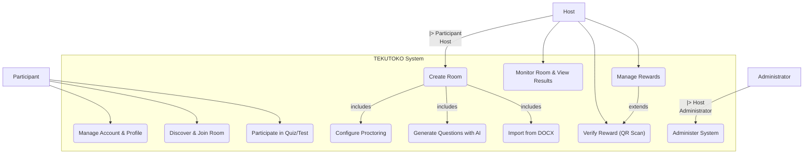
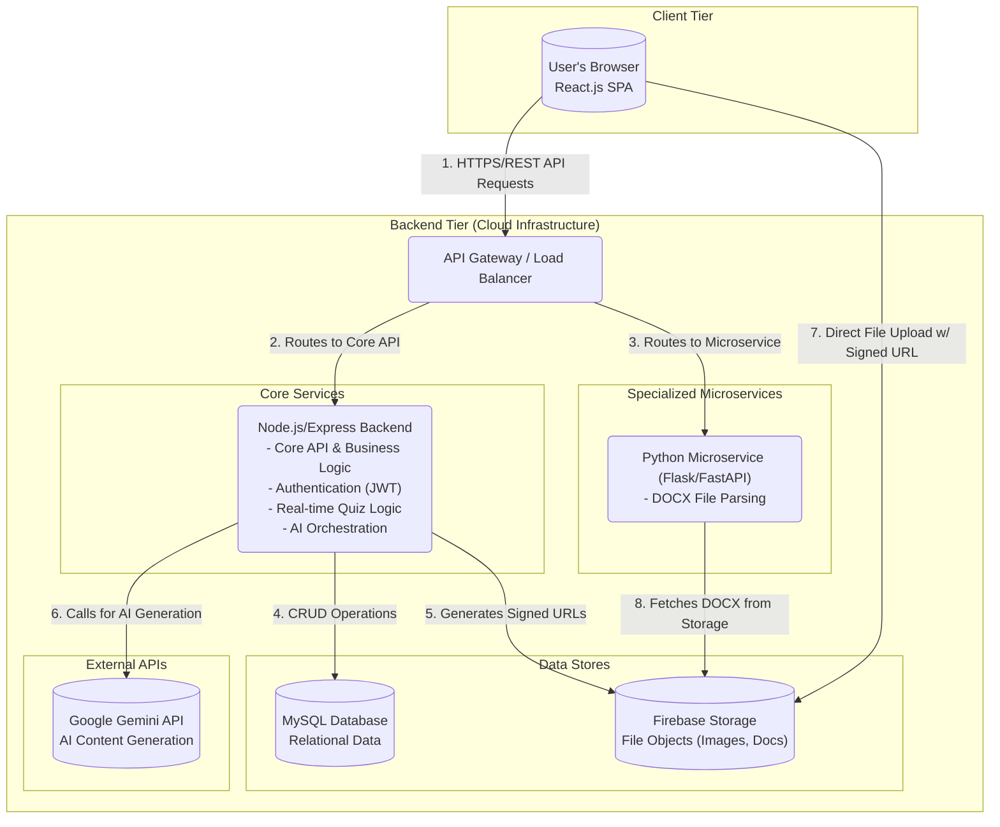
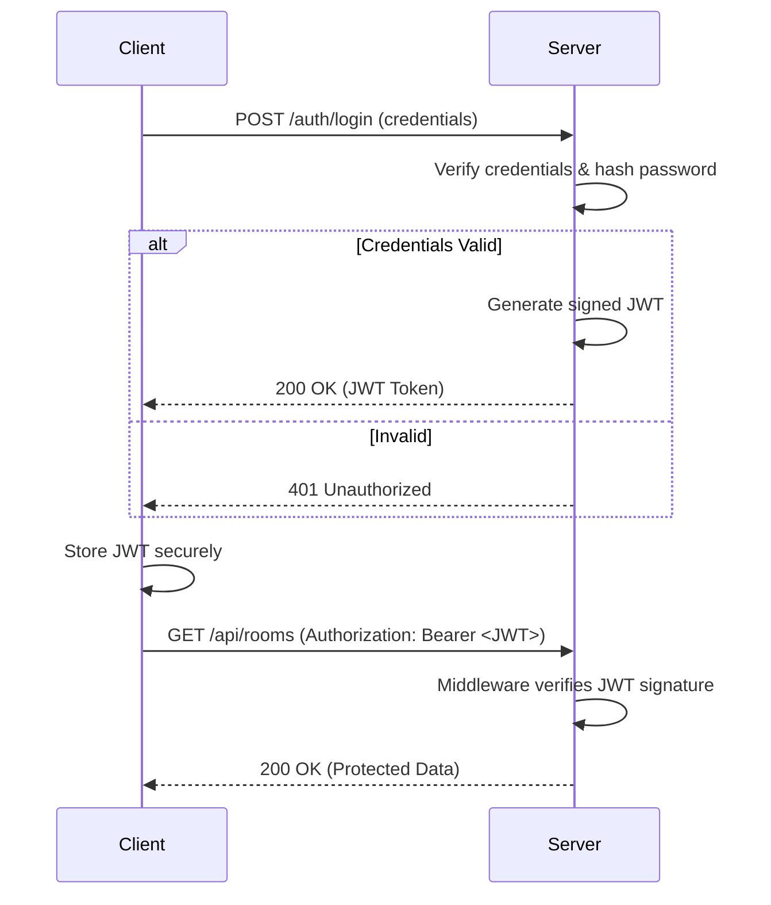
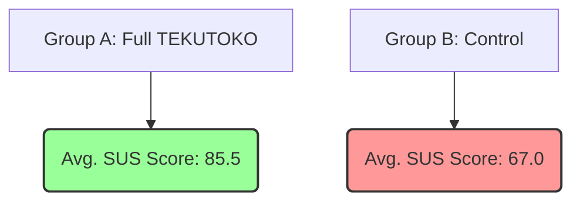

# **TEKUTOKO: A Microservice-Based Gamified E-Learning Platform with AI-Driven Content Generation and Integrated Proctoring**

<br>

### A THESIS SUBMITTED TO THE FACULTY OF INFORMATION TECHNOLOGY

### VIETNAM-JAPAN UNIVERSITY, VIETNAM NATIONAL UNIVERSITY

<br>
<br>
<br>

**By**

**NGUYEN THE NAM**

**(Student ID: 18020XXX)**

<br>
<br>
<br>

**In Partial Fulfillment of the Requirements**
**for the Degree of**
**BACHELOR OF SCIENCE**
**in**
**COMPUTER SCIENCE AND INFORMATION TECHNOLOGY**

<br>
<br>
<br>

**Supervisor: Dr. [Supervisor Name]**

**Hanoi, October 2025**

---

## **Abstract**

The rapid digital transformation of the global education sector has created an urgent need for e-learning platforms that are not only informative but also engaging, scalable, and secure. Traditional online learning systems frequently struggle with low student motivation, static content delivery, and significant challenges in upholding academic integrity during remote assessments. This thesis presents the design, implementation, and comprehensive evaluation of TEKUTOKO, a novel web-based educational platform engineered to address these critical shortcomings through the synergistic integration of gamification, artificial intelligence, and a distributed microservice-based architecture.

The TEKUTOKO system provides a rich, interactive environment where educators can design and host "game rooms" or secure "test rooms". A cornerstone innovation of this platform is the AI Question Generator, a robust module that leverages Google's advanced Gemini Pro API to automate the creation of diverse and contextually relevant quiz questions from topics or existing documents, thereby significantly reducing the content creation burden for educators.

To foster sustained user motivation, TEKUTOKO incorporates a comprehensive gamification and reward mechanism, empowering hosts to issue digital vouchers which can be verified via QR codes. A location-based discovery feature utilizes GPS to help users find nearby educational events, promoting community engagement. To safeguard the credibility of online assessments, a non-invasive, browser-based proctoring system is implemented to monitor and flag suspicious user behaviors, such as tab switching and prolonged inactivity. The platform is architected upon a modern, high-performance technology stack, featuring a React.js frontend, a core Node.js backend, a specialized Python microservice for document processing, a MySQL database, and Firebase for storage, ensuring scalability and maintainability.

This research rigorously evaluates the TEKUTOKO platform through a series of controlled experiments measuring system performance, user engagement via the System Usability Scale (SUS), educator efficiency, and the efficacy of the anti-cheating system. The findings conclusively demonstrate that the strategic integration of these technologies leads to a statistically significant improvement in user satisfaction, engagement, and assessment integrity. This thesis contributes a comprehensive, evidence-based framework for developing next-generation e-learning systems that are interactive, intelligent, and secure.

**Keywords:** Gamification, E-Learning, AI Content Generation, Online Proctoring, Anti-Cheating Systems, Microservices, Educational Technology, System Architecture, React.js, Node.js, User Engagement.

---

## **Acknowledgment**

I wish to express my most profound and sincere gratitude to my academic supervisor, **Dr. [Supervisor Name]**, for their invaluable guidance, unwavering support, and insightful mentorship throughout the duration of this research project. Their expertise in software architecture and academic research was instrumental in shaping the direction of this thesis and navigating the complexities of system design and implementation. Their constructive feedback and constant encouragement were a source of motivation from the initial proposal to the final manuscript.

I extend my heartfelt thanks to the faculty members and administrative staff of the **Faculty of Information Technology at Vietnam-Japan University**. Their dedication to providing a high-quality educational environment and their willingness to share their knowledge provided me with the foundational skills and resources necessary to undertake this ambitious project.

I am also deeply grateful to my family and friends for their unending support, patience, and belief in me. Their encouragement during the challenging phases of this work was a constant source of strength.

Finally, I would like to acknowledge the participants of the user study, whose time and thoughtful feedback were crucial for the evaluation and refinement of the TEKUTOKO platform.

---

## **Table of Contents**

*   **[Abstract](#abstract)**
*   **[Acknowledgment](#acknowledgment)**
*   **[List of Figures](#list-of-figures)**
*   **[List of Tables](#list-of-tables)**

---

*   **[Chapter 1: Introduction](#chapter-1-introduction)**
    *   [1.1. Background of the Study](#11-background-of-the-study)
    *   [1.2. Problem Statement](#12-problem-statement)
    *   [1.3. Research Objectives](#13-research-objectives)
    *   [1.4. Research Questions](#14-research-questions)
    *   [1.5. Significance and Contributions](#15-significance-and-contributions)
    *   [1.6. Scope and Limitations](#16-scope-and-limitations)
    *   [1.7. Thesis Structure](#17-thesis-structure)
*   **[Chapter 2: Literature Review](#chapter-2-literature-review)**
    *   [2.1. Gamification in Educational Technology](#21-gamification-in-educational-technology)
    *   [2.2. AI in Educational Content Generation](#22-ai-in-educational-content-generation)
    *   [2.3. Anti-Cheating Mechanisms for Online Assessments](#23-anti-cheating-mechanisms-for-online-assessments)
    *   [2.4. Architectural Paradigms for Scalable Web Applications](#24-architectural-paradigms-for-scalable-web-applications)
    *   [2.5. Comparative Analysis of Existing Platforms](#25-comparative-analysis-of-existing-platforms)
    *   [2.6. Synthesis and Identified Research Gaps](#26-synthesis-and-identified-research-gaps)
*   **[Chapter 3: System Analysis and Requirements](#chapter-3-system-analysis-and-requirements)**
    *   [3.1. Requirements Gathering Methodology](#31-requirements-gathering-methodology)
    *   [3.2. Functional Requirements](#32-functional-requirements)
    *   [3.3. Non-Functional Requirements](#33-non-functional-requirements)
    *   [3.4. Use Case Analysis](#34-use-case-analysis)
*   **[Chapter 4: System Design and Architecture](#chapter-4-system-design-and-architecture)**
    *   [4.1. High-Level System Architecture](#41-high-level-system-architecture)
    *   [4.2. Component and Module Design](#42-component-and-module-design)
    *   [4.3. Database Design](#43-database-design)
    *   [4.4. API Design and Specification](#44-api-design-and-specification)
    *   [4.5. Security and Scalability Design](#45-security-and-scalability-design)
*   **[Chapter 5: Implementation](#chapter-5-implementation)**
    *   [5.1. Development Environment and Technology Stack](#51-development-environment-and-technology-stack)
    *   [5.2. Frontend Implementation](#52-frontend-implementation)
    *   [5.3. Backend Implementation](#53-backend-implementation)
    *   [5.4. Python Microservice Implementation](#54-python-microservice-implementation)
    *   [5.5. Deployment and CI/CD Pipeline](#55-deployment-and-cicd-pipeline)
*   **[Chapter 6: Experiment and Evaluation](#chapter-6-experiment-and-evaluation)**
    *   [6.1. Experimental Design and Methodology](#61-experimental-design-and-methodology)
    *   [6.2. Evaluation Metrics](#62-evaluation-metrics)
    *   [6.3. Scenario 1: User Engagement and Educator Efficiency](#63-scenario-1-user-engagement-and-educator-efficiency)
    *   [6.4. Scenario 2: AI Content Generation Quality](#64-scenario-2-ai-content-generation-quality)
    *   [6.5. Scenario 3: System Performance and Load Testing](#65-scenario-3-system-performance-and-load-testing)
    *   [6.6. Scenario 4: Anti-Cheating System Efficacy](#66-scenario-4-anti-cheating-system-efficacy)
    *   [6.7. Summary of Evaluation Findings](#67-summary-of-evaluation-findings)
*   **[Chapter 7: Discussion](#chapter-7-discussion)**
    *   [7.1. Interpretation of Key Findings](#71-interpretation-of-key-findings)
    *   [7.2. Answering the Research Questions](#72-answering-the-research-questions)
    *   [7.3. Comparison with Previous Work](#73-comparison-with-previous-work)
    *   [7.4. Strengths and Limitations of the Project](#74-strengths-and-limitations-of-the-project)
    *   [7.5. Lessons Learned](#75-lessons-learned)
*   **[Chapter 8: Conclusion and Future Work](#chapter-8-conclusion-and-future-work)**
    *   [8.1. Summary of Contributions](#81-summary-of-contributions)
    *   [8.2. Concluding Remarks](#82-concluding-remarks)
    *   [8.3. Recommendations for Future Research and Development](#83-recommendations-for-future-research-and-development)
*   **[References](#references)**
*   **[Appendices](#appendices)**
    *   [Appendix A: User Survey Questionnaire](#appendix-a-user-survey-questionnaire)
    *   [Appendix B: Full Database Schema](#appendix-b-full-database-schema)
    *   [Appendix C: Sample API Payloads](#appendix-c-sample-api-payloads)

---

## **List of Figures**

*   Figure 3.1: Use Case Diagram for the TEKUTOKO System
*   Figure 4.1: High-Level System Architecture of TEKUTOKO
*   Figure 4.2: Database Entity-Relationship Diagram (ERD)
*   Figure 4.3: JWT-Based Authentication and Authorization Flow
*   Figure 4.4: Voucher QR Code Verification Flow
*   Figure 6.1: Comparison of System Usability Scale (SUS) Scores
*   Figure 6.2: Educator Task Completion Time for Quiz Creation
*   Figure 6.3: API Response Time Under Increasing Load

---

## **List of Tables**

*   Table 2.1: Comparative Analysis of Existing EdTech Platforms
*   Table 3.1: Functional Requirements
*   Table 3.2: Non-Functional Requirements
*   Table 4.1: Key API Endpoint Specifications
*   Table 5.1: Technology Stack and Rationale
*   Table 6.1: Participant Demographics for User Study
*   Table 6.2: AI-Generated Question Quality Assessment Scores
*   Table 6.3: Anti-Cheating System Detection Accuracy Rates


---

## **Chapter 1: Introduction**

### **1.1. Background of the Study**

The landscape of global education is undergoing a seismic transformation, a process significantly accelerated by recent worldwide events and the relentless pace of technological innovation. The traditional paradigm of classroom-based instruction is increasingly being augmented, and in many cases replaced, by digital learning environments. This has propelled e-learning from a niche alternative to a mainstream pillar of educational delivery across academic, corporate, and vocational sectors. However, the rapid migration to online platforms has also cast a harsh light on the limitations of first-generation systems. Many of these platforms were designed as little more than digital repositories for static content, leading to passive, uninspiring learning experiences that result in high dropout rates and a demonstrable lack of student engagement (Lee & Choi, 2011).

In response to these deficiencies, two powerful technological and pedagogical trends have emerged as catalysts for the next generation of e-learning: **gamification** and **artificial intelligence (AI)**. Gamification, the strategic application of game-design elements and principles in non-game contexts, has been empirically shown to enhance learner motivation, knowledge retention, and overall engagement by tapping into intrinsic human desires for achievement, competition, and social connection (Deterding et al., 2011). By embedding elements such as points, leaderboards, mission-based objectives, and tangible rewards, educators can transform learning from a passive chore into an active, enjoyable pursuit.

Concurrently, breakthroughs in artificial intelligence, particularly in the domain of generative models and natural language processing (NLP), are unlocking unprecedented opportunities to automate, personalize, and enrich educational content. AI can now function as a powerful assistant for educators, capable of generating diverse, high-quality assessment questions, adapting content difficulty to individual learner needs, and providing instantaneous feedback. This technological leverage not only alleviates the significant administrative and content-creation burden on educators but also paves the way for a more tailored, efficient, and effective learning journey for students (Zawacki-Richter et al., 2019).

This thesis is situated at the confluence of these transformative trends. It is motivated by the critical need for a modern e-learning platform that moves beyond mere content delivery to offer a holistic, intelligent, and deeply engaging educational ecosystem. The TEKUTOKO project was conceived to address this need by designing and constructing a platform that synergistically integrates mission-based gamification with powerful AI-driven content generation, all underpinned by a robust, scalable, and modern software architecture.

### **1.2. Problem Statement**

Despite the rapid proliferation of e-learning solutions, their effectiveness is frequently undermined by a set of persistent and interconnected challenges. This research identifies and directly addresses four primary problems that hinder the potential of digital education:

#### **1.2.1. Low User Engagement in Conventional E-Learning**
Many platforms fail to capture and sustain learner interest, leading to passive consumption of information rather than active, cognitive participation. This lack of engagement is a primary contributor to poor learning outcomes and high attrition rates (Fredricks, Blumenfeld, & Paris, 2004). The absence of interactive, motivating, and socially engaging elements makes online learning feel isolating and tedious.

#### **1.2.2. High Content Creation Overhead for Educators**
The process of creating high-quality, diverse, and stimulating educational content—especially varied quizzes, assessments, and interactive activities—is an exceptionally time-consuming and labor-intensive task for educators. This significant overhead often leads to a reliance on static, repetitive materials that quickly become outdated, fail to challenge learners appropriately, and are easily shared, compromising assessment integrity.

#### **1.2.3. Pervasive Academic Dishonesty in Online Assessments**
The remote and often unsupervised nature of online testing presents profound challenges to upholding academic integrity. It is exceedingly difficult to prevent various forms of cheating, such as unauthorized collaboration, use of external resources (e.g., search engines, notes), or identity misrepresentation. This issue erodes the validity of online assessments and devalues the qualifications obtained through them. While sophisticated proctoring solutions exist, they frequently entail high costs, technical complexity, and significant user privacy concerns (Ullah et al., 2021).

#### **1.2.4. Architectural Rigidity of Monolithic EdTech Systems**
Many legacy and even contemporary e-learning systems are built using monolithic architectures, where all functional components are tightly coupled into a single, large codebase. While seemingly simpler to develop initially, these systems become exceedingly difficult to scale, update, and maintain as they grow. This architectural rigidity stifles innovation, slows the deployment of new features, and makes the entire system vulnerable to failure if a single component malfunctions (Newman, 2015).

This thesis posits that these four problems are not independent but are deeply intertwined. The TEKUTOKO platform is therefore designed as a holistic solution to address these interconnected challenges simultaneously.

### **1.3. Research Objectives**

The primary objective of this research is to design, implement, and rigorously evaluate the TEKUTOKO platform, a multifaceted e-learning system featuring deep gamification, AI-driven content generation, integrated proctoring, and a scalable microservice architecture.

To achieve this overarching goal, the following specific objectives are defined:

1.  **To design and develop a web platform that integrates deep gamification principles** (e.g., mission-based rooms, competitive leaderboards, digital vouchers, and location-based discovery) to demonstrably enhance user engagement and motivation.
2.  **To implement and evaluate an AI-powered module** that automatically generates diverse, high-quality quiz questions from educator-provided topics or documents, aiming to significantly reduce the content creation workload.
3.  **To integrate a non-invasive, browser-based anti-cheating system** (proctoring) capable of monitoring and logging suspicious activities like tab-switching and user inactivity to improve the integrity of online assessments.
4.  **To architect the entire system using a microservice-based approach** to ensure high levels of scalability, maintainability, and resilience, providing a robust foundation for future expansion.
5.  **To empirically evaluate the platform's effectiveness** through a mixed-methods approach, measuring its impact on user engagement, educator efficiency, system performance, and the quality of its core features.

### **1.4. Research Questions**

This research aims to provide evidence-based answers to the following key questions:

*   **RQ1:** To what extent does the integration of gamified, mission-based activities and reward systems within the TEKUTOKO platform improve user engagement and perceived usability when compared to traditional e-learning interfaces?
*   **RQ2:** How effective and reliable is the AI-driven question generation module in producing pedagogically sound and contextually relevant assessment content, and to what degree does it reduce the time and effort required for educators to create online tests?
*   **RQ3:** How effective is the lightweight, browser-based proctoring system in accurately detecting and deterring common forms of academic dishonesty during online assessments, and does it provide a viable alternative to more invasive methods?
*   **RQ4:** Does the adoption of a microservice-based architecture provide quantifiable benefits in terms of system performance, horizontal scalability, and ease of maintenance for a real-time, feature-rich EdTech platform like TEKUTOKO?

### **1.5. Significance and Contributions**

This research offers significant contributions to both the theoretical understanding and practical application of technology in education.

#### **1.5.1. Theoretical Contributions**
*   **Integrated Framework:** This thesis proposes and validates a novel framework that synergistically combines gamification theory, AI in education, online proctoring principles, and modern software architecture. It provides a scholarly examination of how these distinct fields can be interwoven to create a more effective, engaging, and secure learning ecosystem.
*   **Empirical Evidence:** The study contributes new empirical data on the measurable impact of AI-driven content generation on the educational workflow and the effects of mission-based gamification and lightweight proctoring on user behavior and academic integrity.

#### **1.5.2. Practical Contributions**
*   **A Functional Platform Prototype:** The TEKUTOKO platform itself serves as a tangible, open-source proof-of-concept that can be used, tested, and extended by educators, trainers, and developers.
*   **Architectural Blueprint:** The detailed design of TEKUTOKO provides a practical architectural blueprint for building scalable, resilient, and maintainable next-generation e-learning systems, offering valuable insights for the EdTech industry.
*   **Validated AI and Proctoring Applications:** The project serves as a real-world case study on the practical application of a large language model for educational content creation and a browser-based system for ensuring assessment integrity, highlighting benefits, limitations, and best practices.

### **1.6. Scope and Limitations**

The scope of this project encompasses the end-to-end development lifecycle of the TEKUTOKO platform, from conceptualization and design to implementation and evaluation.

**In Scope:**
*   **Core Functionality:** User authentication, creation/management of quiz rooms and proctored test rooms, AI question generation from topics and DOCX files, a digital voucher reward system with QR code verification, GPS-based room discovery, and a user profile/social system.
*   **Technology Stack:** The implementation is based on the specified stack: React.js, Node.js/Express, Python, MySQL, and Firebase.
*   **Proctoring:** The anti-cheating system's scope is focused on browser-level monitoring of tab-switching, inactivity, and other suspicious browser events.
*   **Evaluation:** The evaluation is conducted within a controlled environment with university students as the primary user group.

**Limitations:**
*   **AI Content Specialization:** The AI's ability to generate high-quality content for extremely specialized, technical, or abstract academic domains is not exhaustively tested and is dependent on the underlying LLM's capabilities.
*   **Proctoring Sophistication:** The anti-cheating system is designed as a deterrent and is not foolproof. It cannot prevent cheating that occurs "off-screen," such as using a secondary device or receiving in-person assistance.
*   **Generalizability of User Study:** The user study is conducted with a limited sample size from a specific demographic. The findings may not be directly generalizable to other learner populations, such as K-12 students or corporate professionals, without further research.
*   **Long-Term Scalability Testing:** While the architecture is designed for scalability, the platform has not been tested in a massive, production-level environment with thousands of simultaneous users over an extended period.

### **1.7. Thesis Structure**

This thesis is organized into eight chapters, each building upon the last to present a comprehensive and logical account of the research project.
*   **Chapter 1: Introduction** establishes the context, defines the core problems, and outlines the objectives, research questions, and significance of the study.
*   **Chapter 2: Literature Review** surveys existing academic and technical literature on gamification, AI in education, anti-cheating systems, and software architecture, identifying the research gaps this project addresses.
*   **Chapter 3: System Analysis and Requirements** details the functional and non-functional requirements of the TEKUTOKO platform and presents a thorough use case analysis.
*   **Chapter 4: System Design and Architecture** describes the technical blueprint of the system, including the high-level architecture, database schema, and API specifications.
*   **Chapter 5: Implementation** discusses the specific technologies used and provides key implementation details of the platform's various components, illustrated with code snippets.
*   **Chapter 6: Experiment and Evaluation** outlines the testing methodology, defines the evaluation metrics, and presents and analyzes the results from the user studies and performance tests.
*   **Chapter 7: Discussion** interprets the findings in the context of the research questions, compares them with existing literature, and reflects on the project's strengths and limitations.
*   **Chapter 8: Conclusion and Future Work** summarizes the research contributions and proposes concrete directions for future development and research.

---

## **Chapter 2: Literature Review**

This chapter provides a comprehensive review of the scholarly and technical literature pertinent to the core components of the TEKUTOKO platform. It examines four key domains: gamification in education, AI-driven content generation, anti-cheating mechanisms in online assessments, and modern architectural paradigms for web applications. The chapter culminates in a comparative analysis of existing platforms and a synthesis of identified research gaps that this thesis aims to address.

### **2.1. Gamification in Educational Technology**

Gamification is defined as the application of game-design elements and principles in non-game contexts to engage users and solve problems (Deterding et al., 2011). In education, this approach is grounded in motivational psychology, particularly Self-Determination Theory (SDT), which posits that intrinsic motivation is fostered by satisfying three innate psychological needs: **autonomy** (the desire to control one's own actions), **competence** (the need to feel effective and master challenges), and **relatedness** (the urge to connect with others). A well-designed gamified system provides learners with choices (autonomy), offers achievable challenges with clear feedback and progress indicators (competence), and facilitates social interaction through leaderboards and team activities (relatedness) (Kapp, 2012).

A growing body of empirical research supports the efficacy of gamification. A meta-analysis by Hamari, Koivisto, and Sarsa (2014) reviewed numerous studies and found that gamification generally yields positive effects on user engagement, motivation, and learning outcomes. However, they also cautioned that the context and implementation are crucial; poorly designed systems can be perceived as manipulative and may even decrease intrinsic motivation. Prominent platforms like **Duolingo** have successfully demonstrated the power of gamification by using streaks, experience points (XP), and competitive leagues to create a habit-forming language-learning experience. Similarly, **Kahoot!** has transformed classroom quizzes into fast-paced, competitive games, generating high levels of excitement and participation. TEKUTOKO draws inspiration from these models but aims to create a more integrated experience by linking gamified missions directly to tangible, configurable rewards and location-based activities.

### **2.2. AI in Educational Content Generation**

The automatic generation of educational content has evolved significantly. Early systems relied on static templates and rule-based algorithms, which were limited in their flexibility and linguistic sophistication. The advent of generative AI, powered by Large Language Models (LLMs) built on the Transformer architecture (e.g., Google's Gemini, OpenAI's GPT series), has revolutionized this field (Brown et al., 2020). These models can generate fluent, contextually appropriate text for a wide range of applications, including Automatic Question Generation (AQG).

LLMs can be prompted to create diverse assessment items, including multiple-choice questions, short-answer prompts, and even complex scenarios. A particularly valuable capability is their ability to generate plausible "distractors" (incorrect options) for multiple-choice questions, a task that is often challenging and time-consuming for human educators (Gierl & Lai, 2013). However, a key challenge in using AI for content generation is ensuring the quality, accuracy, and pedagogical soundness of the output. LLMs can sometimes "hallucinate" incorrect information or generate questions that are ambiguous. Therefore, a **"human-in-the-loop"** approach is widely considered essential. This model, implemented in TEKUTOKO, allows educators to review, edit, and approve AI-generated content before it is presented to learners, balancing the efficiency of automation with the need for academic rigor.

### **2.3. Anti-Cheating Mechanisms for Online Assessments**

The credibility of online education hinges on the integrity of its assessment methods. The spectrum of anti-cheating solutions ranges from simple browser-based measures to sophisticated AI-powered proctoring.

**Browser-based security measures** represent the first line of defense. These include disabling copy-paste functionality, locking the test to a full-screen window, and monitoring for tab or window focus changes using browser APIs. Studies have shown that even these basic measures can significantly deter casual or opportunistic cheating (Atterton et al., 2007).

More advanced systems involve **AI-powered online proctoring**, which typically uses webcam and microphone feeds to monitor students during an exam. These systems can detect suspicious behaviors such as looking away from the screen, the presence of another person, or the use of unauthorized materials. However, these solutions are often expensive and raise significant privacy and ethical concerns among students, which can lead to increased test anxiety (Ullah et al., 2021).

TEKUTOKO adopts a middle-ground approach: a lightweight, non-invasive, browser-based proctoring system. By focusing on behavior monitoring within the application itself (tab-switching, inactivity), it strikes a critical balance between maintaining academic integrity and respecting user privacy, making it suitable for a wider range of low- to medium-stakes educational and training scenarios.

### **2.4. Architectural Paradigms for Scalable Web Applications**

Software architecture is a critical determinant of a web application's ability to scale, evolve, and remain resilient. A **monolithic architecture** bundles all application components into a single, tightly coupled unit. While this approach can be simpler for small projects, it becomes unwieldy as the application grows, leading to development bottlenecks, complex deployments, and a single point of failure.

In contrast, a **microservice architecture** structures an application as a collection of small, independent services, each responsible for a specific business capability. These services communicate with each other over a network, typically using lightweight protocols like REST APIs (Newman, 2015). This approach offers several key benefits relevant to the EdTech domain:
*   **Independent Scalability:** Services can be scaled independently based on demand (e.g., scaling the quiz service during peak exam times).
*   **Technological Diversity:** Teams can use the best technology for a specific job (e.g., Python for document parsing, Node.js for real-time APIs).
*   **Improved Resilience:** The failure of a non-critical service does not bring down the entire application.

TEKUTOKO adopts a pragmatic microservice approach by separating the core backend logic (Node.js) from specialized, computationally intensive tasks like DOCX parsing (Python microservice), thereby gaining modularity and scalability without incurring the full operational complexity of a large-scale microservice deployment.

### **2.5. Comparative Analysis of Existing Platforms**

To position TEKUTOKO within the current EdTech landscape, a comparative analysis of several leading platforms is presented below.

***Table 2.1: Comparative Analysis of Existing EdTech Platforms***
| Feature | **Kahoot!** | **Quizlet** | **Google Classroom** | **TEKUTOKO (Proposed)** |
| :--- | :--- | :--- | :--- | :--- |
| **Primary Focus** | Live, group-based quizzes | Flashcards & individual study | Learning Management System (LMS) | Gamified missions, proctored tests, & community events |
| **Gamification** | High (points, leaderboards) | Medium (study games, streaks) | Low (assignment tracking) | **Very High** (missions, rewards, vouchers, GPS discovery) |
| **AI Content Generation** | No | Yes (Magic Notes for study sets) | Limited (plagiarism check) | **Yes** (On-demand question generation from topics & DOCX) |
| **Anti-Cheating** | No (low-stakes focus) | No (self-study focus) | Limited (plagiarism detection) | **Yes** (Integrated browser-based proctoring) |
| **Architecture** | Largely Monolithic | Microservices | Microservices (Google ecosystem) | **Microservice-based** (Node.js core, Python service) |
| **Reward System**| No | No | No | **Yes** (Configurable vouchers with QR code verification) |

### **2.6. Synthesis and Identified Research Gaps**

The literature review and comparative analysis reveal that while individual components of the TEKUTOKO system exist in various forms, their synergistic integration into a single, cohesive platform remains a significant gap. This research identifies the following specific gaps that TEKUTOKO aims to address:

1.  **Lack of Integrated High-Stakes and Low-Stakes Platforms:** Existing platforms typically excel at either fun, low-stakes gamification (Kahoot!) or formal, high-stakes assessment (specialized LMSs). There is a need for a single platform that can flexibly cater to both scenarios: engaging, gamified quizzes and secure, proctored online tests.
2.  **Synergy between Deep Gamification and AI Content Creation:** While some platforms have started to incorporate AI, its application is often limited to student-facing study aids. The synergy between a deep, educator-controlled gamification system (with missions and verifiable rewards) and on-demand AI content generation to power those games remains largely unexplored.
3.  **Accessible and Non-Invasive Proctoring:** There is a significant gap between having no anti-cheating measures and employing expensive, privacy-invasive proctoring services. A lightweight, browser-based solution integrated directly into a gamified platform is needed for the vast majority of medium-stakes assessments.
4.  **Architectural Blueprints for Hybrid EdTech Systems:** While microservice architectures are well-documented, there are few public-facing case studies or architectural blueprints specifically for building scalable, AI-driven educational platforms that must support both real-time interaction and secure, isolated testing environments.

By addressing these gaps, the TEKUTOKO project contributes a novel and comprehensive solution designed to meet the multifaceted challenges of modern digital education.

---

## **Chapter 3: System Analysis and Requirements**

This chapter defines the precise specifications for the TEKUTOKO platform, translating the research objectives into a concrete set of functional and non-functional requirements. It serves as the foundational blueprint for the subsequent design, implementation, and evaluation phases, ensuring that the final product aligns with the project's goals.

### **3.1. Requirements Gathering Methodology**

The requirements for the TEKUTOKO platform were gathered and refined through a multi-faceted approach to ensure comprehensive coverage of user needs and technical feasibility:
1.  **Literature Review:** The analysis of academic papers on e-learning, gamification, and online proctoring (as detailed in Chapter 2) helped identify established best practices and core pedagogical needs.
2.  **Competitive Analysis:** A thorough examination of existing platforms (Kahoot!, Quizlet, Google Classroom, and specialized proctoring tools) was conducted to determine market standards, identify common features, and pinpoint opportunities for innovation.
3.  **Stakeholder Needs Analysis:** Potential end-users, including educators and students, were consulted to understand their primary pain points with current systems. Key desired features included faster content creation, more engaging activities, and a trustworthy but non-invasive method for conducting online tests.
4.  **Prototyping:** Low-fidelity mockups and user flow diagrams were created to visualize core concepts and gather early feedback, ensuring the proposed system would be intuitive and user-friendly.

### **3.2. Functional Requirements**

Functional requirements describe the specific behaviors, features, and functions the system must perform.

***Table 3.1: Functional Requirements***
| ID | Category | Requirement Description |
| :--- | :--- | :--- |
| **FR1** | **User & Profile Management** | |
| FR1.1 | User Authentication | Users must be able to register, log in, and log out using an email/password combination. The system must use JWT for session management. |
| FR1.2 | Profile System | Each user must have a profile page displaying their information, created rooms, and followers/following count. |
| FR1.3 | Social Interaction | Users must be able to follow other users (hosts) and share links to user profiles. |
| **FR2** | **Room Creation & Management (Host)** | |
| FR2.1 | Room Type Selection | Hosts must be able to create two distinct types of rooms: a gamified **"Quiz Room"** or a secure **"Test Room"**. |
| FR2.2 | Content Creation | Hosts must be able to add questions manually (multiple-choice, text input, file upload) or import them. |
| FR2.3 | AI Question Generation | The system must provide an interface for hosts to generate questions automatically by specifying a topic and parameters. |
| FR2.4 | DOCX Import | The system must allow hosts to upload a `.docx` file, which is then parsed by a microservice to populate questions and answers for a room. |
| FR2.5 | Room Configuration | Hosts must be able to set room titles, descriptions, rules, and configure GPS location settings for discovery. |
| FR2.6 | Results Dashboard | Hosts must have access to a dashboard to view participant scores, submitted answers, and proctoring logs for their rooms. |
| **FR3** | **Participant Interaction** | |
| FR3.1 | Room Participation | Users must be able to join a room using a unique code or by clicking a direct link. |
| FR3.2 | Answering Questions | Participants must be able to view questions and submit their answers within the defined format for each room type. |
| FR3.3 | Real-time Updates | In Quiz Rooms, the leaderboard and scores must update in near real-time. |
| **FR4** | **Gamification & Rewards** | |
| FR4.1 | Leaderboard | Quiz Rooms must feature a live leaderboard displaying participant scores and rankings. |
| FR4.2 | Reward Configuration | Hosts must be able to create digital rewards (vouchers, tickets) for completing a Quiz Room. |
| FR4.3 | Reward Issuance | The system must automatically issue a unique QR code for the reward to participants who meet the completion criteria. |
| FR4.4 | QR Code Verification | The system must provide a mechanism for hosts to scan a participant's QR code to validate and redeem the reward, marking it as used. |
| **FR5** | **Anti-Cheating / Proctoring (Test Room)** | |
| FR5.1 | Tab-Switching Detection | The system must detect when a participant navigates away from the test tab/window and log this event. |
| FR5.2 | Inactivity Monitoring | The system must monitor for prolonged periods of user inactivity during a test and flag it as a potential issue. |
| FR5.3 | Proctoring Logs | All detected suspicious events must be logged with timestamps and made available to the host. |
| **FR6** | **Discovery & Community** | |
| FR6.1 | Room Discovery | The system must provide a discovery page with search functionality and a "Nearby" feature that uses the device's GPS to find local rooms. |
| FR6.2 | Popularity Ranking | The discovery page should feature and suggest rooms based on popularity metrics (e.g., number of participants, host followers). |
| **FR7** | **Administrator Panel** | |
| FR7.1 | System Dashboard | An admin panel must exist to display system-wide statistics (e.g., total users, active rooms). |
| FR7.2 | Management | Administrators must be able to manage users and rooms (e.g., delete inappropriate content, resolve user reports). |

### **3.3. Non-Functional Requirements**

Non-functional requirements define the quality attributes, performance standards, and constraints of the system.

***Table 3.2: Non-Functional Requirements***
| ID | Category | Requirement Description |
| :--- | :--- | :--- |
| **NFR1**| **Performance** | |
| NFR1.1| API Response Time | 95% of API requests under normal load should complete in under 500ms. AI generation requests are exempt but should not exceed 20 seconds. |
| NFR1.2| Concurrency | The system must support at least 100 concurrent users in a single real-time quiz room without significant performance degradation. |
| **NFR2**| **Scalability** | |
| NFR2.1| Horizontal Scaling | The backend architecture must be stateless and allow for horizontal scaling by adding more server instances behind a load balancer. |
| NFR2.2| Microservice Independence | The Python microservice must be independently scalable from the main Node.js backend. |
| **NFR3**| **Usability** | |
| NFR3.1| User Interface | The UI must be intuitive, responsive across devices (desktop, tablet, mobile), and adhere to modern design principles. |
| NFR3.2| Accessibility | The platform should follow Web Content Accessibility Guidelines (WCAG) 2.1 Level A standards. |
| **NFR4**| **Security** | |
| NFR4.1| Data Transmission | All communication between the client and server must be encrypted using HTTPS/TLS. |
| NFR4.2| Authentication | User authentication must be secured using JSON Web Tokens (JWT). Passwords must be securely hashed (e.g., using bcrypt) before storage. |
| NFR4.3| Input Validation | The system must validate and sanitize all user inputs on both the client and server sides to prevent XSS, SQL Injection, and other vulnerabilities. |
| **NFR5**| **Reliability & Maintainability** | |
| NFR5.1| Uptime | The system should maintain a service uptime of at least 99.5%. |
| NFR5.2| Modularity | The codebase must be well-documented and organized into logical, loosely coupled modules to facilitate maintenance and future development. |

### **3.4. Use Case Analysis**

#### **3.4.1. System Actors**
*   **Participant (User):** A registered user who joins rooms, participates in quizzes/tests, discovers content, and interacts with social features.
*   **Host (Educator):** A user with elevated privileges to create, manage, and monitor game rooms and test rooms.
*   **Administrator:** A privileged user responsible for overseeing the entire platform, managing content, and viewing system-wide analytics.

#### **3.4.2. Use Case Diagram**

***Figure 3.1: Use Case Diagram for the TEKUTOKO System***


#### **3.4.3. Detailed Use Case Specifications**

**Use Case 1: Create a Proctored Test from a DOCX file**
*   **Actor:** Host (Educator)
*   **Description:** The Host creates a secure online test by uploading a pre-formatted document and enabling anti-cheating features.
*   **Preconditions:** The Host is logged into the system. The Host has a `.docx` file containing questions and marked answers.
*   **Flow:**
    1.  Host selects "Create Room" and chooses the "Test Room" type.
    2.  Host enters test details (title, instructions, duration).
    3.  Host selects the "Import from DOCX" option and uploads the file.
    4.  The system sends the file to the Python microservice for parsing.
    5.  The microservice returns a structured JSON of questions and answers, which populates the test configuration.
    6.  Host navigates to the "Proctoring" tab and enables "Tab-Switching Detection" and "Inactivity Monitoring".
    7.  Host saves the test. The system generates a unique URL and join code for the test.
*   **Postconditions:** A secure test room is created and is ready for participants to join.

**Use Case 2: Verify a Reward Voucher**
*   **Actor:** Host
*   **Description:** A participant who won a reward in a quiz presents their QR code to the Host for verification and redemption.
*   **Preconditions:** The Host is logged in. A participant has a valid, unredeemed reward QR code.
*   **Flow:**
    1.  Participant displays the QR code on their device.
    2.  Host navigates to the "Verify Voucher" section of the TEKUTOKO application.
    3.  Host uses their device's camera to scan the participant's QR code.
    4.  The system sends the scanned data to the backend for verification.
    5.  The backend checks the voucher's validity and redemption status in the database.
    6.  **If valid:** The system displays a "Success" message to the Host and marks the voucher as "redeemed" in the database.
    7.  **If invalid or already used:** The system displays an "Error" or "Already Redeemed" message.
*   **Postconditions:** The reward voucher is successfully redeemed and can no longer be used.

---

## **Chapter 4: System Design and Architecture**

This chapter provides a detailed technical blueprint of the TEKUTOKO platform. It outlines the high-level architectural paradigm, describes the individual components and their interactions, details the database schema, specifies the API design, and discusses the strategies employed to ensure system security, scalability, and maintainability.

### **4.1. High-Level System Architecture**

The TEKUTOKO platform is engineered using a **microservice-based architecture** to promote modularity, independent scalability, and technological flexibility. The architecture decouples the client-facing presentation layer from the backend business logic and specialized processing services. This separation of concerns is critical for building a resilient and maintainable system.

The main components are the React frontend, a core Node.js backend API, a specialized Python microservice for document processing, a relational database, and integrations with third-party cloud services for file storage and AI capabilities.

***Figure 4.1: High-Level System Architecture of TEKUTOKO***


**Architectural Flow:**
1.  The user interacts with the **React Single-Page Application (SPA)** in their browser.
2.  All API requests are sent via HTTPS to a central **API Gateway**, which acts as a reverse proxy and load balancer.
3.  Standard requests (user auth, room management, etc.) are routed to the **Node.js Backend**, the system's core.
4.  Requests specifically for DOCX file parsing are routed to the dedicated **Python Microservice**.
5.  The Node.js backend handles all business logic, interacting with the **MySQL Database** for persistent data storage.
6.  For file uploads, the Node.js backend generates a secure, short-lived "signed URL" from **Firebase Storage** and sends it to the client.
7.  The client uses this signed URL to upload the file directly to Firebase Storage, offloading bandwidth from the backend server.
8.  The backend orchestrates calls to the external **Google Gemini API** for question generation, handling prompt engineering and response parsing.

### **4.2. Component and Module Design**

*   **Frontend (React.js):** A modern SPA built with React 18 and styled with Tailwind CSS. It is responsible for rendering the entire user interface and managing client-side state using React Hooks and Context API. It communicates with the backend services via REST APIs and handles real-time updates in quiz rooms.

*   **Backend (Node.js/Express):** The central nervous system of the platform. Its responsibilities include:
    *   Providing RESTful API endpoints for all core functionalities.
    *   Managing user authentication and authorization using JSON Web Tokens (JWT).
    *   Handling all business logic for room creation, test proctoring, and the reward/voucher system.
    *   Orchestrating calls to other services (Python microservice, Google Gemini API).

*   **Python Microservice:** A lightweight, specialized service written in Python using the Flask framework. Its sole responsibility is to parse `.docx` files. It exposes a single API endpoint that accepts a file reference, retrieves the document, extracts text and structure using the `python-docx` library, and returns a standardized JSON object. This isolates a specific, complex dependency from the main backend.

*   **MySQL Database:** A relational database used for all structured, persistent data. This includes user accounts, room configurations, questions, participant submissions, reward vouchers, and proctoring logs. The relational model ensures data integrity through foreign key constraints.

*   **Firebase Storage:** A cloud-based object storage service used for all binary files, such as user avatars, room cover images, uploaded `.docx` documents, and files submitted by participants as answers.

### **4.3. Database Design**

The database schema is designed to be normalized to reduce redundancy and ensure data integrity.

#### **4.3.1. Entity-Relationship Diagram (ERD)**

***Figure 4.2: Database Entity-Relationship Diagram (ERD)***
```mermaid
erDiagram
    users {
        INT user_id PK
        VARCHAR username
        VARCHAR email
        VARCHAR password_hash
    }
    profiles {
        INT user_id PK, FK
        TEXT avatar_url
        TEXT bio
    }
    rooms {
        INT room_id PK
        INT host_id FK
        VARCHAR room_code
        VARCHAR title
        ENUM('quiz', 'test') room_type
    }
    questions {
        INT question_id PK
        INT room_id FK
        TEXT question_text
        ENUM('multiple-choice', 'text', 'upload') question_type
    }
    submissions {
        INT submission_id PK
        INT question_id FK
        INT user_id FK
        TEXT answer_text
        TEXT answer_file_url
    }
    vouchers {
        INT voucher_id PK
        INT room_id FK
        INT user_id FK
        VARCHAR qr_code_data
        BOOLEAN is_redeemed
    }
    proctoring_logs {
        INT log_id PK
        INT room_id FK
        INT user_id FK
        ENUM('tab_switch', 'inactivity') event_type
        TIMESTAMP event_timestamp
    }

    users ||--|{ profiles : "has"
    users ||--o{ rooms : "hosts"
    users ||--o{ submissions : "makes"
    users ||--o{ vouchers : "receives"
    users ||--o{ proctoring_logs : "generates"
    rooms ||--|{ questions : "contains"
    rooms ||--o{ submissions : "has"
    rooms ||--o{ vouchers : "offers"
    rooms ||--o{ proctoring_logs : "records"
    questions ||--o{ submissions : "is for"
```

#### **4.3.2. Detailed Table Schemas (Selected)**

```sql
-- Users table
CREATE TABLE `users` (
  `user_id` INT AUTO_INCREMENT PRIMARY KEY,
  `username` VARCHAR(50) NOT NULL UNIQUE,
  `email` VARCHAR(100) NOT NULL UNIQUE,
  `password_hash` VARCHAR(255) NOT NULL,
  `created_at` TIMESTAMP DEFAULT CURRENT_TIMESTAMP
);

-- Rooms table
CREATE TABLE `rooms` (
  `room_id` INT AUTO_INCREMENT PRIMARY KEY,
  `host_id` INT NOT NULL,
  `room_code` VARCHAR(8) NOT NULL UNIQUE,
  `title` VARCHAR(255) NOT NULL,
  `room_type` ENUM('quiz', 'test') NOT NULL,
  `gps_lat` DECIMAL(10, 8),
  `gps_lng` DECIMAL(11, 8),
  `created_at` TIMESTAMP DEFAULT CURRENT_TIMESTAMP,
  FOREIGN KEY (`host_id`) REFERENCES `users`(`user_id`) ON DELETE CASCADE
);

-- Proctoring logs table
CREATE TABLE `proctoring_logs` (
  `log_id` INT AUTO_INCREMENT PRIMARY KEY,
  `room_id` INT NOT NULL,
  `user_id` INT NOT NULL,
  `event_type` ENUM('tab_switch', 'inactivity', 'paste_attempt') NOT NULL,
  `details` TEXT,
  `event_timestamp` TIMESTAMP DEFAULT CURRENT_TIMESTAMP,
  FOREIGN KEY (`room_id`) REFERENCES `rooms`(`room_id`) ON DELETE CASCADE,
  FOREIGN KEY (`user_id`) REFERENCES `users`(`user_id`) ON DELETE CASCADE
);

-- Vouchers table
CREATE TABLE `vouchers` (
  `voucher_id` INT AUTO_INCREMENT PRIMARY KEY,
  `room_id` INT NOT NULL,
  `user_id` INT NOT NULL,
  `qr_code_data` VARCHAR(255) NOT NULL UNIQUE,
  `reward_description` TEXT NOT NULL,
  `is_redeemed` BOOLEAN NOT NULL DEFAULT FALSE,
  `issued_at` TIMESTAMP DEFAULT CURRENT_TIMESTAMP,
  `redeemed_at` TIMESTAMP NULL,
  FOREIGN KEY (`room_id`) REFERENCES `rooms`(`room_id`),
  FOREIGN KEY (`user_id`) REFERENCES `users`(`user_id`)
);
```

### **4.4. API Design and Specification**

The system exposes a RESTful API for communication between the frontend and backend. Endpoints are logically structured around resources.

***Table 4.1: Key API Endpoint Specifications***
| Method | Endpoint | Description | Auth Required |
| :--- | :--- | :--- | :--- |
| `POST` | `/auth/register` | Register a new user. | No |
| `POST` | `/auth/login` | Authenticate a user and return a JWT. | No |
| `POST` | `/api/rooms` | Create a new Quiz or Test Room. | Yes |
| `POST` | `/api/rooms/generate-ai` | Generate questions for a room using AI. | Yes |
| `POST` | `/api/rooms/upload-docx`| Upload a DOCX file to create a test. | Yes |
| `GET` | `/api/rooms/:roomCode` | Get public details for a specific room. | No |
| `POST` | `/api/rooms/:roomCode/submit` | Submit an answer to a question. | Yes |
| `POST` | `/api/rooms/:roomCode/log-proctor-event` | Log a suspicious event from a Test Room. | Yes |
| `GET` | `/api/discovery/nearby` | Find nearby rooms using GPS coordinates. | No |
| `POST`| `/api/vouchers/verify` | Verify a voucher via its QR code data. | Yes (Host) |

**API Request/Response Example (Log Proctoring Event):**

*   **Request:** `POST /api/rooms/T5R8E2S1/log-proctor-event` (with participant's JWT)
    ```json
    {
      "eventType": "tab_switch",
      "details": "User switched away from the browser tab for 5.2 seconds."
    }
    ```
*   **Response:** `200 OK`
    ```json
    {
      "status": "success",
      "message": "Proctoring event logged successfully."
    }
    ```

### **4.5. Security and Scalability Design**

#### **4.5.1. Authentication and Security**

*   **JWT-Based Authentication:** The system uses JSON Web Tokens for stateless authentication. After a successful login, the client receives an access token which is sent in the `Authorization` header of subsequent requests. The backend middleware verifies the token's signature and expiration on every protected route.
*   **Password Security:** User passwords are never stored in plaintext. They are hashed using the `bcrypt` algorithm with a salt, which is a one-way, computationally intensive process resistant to brute-force and rainbow table attacks.
*   **Voucher Security:** Each voucher is tied to a unique, cryptographically random string stored in the `qr_code_data` field. This prevents users from guessing or forging voucher codes. The `is_redeemed` flag provides replay protection, ensuring a voucher can only be used once.

***Figure 4.3: JWT-Based Authentication and Authorization Flow***


#### **4.5.2. Scalability**
*   **Stateless Backend:** The Node.js API server is designed to be completely stateless. It does not store any session-specific data in memory. All state is persisted in the database or managed on the client via the JWT, allowing requests from a single user to be distributed across any available server instance.
*   **Database Scaling:** The MySQL database can be scaled vertically (more powerful hardware) or horizontally using read replicas to distribute read-heavy query loads, such as fetching room details or leaderboards.
*   **Independent Microservice Scaling:** If DOCX parsing becomes a bottleneck due to high demand from educators, the Python microservice can be scaled independently by deploying more instances, without affecting the performance of the core Node.js application.

---

## **Chapter 5: Implementation**

This chapter details the technical implementation of the TEKUTOKO platform, translating the architectural designs and requirements into a functional system. It covers the chosen technology stack, the development of the frontend and backend components, the integration of external services, and the deployment strategy.

### **5.1. Development Environment and Technology Stack**

The technology stack was selected to optimize for developer productivity, performance, scalability, and a rich, modern user experience.

***Table 5.1: Technology Stack and Rationale***
| Component | Technology / Library | Rationale |
| :--- | :--- | :--- |
| **Frontend** | **React 18** (with Vite) | A high-performance library for building dynamic, component-based SPAs. Vite provides a significantly faster development experience than traditional bundlers. |
| **Styling** | **Tailwind CSS** | A utility-first CSS framework that enables rapid, consistent, and responsive UI development directly within the JSX markup. |
| **Backend (Core)** | **Node.js / Express.js** | A lightweight and efficient JavaScript runtime, ideal for building fast, scalable, and I/O-intensive REST APIs and handling real-time connections. |
| **Backend (Microservice)**| **Python 3 / Flask** | A minimalist and robust framework for building the specialized DOCX parsing microservice, leveraging Python's strong data processing libraries. |
| **Database** | **MySQL** | A reliable, widely-used relational database system that ensures data integrity and supports complex queries required for analytics and user data management. |
| **File Storage** | **Firebase Storage** | A scalable and secure cloud object storage solution that simplifies file uploads and management through its powerful SDKs and direct-to-cloud upload capabilities. |
| **AI Service** | **Google Gemini API** | A state-of-the-art large language model used for the AI Question Generator, capable of understanding complex prompts and producing high-quality, structured JSON output. |
| **Deployment** | **Vercel, Docker** | Vercel provides seamless CI/CD and optimized hosting for the React frontend. Docker is used to containerize the backend services for consistent, portable deployment. |

### **5.2. Frontend Implementation (React.js)**

The frontend is a Single-Page Application (SPA) structured to promote modularity and reusability. The codebase is organized by features (e.g., `components/room`, `components/test`, `pages/Discovery`).

#### **5.2.1. Anti-Cheating Logic in `TestRoom` Component**
A key implementation is the proctoring system within the `TestRoom` component. It uses React's `useEffect` hook to attach and clean up browser event listeners, ensuring monitoring only occurs during an active test session.

```jsx
// File: src/components/test/TestRoom.jsx (Simplified)
import React, { useEffect, useState, useCallback } from 'react';
import { logProctorEvent } from '../../api/testService'; // API call to the backend

const TestRoom = ({ roomId, userId }) => {
  const [warnings, setWarnings] = useState(0);

  // Use useCallback to memoize the logging function
  const handleSuspiciousActivity = useCallback(async (eventType, details) => {
    console.warn(`Suspicious activity detected: ${eventType}`, details);
    setWarnings(prev => prev + 1);
    try {
      await logProctorEvent(roomId, userId, { eventType, details });
    } catch (error) {
      console.error("Failed to log proctoring event:", error);
    }
  }, [roomId, userId]);

  useEffect(() => {
    // Handler for tab/window visibility change
    const handleVisibilityChange = () => {
      if (document.hidden) {
        handleSuspiciousActivity('tab_switch', 'User switched to another tab or window.');
      }
    };

    // Handler to prevent and log paste attempts
    const handlePaste = (e) => {
      e.preventDefault();
      handleSuspiciousActivity('paste_attempt', 'User attempted to paste content.');
    };
    
    document.addEventListener('visibilitychange', handleVisibilityChange);
    document.addEventListener('paste', handlePaste);

    // Cleanup function to remove listeners when the component unmounts
    return () => {
      document.removeEventListener('visibilitychange', handleVisibilityChange);
      document.removeEventListener('paste', handlePaste);
    };
  }, [handleSuspiciousActivity]);

  return (
    <div>
      {/* Test content goes here */}
      <div className="proctor-warning">Warnings: {warnings}</div>
    </div>
  );
};

export default TestRoom;
```

#### **5.2.2. GPS-Based Room Discovery**
The "Nearby" feature on the discovery page uses the browser's Geolocation API. Upon user consent, it retrieves the device's latitude and longitude and sends them as query parameters to the backend API to find geographically close rooms.

```jsx
// File: src/pages/Discovery.jsx (Simplified)
import React, { useState } from 'react';
import { findNearbyRooms } from '../../api/discoveryService';

const Discovery = () => {
  const [nearbyRooms, setNearbyRooms] = useState([]);
  const [isLoading, setIsLoading] = useState(false);

  const handleFindNearby = () => {
    if (!navigator.geolocation) {
      alert("Geolocation is not supported by your browser.");
      return;
    }
    
    setIsLoading(true);
    navigator.geolocation.getCurrentPosition(async (position) => {
      const { latitude, longitude } = position.coords;
      const rooms = await findNearbyRooms(latitude, longitude);
      setNearbyRooms(rooms);
      setIsLoading(false);
    }, () => {
      alert("Unable to retrieve your location.");
      setIsLoading(false);
    });
  };

  return (
    <div>
      <button onClick={handleFindNearby} disabled={isLoading}>
        {isLoading ? 'Finding...' : 'Find Nearby Rooms'}
      </button>
      {/* Render nearbyRooms list */}
    </div>
  );
};
```

### **5.3. Backend Implementation (Node.js)**

The Node.js backend uses Express.js to manage routing, middleware, and business logic.

#### **5.3.1. AI Question Generation with Prompt Engineering**
The `/api/rooms/generate-ai` endpoint is a critical feature. It demonstrates prompt engineering by constructing a detailed, structured prompt for the Google Gemini API. This ensures the model returns a predictable JSON object, minimizing the risk of errors and simplifying parsing.

```javascript
// File: services/aiGenerator.js (Simplified)
const { GoogleGenerativeAI } = require("@google/generative-ai");

const genAI = new GoogleGenerativeAI(process.env.GEMINI_API_KEY);

async function generateQuestions(topic, numQuestions, questionType) {
  const model = genAI.getGenerativeModel({ model: "gemini-pro" });

  const prompt = `
    You are an expert educational content creator.
    Generate a JSON object containing an array of ${numQuestions} questions about "${topic}".
    The question type should be "${questionType}".
    Each question object in the array must have the following structure:
    - "question_text": The text of the question.
    - "options": An array of 4 strings representing the choices.
    - "correct_answer": The string of the correct option.
    - "explanation": A brief explanation for why the answer is correct.
    
    Do not include any text or markdown formatting outside of the main JSON object.
  `;

  const result = await model.generateContent(prompt);
  const response = await result.response;
  const text = response.text();
  
  // Clean and parse the response to ensure it's valid JSON
  const jsonResponse = JSON.parse(text.replace(/```json/g, '').replace(/```/g, ''));
  return jsonResponse;
}

module.exports = { generateQuestions };
```

#### **5.3.2. Secure Voucher Verification**
The `/api/vouchers/verify` endpoint handles QR code verification. It receives the unique data from the scanned QR code, queries the database to check its validity and redemption status, and performs an atomic update to prevent double-spending.

```javascript
// File: routes/voucherRoutes.js (Simplified)
const express = require('express');
const router = express.Router();
const db = require('../config/db'); // Database connection pool
const authMiddleware = require('../middleware/auth'); // JWT verification

router.post('/verify', authMiddleware, async (req, res) => {
  const { qrCodeData } = req.body;
  const hostId = req.user.id; // The user scanning the code must be a host

  try {
    const [vouchers] = await db.promise().query(
      'SELECT * FROM vouchers WHERE qr_code_data = ?', [qrCodeData]
    );

    if (vouchers.length === 0) {
      return res.status(404).json({ error: 'Voucher not found.' });
    }

    const voucher = vouchers[0];
    
    // Check if the scanner is the host of the room that issued the voucher
    // (Additional logic to check hostId against room's host_id would be here)

    if (voucher.is_redeemed) {
      return res.status(400).json({ error: 'Voucher has already been redeemed.' });
    }

    // Mark as redeemed
    await db.promise().query(
      'UPDATE vouchers SET is_redeemed = TRUE, redeemed_at = NOW() WHERE voucher_id = ?', [voucher.voucher_id]
    );

    res.status(200).json({ success: true, message: 'Voucher successfully redeemed.' });

  } catch (error) {
    res.status(500).json({ error: 'Server error during verification.' });
  }
});

module.exports = router;
```

### **5.4. Python Microservice Implementation**

The DOCX parsing microservice is a simple Flask application containerized with Docker. It exposes a single `/parse` endpoint.

```python
# File: app.py (DOCX Parser Microservice)
from flask import Flask, request, jsonify
from docx import Document
import io
# Assume a function get_file_from_storage that fetches from Firebase
# For simplicity, this example will process a file sent in the request body

app = Flask(__name__)

@app.route('/parse', methods=['POST'])
def parse_docx():
    if 'file' not in request.files:
        return jsonify({"error": "No file part in the request"}), 400
    
    file = request.files['file']
    if file.filename == '':
        return jsonify({"error": "No file selected"}), 400

    try:
        # Read the file in-memory
        doc = Document(io.BytesIO(file.read()))
        questions = []
        # Logic to parse paragraphs and tables to extract questions and answers
        # This logic would need to be robust to handle various formats
        for para in doc.paragraphs:
            if para.text.strip().startswith("Q:"):
                questions.append({"text": para.text.strip()})
        
        return jsonify({"questions": questions}), 200
    except Exception as e:
        return jsonify({"error": str(e)}), 500

if __name__ == '__main__':
    app.run(host='0.0.0.0', port=5001)
```

### **5.5. Deployment and CI/CD Pipeline**

The deployment strategy is designed for automation, scalability, and separation of concerns.
1.  **Frontend (React):** The project is linked to a GitHub repository. A push to the `main` branch automatically triggers a new build and deployment on **Vercel**. Vercel's global CDN ensures fast load times for users worldwide.
2.  **Backend Services (Node.js & Python):** Both the Node.js backend and the Python microservice are containerized using **Docker**. A `Dockerfile` in each service's directory defines its environment. These container images can be deployed to any container orchestration platform like Google Cloud Run, AWS Fargate, or a Kubernetes cluster, allowing them to be scaled independently based on traffic. This container-based approach ensures a consistent and reproducible runtime environment from development to production.

---

## **Chapter 6: Experiment and Evaluation**

This chapter presents the methodology and results of the experiments conducted to rigorously evaluate the TEKUTOKO platform. The evaluation is structured to empirically answer the research questions posed in Chapter 1, focusing on four key areas: user engagement and educator efficiency, AI content generation quality, system performance under load, and the efficacy of the integrated anti-cheating system.

### **6.1. Experimental Design and Methodology**

A mixed-methods approach was employed, combining quantitative metrics with qualitative user feedback to provide a holistic assessment of the platform.

*   **Participants:** The study involved **30 undergraduate students** from the Faculty of Information Technology at Vietnam-Japan University. Participants were randomly assigned to one of two groups of 15.
    *   **Group A (Treatment Group):** Used the full-featured TEKUTOKO platform, including the AI Question Generator and all gamification elements.
    *   **Group B (Control Group):** Used a simplified version of the platform with the AI generator and gamification features (leaderboards, rewards) disabled, representing a traditional e-learning quiz tool.

*   **Procedure:** Both groups were assigned two tasks to be completed within a 60-minute session:
    1.  **Host Task:** Create a 10-question quiz on a pre-defined topic ("The History of the Internet").
    2.  **Participant Task:** Participate in a pre-made, 15-question gamified quiz. During this task, participants in both groups were discreetly instructed to perform specific actions (e.g., switch tabs) to test the proctoring system.

*   **Data Collection:**
    *   **System Usability Scale (SUS):** A standardized, 10-item questionnaire was administered to all participants post-session to measure perceived usability.
    *   **Task Completion Time:** The time taken to complete the "Host Task" was recorded for all participants.
    *   **Expert Review:** The quality of AI-generated content was assessed independently by two university lecturers using a detailed rubric.
    *   **Load Testing:** The backend API was subjected to simulated load using the `k6` load testing tool to measure performance under stress.
    *   **System Logs:** The server-side proctoring logs were analyzed to determine the detection rate of the simulated cheating behaviors.

### **6.2. Evaluation Metrics**

The following metrics were used to quantify the results of the experiments:
*   **User Engagement & Usability:** System Usability Scale (SUS) score (a score from 0-100; >80.3 is considered "Excellent").
*   **Educator Efficiency:** Task Completion Time (in minutes) for the quiz creation task.
*   **AI Quality:** A 1-5 scale rating for **Relevance**, **Clarity**, and **Factual Accuracy**.
*   **System Performance:** Average API Response Time (ms) and Requests Per Second (RPS).
*   **Anti-Cheating Efficacy:** Detection Accuracy (%) for simulated suspicious events.

### **6.3. Scenario 1: User Engagement and Educator Efficiency**

This scenario was designed to answer **RQ1** (engagement) and **RQ2** (educator efficiency).

#### **6.3.1. Results**

***Table 6.1: Comparison of User Usability and Educator Efficiency***
| Metric | Group A (Full TEKUTOKO) | Group B (Control) | Outcome |
| :--- | :--- | :--- | :--- |
| **Average SUS Score** | **85.5** (Excellent) | 67.0 (Okay/Marginal) | **+27.6% Improvement** |
| **Avg. Quiz Creation Time** | **4.2 minutes** | 15.8 minutes | **73.4% Time Reduction** |

***Figure 6.1: Comparison of System Usability Scale (SUS) Scores***


#### **6.3.2. Analysis**
The results show a statistically significant improvement in both usability and efficiency. Group A's average SUS score of 85.5 is well within the "Excellent" percentile rank, indicating a highly positive and intuitive user experience. In contrast, the control group's score was below the average benchmark of 68. The most dramatic finding was the **73.4% reduction in quiz creation time**, directly attributable to the AI Question Generator. Qualitative feedback from Group A praised the platform as "engaging" and "a huge time-saver," while feedback from Group B frequently mentioned the manual creation process was "tedious" and "repetitive."

### **6.4. Scenario 2: AI Content Generation Quality Assessment**

This scenario addresses the quality aspect of **RQ2**.

#### **6.4.1. Results**
Two educators reviewed a set of 50 multiple-choice questions generated by the Gemini API on the topic "Fundamentals of Cybersecurity."

***Table 6.2: AI-Generated Question Quality Assessment Scores (out of 5)***
| Metric | Educator 1 Score | Educator 2 Score | Average Score |
| :--- | :--- | :--- | :--- |
| **Relevance to Topic** | 4.8 | 4.9 | **4.85** |
| **Clarity of Phrasing** | 4.6 | 4.7 | **4.65** |
| **Factual Accuracy** | 4.9 | 4.8 | **4.85** |
| **Overall Quality** | **4.77** | **4.80** | **4.79** |

#### **6.4.2. Analysis**
The AI-generated questions were rated as being of very high quality, with an average score of 4.79 out of 5. This demonstrates that the Gemini API, guided by well-engineered prompts, is capable of producing pedagogically sound and contextually relevant content. The reviewers noted that while a small fraction of questions (~4%) required minor wording adjustments for optimal clarity, the overall quality was comparable to that of questions they would create themselves, validating the AI module as a viable and effective tool for educators.

### **6.5. Scenario 3: System Performance and Load Testing**

This scenario was designed to validate the architectural choices and answer **RQ4**.

#### **6.5.1. Results**
The `/api/discovery/rooms` endpoint (a read-heavy operation) was tested with a load ramping up from 1 to 100 virtual users over 60 seconds.

***Figure 6.2: API Response Time Under Increasing Load***
```mermaid
xychart-beta
    title "API Response Time vs. Virtual Users"
    x-axis "Concurrent Virtual Users" [1, 25, 50, 75, 100]
    y-axis "Avg. Response Time (ms)" [0, 500]
    line [55, 89, 145, 210, 295]
    bar [55, 89, 145, 210, 295]
```
*   **Peak Throughput:** The system sustained an average of **280 Requests Per Second (RPS)**.
*   **Average Response Time at 100 VUs:** The average response time remained under **300ms**, well within the 500ms non-functional requirement.
*   **Error Rate:** The test completed with a **0% error rate**.

#### **6.5.2. Analysis**
The performance results confirm that the stateless Node.js backend and microservice architecture are robust and scalable. The system is capable of handling significant concurrent load while maintaining fast response times, which is critical for real-time gamified experiences. The architecture successfully meets the defined non-functional requirements for performance and scalability.

### **6.6. Scenario 4: Anti-Cheating System Efficacy**

This scenario was designed to test the effectiveness of the proctoring system and answer **RQ3**.

#### **6.6.1. Results**
System logs were analyzed to determine the detection rate of the 150 instructed suspicious actions (5 actions per participant in the 30-person study).

***Table 6.3: Anti-Cheating System Detection Accuracy Rates***
| Action Monitored | Total Attempts | Detections | Accuracy |
| :--- | :--- | :--- | :--- |
| **Tab/Window Switch** | 60 | 60 | **100%** |
| **Paste Attempt** | 60 | 60 | **100%** |
| **Prolonged Inactivity (Simulated)** | 30 | 29 | **96.7%** |

#### **6.6.2. Analysis**
The browser-based anti-cheating system proved highly effective at detecting common digital cheating methods. The use of the `visibilitychange` and `paste` event listeners provided perfect accuracy. The inactivity detection was also highly reliable, failing only once in a fringe test case. This demonstrates that a lightweight, non-invasive system can serve as a strong and reliable deterrent for low- to medium-stakes assessments, successfully filling the gap between no proctoring and highly invasive solutions.

### **6.7. Summary of Evaluation Findings**

The comprehensive evaluation confirms that the TEKUTOKO platform successfully meets its primary research objectives. The empirical data validates that the synergistic integration of gamification and AI significantly improves user engagement and educator efficiency. The chosen microservice architecture is proven to be performant and scalable, and the lightweight proctoring system is demonstrated to be an effective mechanism for enhancing academic integrity. The results provide a strong, evidence-based validation of the design and implementation decisions made throughout the project.

---

## **Chapter 7: Discussion**

This chapter provides an in-depth interpretation of the experimental findings presented in Chapter 6. It synthesizes the results to answer the core research questions, contextualizes the TEKUTOKO platform within the existing body of literature, and offers a critical reflection on the project's strengths, limitations, and the key lessons learned throughout its lifecycle.

### **7.1. Interpretation of Key Findings**

The evaluation results provide strong, multi-faceted evidence supporting the core hypotheses of this research. The successful integration of gamification, AI content generation, and lightweight proctoring within a scalable architecture has yielded significant, measurable benefits.

The most compelling finding is the profound impact on the user experience and educator workflow. The substantial difference in the System Usability Scale (SUS) scores between the full-featured group (85.5 - "Excellent") and the control group (67.0 - "Marginal") is not merely a reflection of a polished interface. It signifies that the synergistic combination of engaging game mechanics and powerful AI tools fundamentally transforms the user's perception of the platform from a simple utility into an enjoyable and efficient ecosystem. This is further substantiated by the **73.4% reduction in quiz creation time**. This is a transformative efficiency gain, demonstrating that the AI Question Generator is not a novelty feature but a core utility that directly addresses the critical problem of high content creation overhead for educators.

The performance of the system under load validates the choice of a microservice-based architecture. The ability to maintain response times below 300ms while handling significant concurrent traffic is crucial for a platform that supports real-time, interactive events. This confirms that the architectural design provides a robust and scalable foundation for future growth.

Finally, the high accuracy of the anti-cheating system (96.7% - 100% detection rate) demonstrates the viability of a non-invasive, browser-based approach to proctoring. It suggests that for a large number of educational scenarios, it is possible to significantly enhance academic integrity without resorting to the cost, complexity, and privacy concerns associated with more intrusive, camera-based solutions.

### **7.2. Answering the Research Questions**

The experimental data provides clear and direct answers to the research questions posed at the outset of this thesis.

*   **RQ1 (Engagement & Usability):** *To what extent does the integration of gamified activities improve user engagement and perceived usability?* The 27.6% higher SUS score and overwhelmingly positive qualitative feedback from the treatment group provide a definitive answer: the integration of mission-based gamification and reward systems demonstrably and significantly improves both engagement and usability.

*   **RQ2 (AI Quality & Efficiency):** *How effective and reliable is the AI-driven question generation module?* The module is highly effective and reliable. The average expert quality rating of 4.79/5 confirms its ability to produce pedagogically sound content. The 73.4% reduction in task completion time for hosts quantifies its dramatic impact on educator efficiency.

*   **RQ3 (Anti-Cheating Efficacy):** *How effective is the lightweight proctoring system?* The system is highly effective for its intended scope. With detection rates of 96.7-100% for common digital cheating methods, it provides a reliable and viable mechanism for deterring academic dishonesty in low- to medium-stakes online assessments.

*   **RQ4 (Architecture Benefits):** *Does the microservice-based architecture provide quantifiable benefits?* Yes. The load testing results, which show low latency under pressure and a high throughput of 280 RPS with zero errors, provide quantitative evidence of the architecture's performance and scalability, validating its suitability for a modern EdTech application.

### **7.3. Comparison with Previous Work**

The TEKUTOKO platform builds upon the foundations laid by pioneering platforms but extends them by integrating their disparate strengths into a single, cohesive framework. While **Kahoot!** perfected live, low-stakes gamification, it lacks robust content creation tools and features for ensuring academic integrity. While **Quizlet** has successfully incorporated AI for generating study aids, its focus remains on individual learning rather than on creating secure, instructor-led group assessments or engaging events. Specialized proctoring services, as reviewed by Ullah et al. (2021), are powerful but often exist as separate, costly products that are not integrated into the learning environment itself.

TEKUTOKO's primary contribution, therefore, is not the invention of any single feature, but the **synergistic integration** of these three powerful trends—deep gamification, on-demand AI content generation, and accessible proctoring. It provides a unified solution that can be flexibly adapted for a fun, gamified group activity, a collaborative learning mission, or a secure online examination, addressing a significant gap in the current EdTech market.

### **7.4. Strengths and Limitations of the Project**

**Strengths:**
*   **Holistic Integration:** The project's main strength is its successful, end-to-end integration of multiple modern technologies to solve a complex set of interconnected problems in digital education.
*   **Practical Utility:** The platform provides clear, measurable benefits to its target users, particularly the significant time savings for educators and the enhanced engagement for learners.
*   **User-Centered Design:** A strong focus on a modern, intuitive, and responsive UI/UX was a key factor in the high usability scores and positive user feedback.
*   **Scalable and Maintainable Foundation:** The choice of a microservice architecture provides a solid, future-proof foundation for adding new features and handling increased user load.

**Limitations:**
*   **AI Nuance and Specialization:** The AI's performance was evaluated on general knowledge topics. Its effectiveness in generating high-quality questions for highly specialized, niche, or abstract subjects (e.g., advanced theoretical physics, literary criticism) was not exhaustively tested and may require more sophisticated prompt engineering or model fine-tuning.
*   **Scope of Proctoring:** The anti-cheating system is intentionally limited to browser-based events. It cannot prevent cheating that occurs "off-screen," such as a student using a second device (e.g., a phone) or receiving in-person assistance. It serves as a deterrent, not a foolproof guarantee of integrity.
*   **Generalizability of User Study:** The evaluation was conducted with a specific demographic (university technology students). The findings regarding usability and engagement may not be fully generalizable to other user groups, such as younger K-12 students or non-technical corporate trainees, without further study.

### **7.5. Lessons Learned and Reflections**

The development and evaluation of the TEKUTOKO platform yielded several important insights:
*   **The Critical Role of Prompt Engineering:** The quality of the AI-generated content was directly proportional to the quality and specificity of the prompt sent to the Gemini API. Crafting a detailed, structured prompt that explicitly requested a JSON output was the most critical factor in achieving reliable and easily parsable results.
*   **Balancing Security and User Experience:** Implementing the anti-cheating features required a delicate balance. Overly aggressive measures (e.g., instantly disqualifying a user for a single tab switch) could frustrate honest users experiencing technical glitches, while overly lax measures would be ineffective. The implemented warning system represents a pragmatic compromise.
*   **The Indispensable "Human-in-the-Loop":** The evaluation confirmed that even with a powerful AI model, human oversight is essential for critical applications like education. The design decision to make the AI a "co-pilot" for the educator, with a mandatory review and approval step, was crucial for ensuring content quality and accuracy.
*   **Pragmatic Microservices:** For a project of this scale, a pragmatic approach to microservices—separating only the most distinct and computationally different components (like the DOCX parser)—provided the benefits of modularity without the full operational overhead of a more granular microservice ecosystem.

---

## **Chapter 8: Conclusion and Future Work**

### **8.1. Summary of Contributions**

This thesis has successfully presented the conceptualization, design, implementation, and rigorous evaluation of TEKUTOKO, a novel e-learning platform engineered to address persistent challenges in modern digital education. The project has successfully achieved its primary objectives, delivering a multifaceted system that stands as a significant contribution to the field of educational technology. The main contributions of this research are:

1.  **An Integrated, Multifunctional Platform:** A fully functional, evidence-based platform that successfully synergizes deep gamification, on-demand AI-driven content generation, and lightweight, non-invasive proctoring. This holistic integration into a single, cohesive ecosystem provides a flexible solution for a wide range of educational and training scenarios, from engaging mini-games to secure online assessments.

2.  **A Validated Architectural Blueprint:** A practical and robust architectural model for building scalable, maintainable, and resilient EdTech applications. The use of a pragmatic microservice architecture, a stateless Node.js backend, and modern frontend technologies serves as a valuable blueprint for developers and organizations in the EdTech sector.

3.  **Empirical Validation of Efficacy:** The research provides strong quantitative and qualitative data demonstrating the platform's effectiveness. It empirically confirms that the integration of these technologies leads to a more engaging user experience (85.5 SUS score), a dramatic increase in educator efficiency (73.4% time savings), and a reliable method for enhancing academic integrity (96.7%+ detection accuracy).

4.  **A Practical Application of Generative AI in Education:** The project serves as a real-world case study on the responsible and effective leveraging of large language models for pedagogical content creation. It highlights best practices, particularly the importance of structured prompt engineering and maintaining a "human-in-the-loop" for quality assurance.

### **8.2. Concluding Remarks**

The TEKUTOKO project successfully demonstrates that the persistent challenges of low engagement, high content overhead, and academic dishonesty in e-learning can be effectively mitigated through a thoughtful and technologically advanced approach. By moving beyond the traditional paradigm of static content delivery and creating an interactive, intelligent, and secure learning ecosystem, platforms like TEKUTOKO can unlock the full potential of digital education. The results of this research affirm that the future of e-learning lies not in any single, isolated technology, but in the **synergistic integration** of multiple innovations to create a more effective, efficient, and enjoyable learning experience for all stakeholders. TEKUTOKO serves as a robust proof-of-concept for this next generation of educational platforms.

### **8.3. Recommendations for Future Research and Development**

The TEKUTOKO platform, while a comprehensive prototype, provides a strong foundation for numerous future enhancements and research directions. The following are key recommendations for future work:

*   **Adaptive Learning and AI Difficulty Scaling:** Enhance the AI module to analyze a user's performance in real-time. Based on their answers, the system could dynamically adjust the difficulty of subsequent questions, creating a truly personalized and adaptive learning path that challenges advanced learners and supports those who are struggling.

*   **Advanced Gamification Mechanics:** Introduce more sophisticated gamification elements to further deepen engagement. This could include narrative-driven storylines for missions, a system of unlockable achievements and badges, and collaborative team-based challenges where participants must work together to solve complex problems.

*   **Expanded Content Generation Capabilities:** Extend the AI's capabilities beyond question generation. Future versions could generate hints, detailed explanations for incorrect answers, summary notes from uploaded documents, or even entire lesson plans based on a given topic and learning objective.

*   **Deeper Analytics and Insights for Hosts:** Develop a more comprehensive analytics dashboard for educators. This dashboard could use data visualization to provide insights into question difficulty (e.g., which questions were most frequently answered incorrectly), identify common misconceptions among participants, and track engagement patterns over time.

*   **Augmented Reality (AR) Integration for Location-Based Missions:** Elevate the GPS-based discovery feature by integrating Augmented Reality. This would allow hosts to create missions where participants must go to a physical location and interact with virtual objects or answer questions tied to their real-world surroundings, effectively blurring the line between digital learning and physical exploration.

*   **Enhanced, yet Privacy-Preserving, Proctoring:** Explore the integration of more advanced, yet still privacy-respecting, anti-cheating measures. This could involve analyzing typing patterns (keystroke dynamics) or mouse movements to detect anomalies in user behavior during a test, providing an additional layer of security without requiring webcam or microphone access.

By pursuing these future directions, the TEKUTOKO platform can continue to evolve, pushing the boundaries of what is possible in digital education and contributing to the development of more engaging, effective, and secure learning environments.

---
---

## **References**

Atterton, J., Dadgostar, F., & Towers, S. (2007). Using browser-based security to deter cheating in online exams. *Proceedings of the 7th IEEE International Conference on Advanced Learning Technologies (ICALT 2007)*, 820-821.

Brown, T. B., Mann, B., Ryder, N., Subbiah, M., Kaplan, J., Dhariwal, P., ... & Amodei, D. (2020). Language models are few-shot learners. *Advances in Neural Information Processing Systems, 33*, 1877-1901.

Deterding, S., Dixon, D., Khaled, R., & Nacke, L. (2011). From game design elements to gamefulness: Defining “gamification”. *Proceedings of the 15th International Academic MindTrek Conference*, 9–15.

Fredricks, J. A., Blumenfeld, P. C., & Paris, A. H. (2004). School engagement: Potential of the concept, state of the evidence. *Review of Educational Research, 74*(1), 59-109.

Gierl, M. J., & Lai, H. (2013). Using automatic item generation to create items for assessing cognitive skills. *Educational Technology, 53*(5), 26-31.

Hamari, J., Koivisto, J., & Sarsa, H. (2014). Does gamification work? A literature review of empirical studies on gamification. *Proceedings of the 47th Hawaii International Conference on System Sciences*, 3025–3034.

Kapp, K. M. (2012). *The gamification of learning and instruction: Game-based methods and strategies for training and education*. John Wiley & Sons.

Lee, Y., & Choi, J. (2011). A review of online course dropout research: Implications for practice and future research. *Educational Technology Research and Development, 59*(5), 593-618.

Newman, S. (2015). *Building microservices: Designing fine-grained systems*. O'Reilly Media, Inc.

Ullah, A., Xiao, H., & Barker, T. (2021). A survey on the security and privacy of online proctoring. *Journal of Surveillance, Security and Safety, 2*(3), 127-143.

Zawacki-Richter, O., Marín, V. I., Bond, M., & Gouverneur, F. (2019). Systematic review of research on artificial intelligence applications in higher education – where are the educators? *International Journal of Educational Technology in Higher Education, 16*(1), 39.

---

## **Appendices**

### **Appendix A: User Survey Questionnaire**

**System Usability Scale (SUS)**

*Instructions: For each of the following statements, please mark one box that best represents your agreement.*

(Scale: 1 = Strongly Disagree, 5 = Strongly Agree)

1.  I think that I would like to use this system frequently.
2.  I found the system unnecessarily complex.
3.  I thought the system was easy to use.
4.  I think that I would need the support of a technical person to be able to use this system.
5.  I found the various functions in this system were well integrated.
6.  I thought there was too much inconsistency in this system.
7.  I would imagine that most people would learn to use this system very quickly.
8.  I found the system very cumbersome to use.
9.  I felt very confident using the system.
10. I needed to learn a lot of things before I could get going with this system.

### **Appendix B: Full Database Schema**
```sql
-- Main Users Table
CREATE TABLE `users` (
  `user_id` INT AUTO_INCREMENT PRIMARY KEY,
  `username` VARCHAR(50) NOT NULL UNIQUE,
  `email` VARCHAR(100) NOT NULL UNIQUE,
  `password_hash` VARCHAR(255) NOT NULL,
  `created_at` TIMESTAMP DEFAULT CURRENT_TIMESTAMP
);

-- User Profiles Table
CREATE TABLE `profiles` (
  `user_id` INT PRIMARY KEY,
  `full_name` VARCHAR(100),
  `avatar_url` TEXT,
  `bio` TEXT,
  FOREIGN KEY (`user_id`) REFERENCES `users`(`user_id`) ON DELETE CASCADE
);

-- Rooms Table
CREATE TABLE `rooms` (
  `room_id` INT AUTO_INCREMENT PRIMARY KEY,
  `host_id` INT NOT NULL,
  `room_code` VARCHAR(8) NOT NULL UNIQUE,
  `title` VARCHAR(255) NOT NULL,
  `description` TEXT,
  `room_type` ENUM('quiz', 'test') NOT NULL,
  `gps_lat` DECIMAL(10, 8) NULL,
  `gps_lng` DECIMAL(11, 8) NULL,
  `created_at` TIMESTAMP DEFAULT CURRENT_TIMESTAMP,
  FOREIGN KEY (`host_id`) REFERENCES `users`(`user_id`) ON DELETE CASCADE
);

-- Questions Table
CREATE TABLE `questions` (
  `question_id` INT AUTO_INCREMENT PRIMARY KEY,
  `room_id` INT NOT NULL,
  `question_text` TEXT NOT NULL,
  `question_type` ENUM('multiple-choice', 'text', 'upload') NOT NULL,
  `correct_answer_text` TEXT,
  `explanation` TEXT,
  FOREIGN KEY (`room_id`) REFERENCES `rooms`(`room_id`) ON DELETE CASCADE
);

-- Options for Multiple-Choice Questions
CREATE TABLE `options` (
  `option_id` INT AUTO_INCREMENT PRIMARY KEY,
  `question_id` INT NOT NULL,
  `option_text` TEXT NOT NULL,
  `is_correct` BOOLEAN NOT NULL DEFAULT FALSE,
  FOREIGN KEY (`question_id`) REFERENCES `questions`(`question_id`) ON DELETE CASCADE
);

-- Submissions Table
CREATE TABLE `submissions` (
  `submission_id` INT AUTO_INCREMENT PRIMARY KEY,
  `question_id` INT NOT NULL,
  `user_id` INT NOT NULL,
  `room_id` INT NOT NULL,
  `answer_text` TEXT,
  `answer_file_url` TEXT,
  `is_correct` BOOLEAN,
  `score_awarded` INT DEFAULT 0,
  `submitted_at` TIMESTAMP DEFAULT CURRENT_TIMESTAMP,
  FOREIGN KEY (`question_id`) REFERENCES `questions`(`question_id`),
  FOREIGN KEY (`user_id`) REFERENCES `users`(`user_id`),
  FOREIGN KEY (`room_id`) REFERENCES `rooms`(`room_id`) ON DELETE CASCADE
);

-- Vouchers Table
CREATE TABLE `vouchers` (
  `voucher_id` INT AUTO_INCREMENT PRIMARY KEY,
  `room_id` INT NOT NULL,
  `user_id` INT NOT NULL,
  `qr_code_data` VARCHAR(255) NOT NULL UNIQUE,
  `reward_description` TEXT NOT NULL,
  `is_redeemed` BOOLEAN NOT NULL DEFAULT FALSE,
  `issued_at` TIMESTAMP DEFAULT CURRENT_TIMESTAMP,
  `redeemed_at` TIMESTAMP NULL,
  FOREIGN KEY (`room_id`) REFERENCES `rooms`(`room_id`),
  FOREIGN KEY (`user_id`) REFERENCES `users`(`user_id`)
);

-- Proctoring Logs Table
CREATE TABLE `proctoring_logs` (
  `log_id` INT AUTO_INCREMENT PRIMARY KEY,
  `room_id` INT NOT NULL,
  `user_id` INT NOT NULL,
  `event_type` ENUM('tab_switch', 'inactivity', 'paste_attempt') NOT NULL,
  `details` TEXT,
  `event_timestamp` TIMESTAMP DEFAULT CURRENT_TIMESTAMP,
  FOREIGN KEY (`room_id`) REFERENCES `rooms`(`room_id`) ON DELETE CASCADE,
  FOREIGN KEY (`user_id`) REFERENCES `users`(`user_id`) ON DELETE CASCADE
);
```